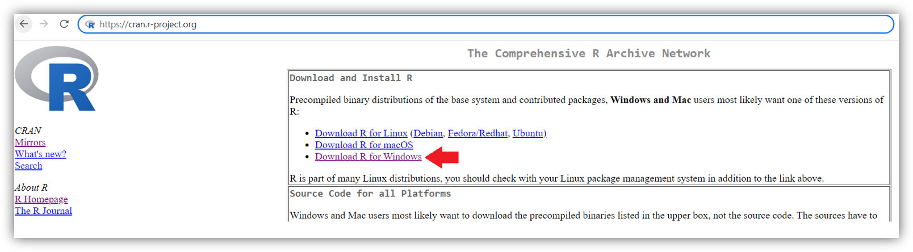
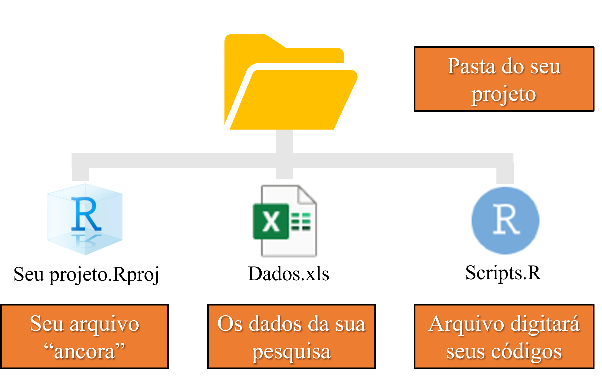
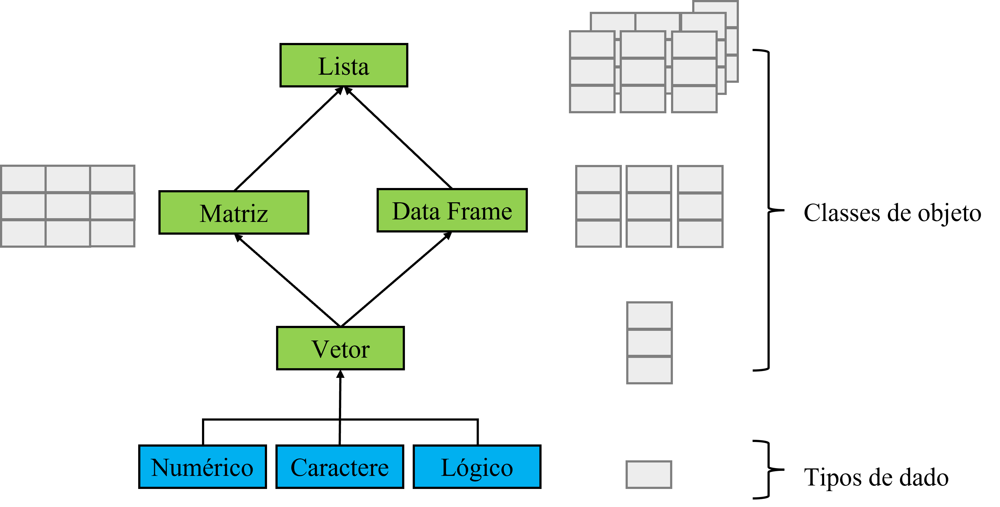

```{r setup, include=FALSE}
knitr::opts_chunk$set(paged.print=FALSE)
knitr::opts_chunk$set(echo=TRUE)
knitr::opts_chunk$set(error=FALSE)
knitr::opts_chunk$set(message=FALSE)
knitr::opts_chunk$set(warning=FALSE)
knitr::opts_chunk$set(tidy.opts = list(width.cutoff = 60), tidy = TRUE)
```

## Por que o R?

R é uma **linguagem** voltada para análise de dados, em um programa **gratuito** e **colaborativo**.

-   Por ser uma **linguagem** permite compartilharmos nossas análises de forma clara e reproduzível, para qualquer pessoa no mundo (assim como nos periódicos).

-   Por ser um programa **gratuito** qualquer um pode reproduzir nossas análises. Assim como mais pessoas tem acesso para colaborar com a comunidade.

-   Ser **colaborativo** significa que qualquer pessoa que tenha elaborado códigos para as mais diversas funções (ex., novas análises, manipulação e visualização de dados, manipulação de imagens...) pode compartilhar com toda a comunidade por meio de **pacotes**. Os quais são seguros, pois são análisados antes de irem para a biblioteca principal (CRAN).

O R possui uma das maiores bibliotecas dentre as linguagens existentes. Essa versatilidade somada com a reprodutibilidade da linguagem tornam o R tão popular.

{.illustration width="148"}

## Por que o RStudio?

R é uma liguagem, ou seja, qualquer programa que entenda a linguagem R, pode ser utilizado. Quando baixamos o R, estamos baixando o *software* base e nele podemos programar. Porém, existem programas que "complementam" o R, para facilitar a sua programação.

O RStudio foi criado especialmente para linguagem R. Nele há botões, abas, pré-preenchimento de códigos, tudo feito para facilitar o uso do R. Por isso o RStudio é classificado como IDE (integrated development environment), pois é uma "roupagem" mais amigável à programação em R.

Existem outras IDEs para o R, porém, o RStudio é certamente a mais popular.

{width="230"}

# Instalando o R e o RStudio

## Instalando o R

### $1^{\circ}$Acesse o site: <https://cran.r-project.org/>

### $2^{\circ}$ Escolha conforme seu sistema operacional

{width="1089"}

## Instalando o R

### $3^{\circ}$ Escolha o R "base"

{width="700"}

### $4^{\circ}$ Baixe o R

{width="700"}

## Instalando o RStudio

### $1^{\circ}$ Acesse o site: <https://www.rstudio.com/products/rstudio/download/>

### $2^{\circ}$ Baixe o RStudio

{width="700"}

# Organizando o R para seu novo projeto

## Primeiros passos

Se você quer apenas usar o R rapidamente, basta você abrir o aquivo do RStudio da sua área de trabalho e começar a digitar. Porém, se quiser fazer uma análise estatística para seu projeto (ex., TCC, dissertação, tese ou artigo científico), aí precisamos organizar as coisas:

1.  Entender onde o R busca os arquivos que você quer análisar (diretório de trabalho).

2.  Criar uma pasta para seu projeto.

3.  Criar o arquivo que irá indicar seu diretório de trabalho.

4.  Criar seu arquivo para fazer sua análise.

5.  Começar sua análise.

## Diretório de trabalho

Diretório de trabalho é a pasta onde o R busca os dados que você quer análisar e onde são salvos os seus arquivos de trabalho, como os gráficos que você criou.

{width="237"}

O "endereço" do diretório padrão é sua pasta "documentos", alguma coisa como: "C:/Users/SeuNome/Documentos", esse é seu **diretório absoluto**.

O problema de usar sempre o mesmo diretório é que você teria que jogar todos os dados dos seus projetos na mesma pasta, o que seria uma bagunça.

Soluções: (a) indicar o diretório absoluto ("endereço" da pasta) a cada novo projeto ou (b) criar um arquivo "ancora" dentro da pasta do seu projeto, que indicará o diretório, isso é um **diretório relativo**.

Diretório absoluto não é a melhor opção, pois ele está sempre ligado ao **"endereço"** que você indicou, ou seja, o simples fato de você renomear alguma pasta desse endereço ja é o suficiente para corrompe-lo. Já um diretório relativo está ligado a pasta com o seu **arquivo**. Ou seja, você pode mudar a sua pasta de lugar ou renomeá-la que seu diretório não mudará!

## Criando e organizando seu diretório de trabalho

### $1^{\circ}$Abra o RStudio

{width="329"}

## Criando e organizando seu diretório de trabalho

### $2^{\circ}$ Crie sua pasta e seu arquivo .Rproj

{width="715"}

## Criando e organizando seu diretório de trabalho

### $3^{\circ}$ Abra o seu arquivo .Rproj e crie o arquivo que você digitará seus códigos

{width="583"}

## Criando e organizando seu diretório de trabalho

Pronto! Seu novo diretório deve se parecer com algo do tipo:

{width="255"}

Basta você abrir seu arquivo **.R** e começar sua análise.

## .RData e .Rhistory

Quando você fechar seu arquivo, o R criará dois arquivos (ás vezes ocultos): **.RData e .Rhistory**.

{width="254"}


O .RData é criado para que sempre que você abra de novo seu programa R, os objetos que você criou já continuem carregados. Já o .Rhistory é criado para manter o histórico dos códigos que você digitou.

O R faz isso para parecer que você nunca tenha realmente fechado o programa. Porém, nem sempre é interessante isso, pois em análises longas é sempre uma boa prática executar os códigos passo-a-passo novamente, isso evita possíveis erros no meio do caminho.

Dessa forma, muitos usuários costumam, ao abrir o R, limpar os objetos do ambiente manualmente antes de começar a análise. Porém, podemos simplesmente desativar a opção de criar esses arquivos.

## .RData e .Rhistory

Para desativar o .RData e o .Rhistory, basta abrir o seu arquivo .Rproj, ir em **Tools\>Global Options** e desativar as opçoes:

{width="433"}

# Interface do RStudio

## Interface geral

Ao abrir o seu arquivo .R, você encontrará uma interface dividida em quatro campos: **editor** (1); **console** (2); **ambiente e histórico** (3); **arquivos, gráficos e pacotes** (4).

{width="734"}

## Editor e Console

O editor é como se fosse seu "caderno", nele você digita todos os seu códigos, linha por linha. Para ler o seu código, basta você enviar cada linha para o console utilizando as teclas **Alt + Enter**.

{width="561"}

No console é onde cada linha é lida e interpretada (resultado). Lá há dois simbolos: $>$ e $+$. O $>$ é o R dizendo "O que eu devo ler?", já o $+$ aparece quando o código que você inseriu está inacabado, como na imagem acima, em que o parenteses foi fechado apenas na segunda linha. Quando o código está completo, o R fornece o resultado. No exemplo foi pedido para sortear 10 números de 1 a 20.

## Ambiente

No ambiente é onde ficam salvos os objetos que você criou por meio do simbolo $<-$. Salvar no ambiente é uma forma de você criar um atalho para seu código, **armazenando o seu resultado**.

{width="805"}

Em situações que você precisa utilizar constantemente um código (como por exemplo carregar os dados do seu experimento) é muito mais conveniente armazená-los no ambiente.

# Entendendo a linguagem

## Objetos e dados

O R entende basicamente três tipos de dados: números; caracteres; ou lógicos (TRUE ou FALSE). Caso exista alguma célula com valor faltante, irá aparecer como **NA** (não é a mesma coisa que 0).

{width="592"}

O grupamento de dados formam os objetos. Um **vetor** é uma coluna de dados. Um **data frame** é a junção de vetores. **Matriz** é uma forma especial de data frame em que todas as colunas (vetores) são numéricos. Por fim, uma **lista** é a junção de vários objetos diferentes.

## Objetos e dados: fatores

No R, um vetor que possua **caracteres** ou seja **numérico** pode ser convertido para um **fator**. Quando é um fator, **cada elemento diferente** é considerado um nível, logo, deve-se ter cuidado com erros de digitação.

{width="451"}

Transformar um vetor em um fator é muito importante para análise de dados, principalmente em um vetor numérico (ex., experimentos com diferentes doses), pois o R precisa entender que os dados são categorias e não uma sequência de números.

## Exemplo no R - objetos e dados

Veja um exemplo de cada tipo de variável:

```{r, results = "hold"}
exemplo_numerico <- c(1,2,3,4) # criando um vetor de números
exemplo_caractere <- c("a", "b", "c") # criando um vetor de caracteres
exemplo_lógico <- c(TRUE, FALSE, FALSE) # criando um vetor logico
exemplo_fatores <- as.factor(exemplo_numerico) # transformando numérico em fator
class(exemplo_numerico) # função que identifica a classe dos dados (class())
class(exemplo_caractere)
class(exemplo_lógico)
class(exemplo_fatores)
```

## Exemplo no R - objetos e dados

Veja como fica no programa:

{width="1562"}

Repare que no lado campo direito, em "Values", em cada vetor, há o tipo de dado abreviado:

-   chr = character (caractere).

-   factor w/ 4 levels = fator com quatro níveis.

-   logi = logical (lógico).

-   num = numeric (numérico). Pode aparecer também como **int** (integer, ou seja, número inteiro).

## Operaçoes e operadores

No R, com os objetos e dados podemos fazer diversas operações: **cálculos, operações lógicas, criar sequências, manipular dados, escrever funções,** entre outros. Para essas operações, existem algum símbolos básicos:

| Tipo         | Operadores                                                                                          |
|------------------|------------------------------------------------------|
| Aritiméticos | \+ (soma), - (subtração), \* (multiplicação), / (divisão), \^ (potência)                            |
| Relacionais  | \> (maior), \< (menor), \>= (maior ou igual), == (igual), != (não igual)                            |
| Lógicos      | ! (não), & (e), \| (ou)                                                                             |
| Fórmula      | \~ ("é modelado em função de")                                                                      |
| Atribuição   | \<- ("recebe o valor de")                                                                           |
| Sequêncial   | : (ex., 1:3 = 1,2,3)                                                                                |
| Extração     | \$, [, [[ (utilizados para acessar/extrair dados do seu objeto (vetor, data frame, matriz ou lista) |
| Comentário   | \# (o que vier após esse simbolo é lido como texto)                                                 |

## Operações e operadores

Alguns símbolos podem mudar sua função quando dentro de uma **fórmula**. Por exemplo, o simbolo aritimético de multiplicação ($*$) em uma fórmula representa interação entre dois efeitos.

Para acessar informações sobre algum operador, basta você utilizá-lo na função help. Por exemplo: **help("[")**.

## Exemplo no R - operações e operadores

Veja o exemplo do uso de alguns operadores:

```{r}
x <- sample(20,10) # atribuir o valor do sorteio (função sample) a "x" com "<-"
x # mostrar x
y <- x+10 # somar 10 a cada valor de "x" e atribuir a "y"
y # mostrar y
```

## Exemplo no R - operações e operadores

```{r}
x[1:3] # acessar ("[]") os valores nas posições 1, 2 e 3 (":") de "x"
x[x>10 | x<5] # acessar os valores maiores que 10 (">") ou ("|") menores que 5
lm(y~x) # fazer uma regressão simples de y em função de x ("~")
```

# Funções e pacotes

## Funções

Uma função tem a finalidade de **realizar alguma tarefa** conforme **os argumentos** fornecidos a ela:

$$Nome\;da\;função(argumento_1, argumento_2,...)$$

Logo para realizar alguma tarefa no R voce precisa saber de duas coisas: **o nome** da função e os **seus argumentos**.

Aprender o nome das funções é como aprender o vocabulário de uma língua. O R vem com diversas funções básicas inclusas e o nome é geralmente a sua finalidade (ex., função da média é **mean()**).

A melhor maneira de aprender o vocabulário de funções é seguindo as atividades práticas guiadas, conforme as análises que serão mostradas aqui.

As funções básicas mais frequentes podem ser acessadas no "dicionário" abaixo:

<https://cran.r-project.org/doc/contrib/Short-refcard.pdf>

## Funções

Sabendo o nome da função, saber seus argumentos é fácil. Basta você digitar **help(nome da função)** ou **?nome da função** no console que irá aparecer a sua descrição na aba *help* do seu RStudio. No *help* há toda a **descrição** da função, seus **argumentos** e **exemplos** de como utilizá-la:

{width="1166"}

Alguns argumentos são **obrigatórios** para você utilizar a função, outros são **opcionais** e pré-estabelecidos, caso você não mude (geralmente são seguidos do simbolo "$=$"). No exemplo da imagem, você pode escolher se quer um sorteio com ou sem reposição.

Já em um teste de comparação de médias, por exemplo, você pode escolher o nível de significância do teste.

## Pacotes

Pacotes são nada mais que um **conjunto de funções, dados e códigos**, escritos e organizados por um autor da comunidade de acordo com um tema e compartilhado na biblioteca principal (CRAN).

{width="548"}

Um pacote é como um livro, qualquer usuário pode escrever um; porém, para ir para biblioteca principal CRAN ele precisa seguir um padrão. Ou seja, deve conter uma descrição, sua autoria, um sumário de funções, entre outras informações.

## Acessando seus pacotes

Existem mais de 18 mil pacotes na biblioteca CRAN, alguns são pré-instalados no R e outros você pode instalar manualmente. Você pode acessar sua biblioteca por meio da aba "Packages":

{width="796"}

Ao clicar no nome do pacote, você irá acessar sua página com um documento da descrição do pacote e o sumário de funções que ele possui.

Sempre que for utilizar alguma função do pacote escolhido, você precisa **ativá-lo** antes, sempre que abrir o R.

## Intalando pacotes

Para instalar um pacote basta digitar no console:

$$
install.packages(``NomeDoPacote")
$$

Uma forma alternativa é acessando a aba **Tools\>Install Packages** na parte superior do seu RStudio e digitar o nome do pacote:

{width="405"}

# Procurando ajuda

## Procurando ajuda no próprio R

-   Para funções ou operadores que você sabe o nome:

$$
help(``Nome DaFunção") \; ou\; ?``Nome DaFunção"
$$

Exemplo: help("anova") ou ?"anova".

-   Para funções que você não sabe exatamente o nome:

$$
help.search(``NomeDaFunção") \; ou\; ??``Nome DaFunção"
$$

Exemplo: procurar funções e pacotes que contenham análises de regressão (*regression*), help.search("regression"), ??"regression".

$*$ **Deve-se utilizar aspas no nome da função**

## Procurando ajuda fora do R:

-   Existem diversos sites e livros com informações sobre o R. No link abaixo você encontrará uma lista completa de recursos separados por tema. E tudo gratuito!

<https://stackoverflow.com/tags/r/info>

## Referências

-   Crawley, M.J. **The R Book**. Willey, 2013, 975p.
