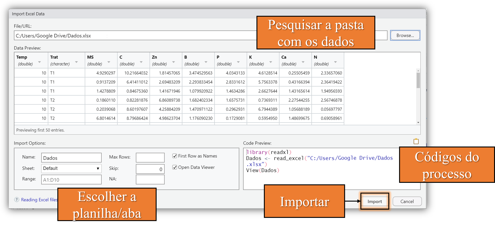

```{r setup, include=FALSE}
knitr::opts_chunk$set(paged.print=FALSE)
knitr::opts_chunk$set(echo=TRUE)
knitr::opts_chunk$set(error=FALSE)
knitr::opts_chunk$set(message=FALSE)
knitr::opts_chunk$set(warning=FALSE)
knitr::opts_chunk$set(tidy.opts = list(width.cutoff = 60), tidy = TRUE)
```

# Trazendo seu experimento para o R

## Maneiras de importar seus dados

Existem duas formas de você trazer os dados do seu experiêmento para o R:

1.  Digitando no programa.
2.  Importando um arquivo com seus dados (ex., planilha de Excel, bloco de notas).

{width="424"}

Quando você possui poucos dados, uma maneira rápida é apenas digitando no próprio R. Porém, geralmente o experimento é uma grande planilha no Excel, com diversas abas. Nesse caso, a melhor maneira é ler os dados diretamente da planilha.

## Digitando seus dados no R

A maneira mais simples de você digitar seus dados é usando a função:

$$
data.frame(nome_1=c(dados),nome_2=c(dados),...)
$$

$*$ Repare que quando temos que digitar mais de um valor, sempre devemos utilizar a função combinar **c()**, que significa: *isso não é **um** dado separado por vírgula e sim **vários** dados os quais estão separados pela vírgula.*

Assim, basta você atribuir (**\<-**) seu data frame a um nome qualquer para armazená-lo no ambiente. Veja o exemplo:

```{r}
dados <- data.frame(tratamento=c("t1", "t1", "t2","t2"),emergencia=c(20,19,32,25)) # criar data frame
dados # mostrar os dados
```

## Importando de uma planilha

### $1^{\circ}$ Organizando sua planilha - orientação

O R entende cada coluna como uma variável, cada linha como uma observação, sendo que linhas com observações iguais são entendidas como repetições. Logo, seus dados devem estar da seguinte forma:

{width="1002"}

## Importando de uma planilha

### $1^{\circ}$ Organizando sua planilha - boas práticas

Com seus dados no formato correto, existem algumas boas práticas de organização dos dados que facilitam a manipulação e análise dos dados no R:

-   **Nomes**: abreviados, sem espaço, com letras minúsculas, sem acentos

-   **Células**: cuidar com células mescladas, isso resultará em valores faltantes.

-   **Valores faltantes**: substituir por NA (not avaliable - não disponível).

## Importando de uma planilha

{width="799"}

## Importando de uma planilha

### $2^{\circ}$ Salvando em .CSV

Pelo formato padrão **.xlsx** ser mais "complexo" (pode possuir diversas planilhas), para lê-lo, precisariamos instalar um pacote. Assim, a forma mais mais prática é salvando o arquivo no formato **CSV (dados separados por vírgulas) (.CSV)**.

{width="449"}

$*$ Um arquivo **.CSV** não suporta diversas planilhas, logo ele só salvará a que estiver ativa no seu Excel. Ou seja, se você tem mais experimentos, cada um em uma planilha, deve salvá-los separadamente.

## Importando de uma planilha

### $3^{\circ}$ Enviando para o diretório de trabalho

Diretório de trabalho é onde o R irá procurar seu arquivo. Para saber onde fica seu diretório, basta digitar no console **getwd()**. Seu diretório padrão é na pasta documentos: "C:/Users/SeuNome/Documentos".

Porém, se você criou um diretório personalizado por projeto, como é aconselhável, basta você colcoar seu arquivo na pasta do seu projeto, a qual deve ficar alguma coisa assim:

{width="411"}

## Importando de uma planilha

### $4^{\circ}$ Lendo sua planilha no R

$$
read.csv(file, header = TRUE, sep = ",", dec = ".",..)
$$

-   **file** é o o nome do seu arquivo e sua extensão (ex., "Dados.csv"). Caso o arquivo não esteja no seu diretório, file será o endereço (ex., "C:Pasta1/Pasta2/Dados.csv").

-   **header = TRUE**, significa que a primeira linha da sua planilha contém os nomes das suas variáveis.

-   **sep** é o "separador". Num arquivo **.CSV**, o separador é a vírgula, porém pode ser também o ponto e vírgula, assim, você pode mudar o símbolo por "$;$".

-   **dec** é o "decimal". No R o separador de decimal é o **ponto** e não a vírgula, logo, se você possui dados com casas decimais separados por vírgula na sua planilha, você deve mudar.

Exemplo:

```{r, eval=FALSE}
dados <- read.csv("dados.csv", sep = ";", dec = ",") # carregando e armazenando (<-) em "dados"
```

## Importando uma planilha usando o menu

É possível importar uma planilha usando o menu do RStudio por meio do pacote **readxl**. Basta acessar no menu superior **File\>Import Dataset\> From Excel** ou por meio do ambiente:{width="339"}

## Importando uma planilha usando o menu

{width="874"}

$*$ **Cuidado!** Repare que nos códigos do processo, você estará importanto seu arquivo utilizando seu endereço absoluto e não diretamente pelo diretório, isso dificulta a reprodutibilidade dos seus códigos.

# Manipulação de dados

## Para que usamos?

Com os dados do nosso experimento, é comum precisarmos **alterar a classe** das nossas variáveis para nossa análise, **criar** dados transformados, **selecionar/filtrar** dados para calcular medidas descritivas (ex., média, desvio padrão), **substituir valores** com erros de digitação, etc.

{width="570"}

Para sabermos o que precisa ser modificado nos nossos dados, primeiro precisamos visualizá-los.

## Visualizando nossos dados

Se você digitou ou importou seus dados e atribuiu (**\<-**) um nome a eles, seus dados estarão no **ambiente**. Basta você clicar neles ou digitar **View("nome dos seus dados")** que irão carregar em uma aba:

{width="968"}

Repare que nessa aba podemos apenas visualizar e explorar (usando "filter") nossos dados, mas não manipulá-los.

## Como manipulamos nosso dados?

Existem diversos caminhos para manipularmos nossos dados, podemos usar:

1.  **A linguagem do R base:** usando o símbolos (\$, [ ], -,\<,\>,=,&, \|,!) para acessar e filtrar nossos dados.

2.  **Funções do R base:** funções pré-instaladas como a função **subset()**.

3.  **Funções de de pacotes que precisam ser instalados:** pacotes especialmente elaborados para manipulação de dados como o pacote **dplyr**.

# Manipulando usando o R base

## Selecionar

Os dois principais símbolos para acessar/selecionar os dados são: **\$** e **[ ]**.

-   O **\$** é usado para extrair uma coluna do seu data frame a partir do **nome** dela.

-   O **[ ]**, pode ser usado especificando **a posição** da coluna, **o valor da linha e coluna** (nessa ordem) ou **o nome** da coluna entre aspas.

{width="581"}

$*$ Para selecionar mais de uma linha ou coluna ao mesmo tempo, basta utilizarmos **c()**. Por exemplo, se quisermos selecionar as linhas 1 a 3 da segunda coluna: dados[c(1,2,3), 2].

## Exemplos no R - Selecionando dados

```{r}
dados <- data.frame(a=c(3,6,7,2),b=c(1,1,2,2),c=c("X", "Y", "Z", "W")) # data frame de exemplo
dados # mostrar os dados
dados$a # coluna "a"
dados[,1] # primeira coluna

```

## Exemplos no R - Selecionando dados

```{r}
dados[,-1] # tudo menos a primeira coluna
dados[,c(1,2)] # primeira e segunda coluna
```

## Exemplos no R - Selecionando dados

```{r}
dados[1,1] # primeira linha, primeira coluna
dados$a[1] # coluna "a", primeiro elemento
```

## Filtrar

Filtrar é nada mais que selecionar de acordo com um critério. Como pelo **[ ]** conseguimos especificar colunas e linhas pela sua posição ou nome, podemos inserir um critério com expressões lógicas utilizando símbolos relacionais (**\>, \<, =\<, ==, !=**) e lógicos e, ou, não (**&, \|, !**).

{width="682"}

$*$ Filtrar quanto a um critério é especialmente útil em experimentos fatoriais, quando queremos filtrar uma resposta combinando diferentes níveis de cada fator.

## Exemplo no R - Filtrando seus dados

```{r}
dados[dados$b=="1",] # todas as linhas referentes ao nível "1" da coluna b
dados[dados$b=="1",1] # linhas da primeira coluna referentes ao nível "1" da coluna b
dados$a[dados$b=="1"] # mesmo resultado anterior, porém acessando com o nome da primeira coluna


```

## Exemplo no R - Filtrando seus dados

```{r}
dados$a[!dados$b =="1"] # linhas da coluna a não pertencentes ao nível "1" da coluna b
dados[dados$a > 5 & dados$c == "Z",] # todas as linhas que contenham a coluna "a" maior que 5 e a "c" igual a "z"
```

## Filtrar usando subset()

Podemos ao invés de utilizar a linguagem do R base, usar uma função que vem pré-instalada no R:

$$
subset(object,subset,select,...)
$$

-   **object** é o nome dos seus dados.

-   **subset** é usado para selecionar as *linhas*.

-   **select** é utilizado para selecionar as *colunas*.

Veja como selecionamos as linhas como no exemplo anterior:

```{r}
subset(dados, a>5 & c=="Z") # todas as linhas que contenham a coluna "a" maior que 5 e a "c" igual a "z"
```

$*$ Repare que na função ao especificarmos nosso objeto (dados), podemos utilizar diretamente o nome da coluna, ou seja, apenas "a", ao invés de "dados\$a".

## Substituir

Se sabemos acessar uma parte dos dados, para alterá-los basta atribuirmos um valor ou conjunto de valores, usando o símbolo de atribuição (**\<-**). Veja alguns exemplos:

```{r}
dados # mostrar os dados
dados[1,1] <- 6 # alterando a primeira linha da primeira coluna
dados[2] <- c("lavoura", "lavoura", "floresta", "floresta")  # alterando toda a segunda coluna
dados # mostrar os dados
```

## Criar

A maneira mais simples é acessando os dados utilizando \$ e especificando uma coluna que não existe, assim, ao atribuirmos um conjunto de valores a ela, será criado uma coluna com o nome especificado.

{width="599"}

Criar uma nova variável é especialmente importante quando temos que transformar nossos dados para questões de normalidade, por exemplo.

## Exemplo no R - Criando variáveis

Veja nesse exemplo em que criaremos duas variáveis, uma chamada "d" em que atribuiremos seus valores e outra "log_A" a partir de valores transformados (log) da primeira coluna:

```{r}
dados # mostrar os dados
dados$d <- c(1,2,3,4) # criar nova coluna
dados$log_A <- log(dados$a) # criar nova coluna com dados transformados da primeira
dados # mostrar os dados
```

## Renomear

Podemos mudar o nome de uma coluna (nome da variável) usando a função:

$$
names(object)
$$

Com essa função, acessamos os nomes das colunas do seu data frame e assim podemos mudar um nome especificando sua posição com **[ ]** e atribuindo (**\<-**) um novo nome.

Veja esse exemplo em que mudaremos o nome da segunda coluna "b" para "ambiente":

```{r}
names(dados) # mostrar nome dos dados
names(dados)[2] <- "ambiente" # alterar o segundo
names(dados) # mostrar o nome dos dados
```

## Alterar classe

Na classe de dados fator, que geralmente ocorre em experimentos controlados, os diferentes valores são entendidos como **níveis** e não apenas como texto ou número. Para mudarmos a classe para fator:

$$
as.factor(object)
$$

-   **object** é o nome da coluna e não o nome dos meus dados.

O primeiro passo é indicar a coluna a ser alterada (**\$** ou **[ ]**) e depois atribuimos (**\<-**) a classe nova. Veja um exemplo em que mudamos a classe da coluna "b" que era caractere para fator:

```{r}
class(dados$ambiente) # mostrar a classe da coluna "ambiente"
dados$ambiente <- as.factor(dados$ambiente) # alterar a classe e atribuir a coluna "ambiente"
class(dados$ambiente) # mostrar a classe da coluna "ambiente"
```

## Alterar níveis

Vimos anteriormente como alterar o valor de uma célula. Porém, se você possui um fator, podemos alterar o nome do seu nível todo de uma só vez, sem a necessidade de fazer isso célula por célula, usando a função:

$$
levels(object)
$$

-   **object** é o nome da sua coluna do tipo fator.

Basta acessar o nome dos níveis usando a função, especificar sua posição com **[ ]** e atribuir (**\<-**) um novo nome.

{width="502"}

## Exemplos no R - Alterando o nível

Veja esse exemplo em que trocamos o nome do primeiro nível "floresta" para "pecuária":

```{r}
dados # mostrar os dados
levels(dados$ambiente) # mostrar os níveis do fator "ambiente"
```

$*$ Repare que a ordem dos níveis é alfabética e não a mesma que aparece no seu data frame.

## Exemplos no R - Alterando o nível

```{r}
levels(dados$ambiente)[1] <- "pecuária" # trocar primeiro nível do fator "ambiente"
levels(dados$ambiente) # mostrar níveis do fator "ambiente"
dados # mostrar dados
```

## Função fix()

Função **fix()** permite você mudar seus dados diretamente como se estivesse em uma planilha de Excel. Basta inserir o objeto que você armazenou seus dados:

{width="485"}

$*$ **Cuidado!** Você alterará seus dados "manualmente" e não por meio de códigos, isso torna sua análise **irreprodutível**! Logo, a função deve ser usada apenas para uma análise rápida ou exploração.

# Pacote dplyr

## Usando o pacote dplyr

Pacote dplyr foi criado para manipulação de dados e, assim, possui várias funções para essa finalidade:

| Função         | sintaxe                                                               |
|---------------------|---------------------------------------------------|
| Selecionar     | $select(objeto, variável)$                                            |
| Filtrar        | $filter(objeto, expressão)$                                           |
| Substituir     | $mutate(objeto, variável = replace(variável, posição, novo\; valor))$ |
| Criar          | $mutate(objeto, nova\; variável = novos\; dados)$                     |
| Renomear       | $rename(objeto, nome\; novo = nome\; antigo)$                         |
| Alterar classe | $mutate(objeto, variável = as.factor(variável))$                      |

$*$ Para acessar mais informações, abra o pacote (na aba "Packages") e veja as funções que ele possui, assim como os argumentos de cada função.

## Exemplos no R - Pacote dplyr

### Instalar o pacote

```{r, eval=FALSE}
install.packages("dplyr") # instalar pacote
```

### Carregar o pacote

```{r}
library(dplyr) # carregar pacote
```

## Exemplos no R - Pacote dplyr

### Selecionar

```{r}
dados <- data.frame(a=c(3,6,7,2),b=c(1,1,2,2),c=c("X", "Y", "Z", "W")) # data frame de exemplo
dados # mostrar dados
select(dados,a) # selecionar coluna "a"
```

## Exemplos no R - Pacote dplyr

### Selecionar

```{r}
select(dados,-a) # selecionar tudo menos a coluna "a"
select(dados,a,b) # selecionar colunas "a" e "b"
```

## Exemplos no R - Pacote dplyr

### Filtrar

```{r}
filter(dados, b =="1")  # todas as linhas referentes ao nível "1" da coluna b
select(filter(dados, b =="1"), a) # linhas da primeira coluna referentes ao nível 1 da coluna b
```

## Exemplos no R - Pacote dplyr

### Filtrar

```{r}
select(filter(dados, b !="1"),a) # linhas da coluna "a" não pertencentes ao nível "1" da coluna b
filter(dados, a>5 & c=="Z") # todas as linhas que contenham a coluna "a" maior que 5 e a "c" igual a "z"
```

## Exemplos no R - Pacote dplyr

### Substituir

```{r}
# mudando dados da coluna b, posição 1 e 2 de "1" para "lavoura"
dados <- mutate(dados, b=replace(b, c(1,2), "lavoura"))
dados # mostrar os dados
```

## Exemplos no R - Pacote dplyr

### Substituir

```{r}
# semelhante ao anterior, porém usando o valor da observação e não a posição
dados <- mutate(dados, b=replace(b, b==2, "floresta"))
dados # mostrar os dados
```

## Exemplos no R - Pacote dplyr

### Criar

```{r}
dados <- mutate(dados, d=c(1,2,3,4)) # criar nova coluna "d"
dados <- mutate(dados, log_A=log(a)) # criar nova coluna com dados transformados (log) da primeira coluna
dados # mostrar os dados
```

## Exemplos no R - Pacote dplyr

### Renomear

```{r}
dados <- rename(dados, "ambiente"=b) # trocando da coluna "b" para "ambiente"
dados # mostrar os dados
```

## Exemplos no R - Pacote dplyr

### Alterar classe

```{r}
class(dados$ambiente) # mostrar classe da coluna "ambiente"
dados <- mutate(dados, ambiente=as.factor(ambiente)) # mudar classe
class(dados$ambiente) # mostrar classe da coluna "ambiente"
```

## Exercícios

Carregue os dados de exemplo com o seguinte código:

```{r, eval=FALSE}
install.packages("ExpDes.pt") # instalar o pacote com dados de exemplo
library(ExpDes.pt) # carregar o pacote com os dados de exemplo
ex1 # dados de exemplo
```

1.  Armazene os dados "ex1" no ambiente atribuindo o nome "dados".

2.  Filtre os dados da coluna "ig" referentes à dose 0 da coluna "trat" e faça a média usando a função **mean()**.

3.  Troque os nomes das variáveis "trat" e "ig" por "tratamento" e "indice_glicemico".

4.  Troque a classe da coluna "tratamento" de númerica para fator e renomeie os fatores 0, 5, 10, 15 para dose_0, dose_5, dose_10 e dose_15.

5.  Crie uma nova coluna chamada ig10 com os dados transformados da coluna "indice_glicemico"**+10**.

## Códigos

```{r, eval=FALSE}
### R base ####
# Selecionar
dados <- data.frame(a=c(3,6,7,2),b=c(1,1,2,2),c=c("X", "Y", "Z", "W")) # data frame de exemplo
dados # mostrar os dados
dados$a # coluna "a"
dados[,1] # primeira coluna
dados[,-1] # tudo menos a primeira coluna
dados[,c(1,2)] # primeira e segunda coluna
dados[1,1] # primeira linha, primeira coluna
dados$a[1] # coluna "a", primeiro elemento

# Filtrar
dados[dados$b=="1",] # todas as linhas referentes ao nível "1" da coluna b
dados[dados$b=="1",1] # linhas da primeira coluna referentes ao nível "1" da coluna b
dados$a[dados$b=="1"] # mesmo resultado anterior, porém acessando com o nome da primeira coluna
dados$a[!dados$b =="1"] # linhas da coluna a não pertencentes ao nível "1" da coluna b
dados[dados$a > 5 & dados$c == "Z",] # todas as linhas em que a coluna "a" for maior que 5 e a "c" igual a "z"
# Subset
subset(dados, a>5 & c=="Z") # todas as linhas em que a coluna "a" for maior que 5 e a "c" igual a "z"

#Substituir
dados # mostrar os dados
dados[1,1] <- 6 # alterando a primeira linha da primeira coluna
dados[2] <- c("lavoura", "lavoura", "floresta", "floresta")  # alterando toda a segunda coluna
dados # mostrar os dados

# Criar
dados # mostrar os dados
dados$d <- c(1,2,3,4) # criar nova coluna
dados$log_A <- log(dados$a) # criar nova coluna com dados transformados (log) da primeira coluna
dados # mostrar os dados

# Renomear
names(dados) # mostrar o nome dos dados
names(dados)[2] <- "ambiente" # alterar o segundo nome
names(dados) # mostrar o nome dos dados

# Alterar classe
class(dados$ambiente) # mostrar a classe da coluna "ambiente"
dados$ambiente <- as.factor(dados$ambiente) # alterar a classe e atribuir a coluna "ambiente"
class(dados$ambiente) # mostrar a classe da coluna "ambiente"

# Alterar nível
dados # mostrar os dados
levels(dados$ambiente) # mostrar os níveis do fator "ambiente"
levels(dados$ambiente)[1] <- "pecuária" # trocar primeiro nível do fator "ambiente"
levels(dados$ambiente) # mostrar níveis do fator "ambiente"
dados # mostrar dados

#### dplyr ####
# Selecionar
dados <- data.frame(a=c(3,6,7,2),b=c(1,1,2,2),c=c("X", "Y", "Z", "W")) # data frame de exemplo
select(dados,a) # selecionar coluna "a"
select(dados,-a) # selecionar tudo menos a coluna "a"
select(dados,a,b) # selecionar colunas "a" e "b"

# Filtrar
filter(dados, b =="1")  # todas as linhas referentes ao nível "1" da coluna b
select(filter(dados, b =="1"), a) # linhas da primeira coluna referentes ao nível 1 da coluna "b"
select(filter(dados, b !="1"),a) # linhas da coluna a não pertencentes ao nível "1" da coluna "b"
filter(dados, a>5 & c=="Z") # todas as linhas em que a coluna "a" for maior que 5 e a "c" igual a "z"

# Substituir
# mudando dados da coluna b, posição 1 e 2 de "1" para "lavoura"
dados <- mutate(dados, b=replace(b, c(1,2), "lavoura"))
dados # mostrar os dados
# semelhante ao anterior, porém usando o valor da observação e não a posição
dados <- mutate(dados, b=replace(b, b==2, "floresta"))
dados # mostrar os dados

# Criar
dados <- mutate(dados, d=c(1,2,3,4)) # criar nova coluna "d"
dados <- mutate(dados, log_A=log(a)) # criar nova coluna com dados transformados (log) da primeira coluna
dados # mostrar os dados

# Renomear
dados <- rename(dados, "ambiente"=b) # trocando da coluna "b" para "ambiente"
dados # mostrar os dados

# Alterar classe
class(dados$ambiente) # mostrar classe da coluna "ambiente"
dados <- mutate(dados, ambiente=as.factor(ambiente)) # alterar classe
class(dados$ambiente) # mostrar classe da coluna "ambiente"
```
