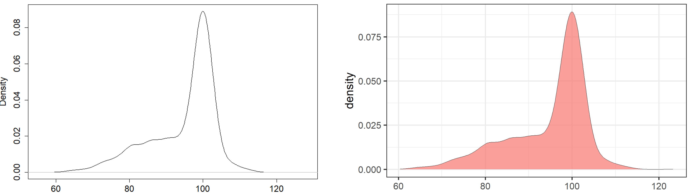
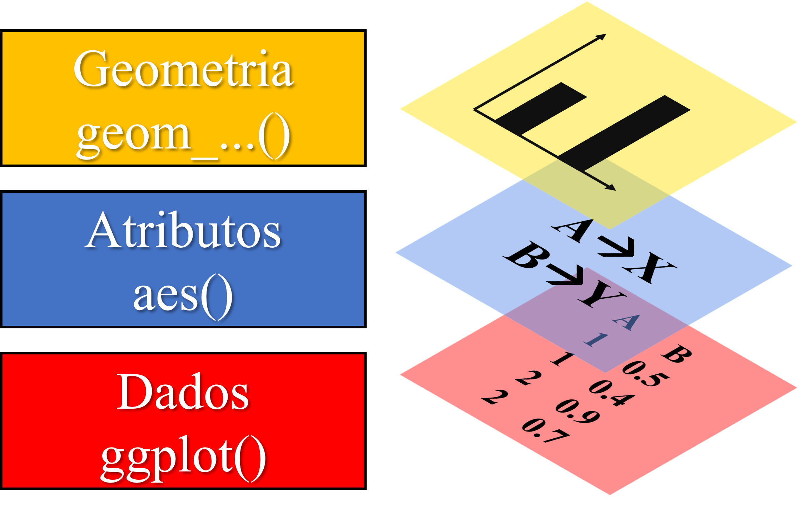
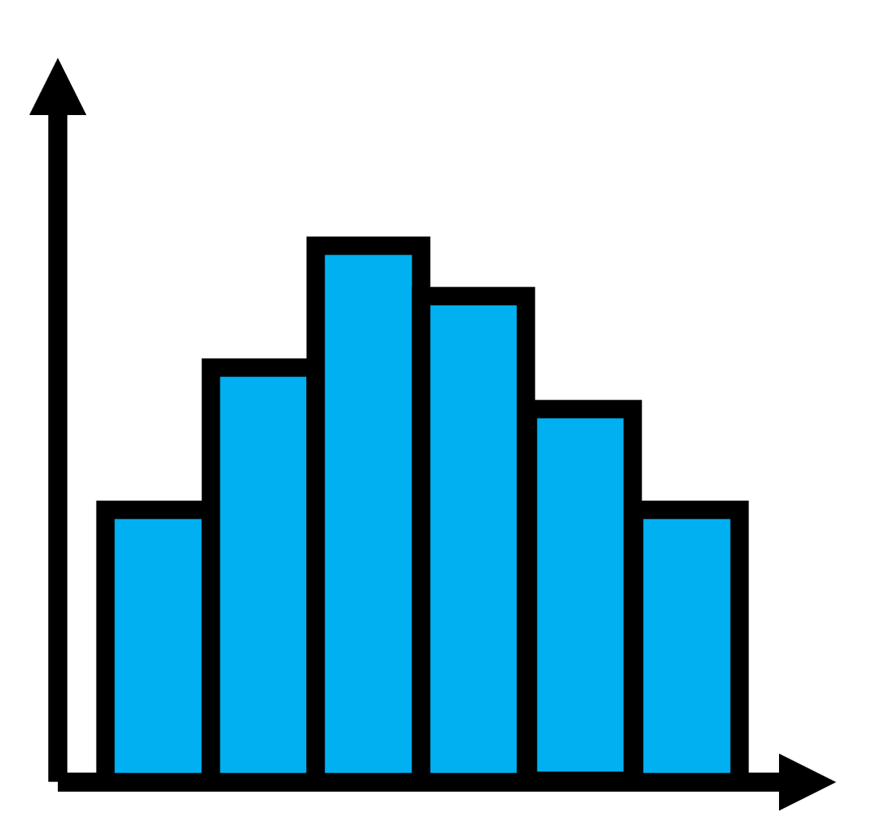
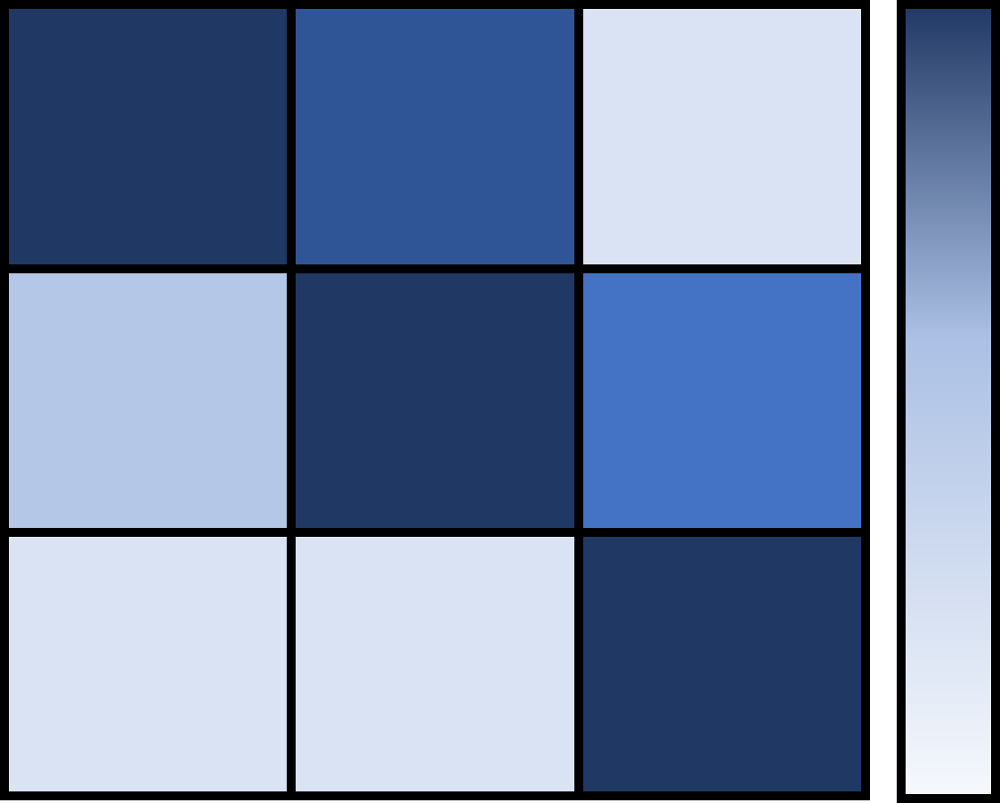
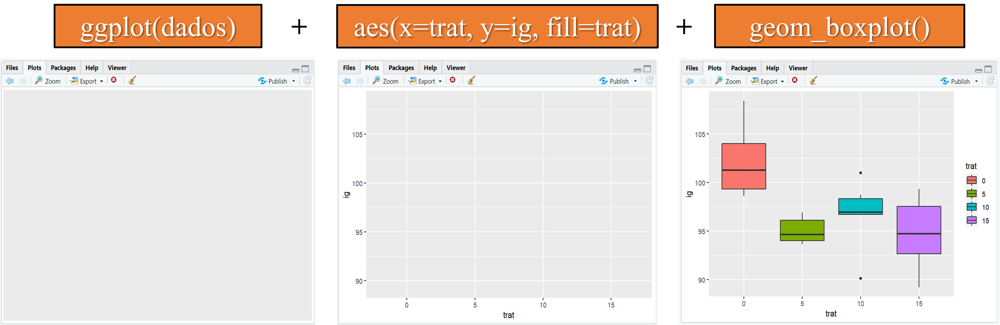
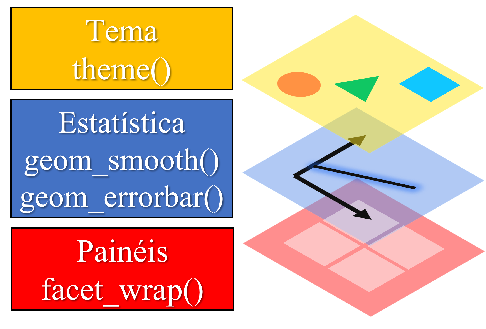
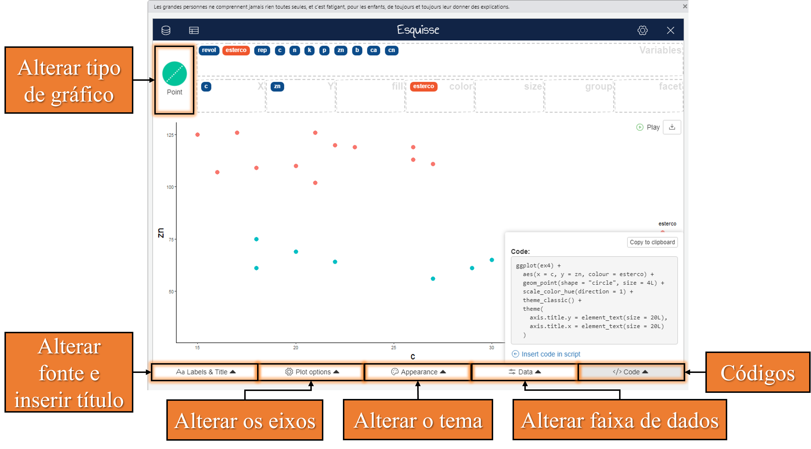

```{r setup, include=FALSE}
knitr::opts_chunk$set(paged.print=FALSE)
knitr::opts_chunk$set(echo=TRUE)
knitr::opts_chunk$set(error=FALSE)
knitr::opts_chunk$set(message=FALSE)
knitr::opts_chunk$set(warning=FALSE)
knitr::opts_chunk$set(tidy.opts = list(width.cutoff = 60), tidy = TRUE)
```

# Estatística descritiva

## Por que descrever os dados?

1.  Análise exploratória.

2.  Resumir dados.

3.  Guiar a modelagem dos dados.

4.  Identificar possíveis anomalias.

## Resumindo os dados

$$
summary(object, …)
$$

```{r}
library(ExpDes.pt) # carregando o pacote com dados de exemplo (ex4)
dados <- ex4 # armazenando ex4 em "dados"
dados$revol <- as.factor(ex4$revol) # transformando a variável revol em fator
summary(dados[1:6]) # resumo das colunas 1 a 6
```

## Medidas de posição

$$
aggregate(x,FUN,...)
$$

-   **x** deve ser escrito em forma de função, ou seja, se você quer calcular al

média

mediana

max

minimo

## Medidas de dispersão

variância

Desvio padrão

CV (%)

# Visualização de dados

## Como criar gráficos no R?

Existem basicamente duas formas de criarmos gráficos no R:

1.  Usando o R base, ou seja, por meio de funções pré-instaladas: plot(), line(), hist(), entre outras.

2.  Utilizando pacotes externos, os quais precisam ser instalados. Os mais utilizados são o pacote lattice e ggplot2.

## Qual a melhor forma de criar gráficos no R?

Os gráficos do R base, são visualmente mais simples e mais difíceis de manipular quando buscamos elaborar gráficos mais elaborados.

Porém para avaliações rápidas a fim de explorar os dados ou nosso modelo, eles são ótimos, pois não é necessário carregar pacotes, além de serem mais "diretos", ou seja, sem a necessidade de especificar muitos argumentos.

{width="1062"}

# Pacote ggplot2

## Porque o ggplot2?

O pacote ggplot2 é um dos pacotes mais instalados no R e certamente o mais popular na elaboração de gráficos. Isso se deve a alguns pontos:

-   O pacote engloba um uma quantidade muito grande de tipos de gráficos.

-   O pacote permite a customização dos gráficos de diversas maneiras, o que os torna os gráficos visualmente mais agradáveis.

-   Existem muitos pacotes que foram construidos como "auxiliares" do ggplot2, isso faz com que existam ainda mais opções para elaborar e customizar gráficos.

-   Permite a construção de gráficos de forma mais intuitiva que os outros pacotes, pois o gráfico é construido em **camadas**.

{width="130"}

## Estrutura básica do ggplot

A construção de um gráfico em camadas é um dos grandes responsáveis pela popularização do pacote. O ggplot é constituido por basicamente três elementos:

1.  Função base **ggplot()** que irá conter seus dados.

2.  Função **aes()**, responsável por mostrar como seus dados serão distribuidos no gráfico.

3.  Função iniciada por **geom\_...()** que representará a **geom**etria do seu gráfico, ou seja, seu formato.

{width="399"}

## Estrutura básica do ggplot - Função aes()

Quem vai no eixo X e no Y? Devo separar por níveis? Essas questões a função **aes()** responde:

$$
aes(x,\;y,\;color,\;fill,\; size,\;group,...)
$$

-   **x** e **y** são as variáveis que vão nos eixos.

-   **fill** e **color** são utilizado para atribuir uma cor ou preenchimento para cada categoria da variável que você especificou. Se for uma variável quantitativa, será criada uma escala de cor. *Fill* é para gráficos que possuam "espaço interno" preencher, como gráfico de colunas ou boxplot, já em pontos e linha usá-se *color*.

-   **size** é utilizado para atribuir uma escala de tamanho conforme a variável que você específicou.

-   **group** é utilizado para quando você não quer necessáriamente trocar a aparência do seu gráfico conforme uma variável, apenas sinaliziar que há grupos diferentes. Isso é comum quando se quer adicionar linhas múltiplas linhas de regressão.

## Estrutura básica do ggplot - Função geom\_...()

O ggplot possui muitos tipos de gráficos e o nome da função geralmente é **geom\_** + o tipo de gráfico:

| Tipo de gráfico | Descrição                                                              |       Função        | Exemplo                                      |
|:---------------:|---------------------|:---------------:|-----------------|
|   Histograma    | Usado em apenas uma variável para visualizar sua distribuição.         | $geom\_histogram()$ | {width="80"}     |
|      Linha      | Acompanhar a mudança de uma variável através do tempo ou entre grupos. |   $geom\_line()$    | {width="80"}          |
|    Dispersão    | Identificar a relação entre duas variáveis quantitativas.              |    $geom\_point$    | {width="80"} |

## Estrutura básica do ggplot - Função geom\_...()

| Tipo de gráfico | Descrição                                                                                                                                                                       |      Função       | Exemplo                               |
|:--------------:|------------------------|:--------------:|----------------|
|   *Box-plot*    | É como se fosse uma forma resumida do histograma. Pode ser utilizado para visualizar a distribuição de uma variável ou sua distribuição em diferentes níveis de outra variável. | $geom\_boxplot()$ | {width="80"} |
|     Colunas     |                                                                                                                                                                                 |   $geom\_col()$   | {width="80"}  |
|      Calor      | Usado para três variáveis: intensidade de uma variável conforme a combinação das outras duas. Comum em gráficos de correlação.                                                  |  $geom\_tile()$   | {width="94"}   |

## Exemplo da estrutura do ggplot



## Exemplos no R - ggplot

Experimento em campo para testar a compostagem de casca de café misturada ou não com esterco bovinos (variável esterco) em diferentes intervalos de revolvimento (variável revol).

```{r}
library(ExpDes.pt) # carregar pacote com dados de exemplo
dados <- ex4 # armazenar dados de exemplo (ex4) em "dados"
dados$revol <- as.factor(dados$revol) # transformar "revol" de numérico para fator
head(dados) # mostrar o começo dos dados
```

## Exemplos no R - ggplot - Box-plot

```{r, out.width="60%"}
library(ggplot2) # carregar o pacote ggplo2
ggplot(dados) + # especificar os dados
  aes(x=revol, y=c, fill=esterco) + # especificar os atributos
  geom_boxplot() # definir a geometria
```

## Exemplos no R - ggplot - Colunas

Como temos repetições, iremos calcular a média de "c" conforme cada combinação entre os fatores para criar o gráfico de barras.

```{r}
medias <- aggregate(c~revol*esterco, data=dados, FUN=mean) # calculando a média
medias
```

## Exemplos no R - ggplot - Colunas

```{r, out.width="60%"}
ggplot(medias) + # especificar os dados
  aes(x=revol, y=c, fill=esterco) + # especificar os atributos
  geom_col(position="dodge2") # definir a geometria
```

## Exemplos no R - ggplot - Dispersão

Gráfico de dispersão para avaliar a relação entre carbono (C) e zinco (Zn) conforme a adição ou não de esterco na compostagem.

```{r, out.width="60%"}
ggplot(dados) + # especificar os dados
  aes(x=zn, y=c, color=esterco) + # especificar os atributos
  geom_point() # definir a geometria
```

## Exemplos no R - ggplot - linhas

```{r, out.width="60%"}
dados$rep <- as.factor(dados$rep)
ggplot(dados) + # especificar os dados
  aes(x=zn, y=c) + # especificar os atributos
  geom_line() # definir a geometria
```

## Exemplos no R - ggplot - linhas

### Interação entre grupos

Pelo gráfico de linhas, podemos ver como as médias se comportam nos diferentes níveis de um fator, a fim de indentificarmos se há indícios de interação entre fatores. A interação entre fatores ocorre quando as linhas se cruzam, pois significa que um fator afeta de forma diferente o outro.

```{r, out.width="80%"}
ggplot(medias) +
  aes(x=revol, y=c, color=esterco, group=esterco) +
  geom_line()
```

## Exemplos no R - ggplot - Calor

Gráfico de calor para avaliar a variação da quantidade de carbono nos diferentes tratamentos.

```{r, out.width="80%"}
ggplot(dados) +
  aes(x=revol, y=esterco, fill=c) +
  geom_tile()
```

## Adicionando mais camadas

Podemos adicionar mais camadas à nossa estrutura básica do ggplot a fim de obter um gráfico mais elaborado. Existem diversas camadas que podemos adicionar, porém, as mais frequentes são:

1.  Dividir nosso gráfico em diferentes painéis, utilizando **facet_wrap()**. Muito útil quando queremos observar a evolução de variáveis em diferentes níveis de um fator, por exemplo.

2.  Adicionar alguma estátística ao nosso gráfico, como barras de erro em gráficos de coluna ou pontos, por meio da função **geom_errorbar()** ou adicionar linhas de regressão ao nosso gráfico de dispersão por meio da função **geom_smooth()**.

3.  Alterar os aspéctos estéticos do gráfico, seja separadamente por elemento (fonte, cor, tamanho) por meio da função **theme()**ou por temas pré-estabelecidos por meio de funções **theme\_...()**.

{width="368"}

## Adicionando mais camadas - dividindo em painéis

Podemos separar nosso gráfico por nível do nosso fator usando:

$$
facet{\_}wrap(facets, nrow, ncol, scales,...)
$$

-   **facets** é a variável que será usada para dividir em painéis, pode ser utilizado na forma de "fórmula", usando os simbolos "\~", "\*", ":", como por exemplo: \~variável1\*variável2. Ou pela função **vars(variável1, variável2,...)**.

-   **nrow** e **ncol** é o número de linhas e colunas que seu painél terá. É uma forma de organizar a disposição dos seus gráficos, ex.: você pode organizar quatro painéis todos em um coluna de quatro linhas.

-   **scales** controla se seu eixo deve (="fixed") ou não (="free") ser o mesmo entre os gráficos na mesma linha/coluna.

## Exemplos no R - dividindo em painéis

```{r, out.width="50%"}
ggplot(dados) + # especificar os dados
  aes(x=revol, y=c, fill = revol) + # especificar os atributos
  geom_boxplot() + # definir a geometria
  facet_wrap(vars(esterco), nrow=2, ncol=1, scales="fixed") # mesmo resultado seria obtido com facet_wrap(~esterco)
```

### Adicionando estatística

geom_smooth()

geom_errorbar

## Pacote esquisse

O pacote esquisse veio para facilitar a vida de quem precisa elaborar gráficos. O pacote é uma interface interativa para criação de gráficos ggplot2. Nele, você pode alterar seu gráfico, seja nos dados ou na aparencia e visualizar em tempo real essas mudanças.

Mas se estou mudando "manualmente" meu gráfico isso não torna minha análise irreprodutível? Não, pois, os códigos do gráfico gerado é fornecido e você pode acrescentar na sua análise.

Para instalar o pacote, basta digitar no console:

```{r, eval= FALSE}
install.package("esquisse")
```

{width="219"}

## Pacote esquisse

A funçao do pacote esquisse responsável por abrir o painel interativo com seus dados é:

$$
esquisser(data,...)
$$

-   data é o objeto com seus dados.

Veja nesse exemplo utilizando a função nos dados de exemplo do pacote ExpDes.pt:

```{r, eval=FALSE}
library(esquisse) # carregar pacote esquisse
library(ExpDes.pt) # carregar pacote com os dados de exemplo (ex4)
dados <- ex4 # armazenar dados de exemplo em "dados"
esquisser(dados) # abrir painel interativo do esquisse
```

## Exemplos no R - pacote esquisse

{width="901"}

## Mais informações

-   O site "r-graph-gallery" possui informações de gráficos tanto em Rbase quanto para ggplot2

[https://r-graph-gallery.com/](https://r-graph-gallery.com/base-R.html)

-   O livro R graphics CookBook (2nd ed) é referência, ensina a criar e manipular gráficos de diversas maneiras e se baseia no pacote ggplot2. O livro é totalmente gratuito online:

<https://r-graphics.org/>
