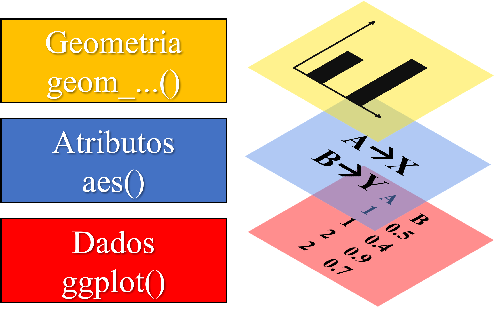
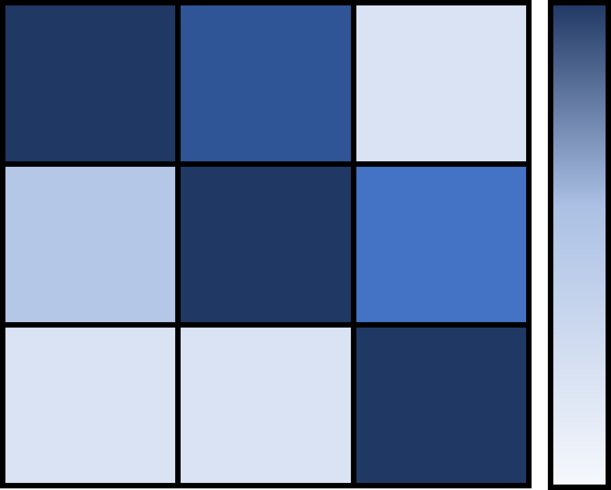

```{r setup, include=FALSE}
knitr::opts_chunk$set(paged.print=FALSE)
knitr::opts_chunk$set(echo=TRUE)
knitr::opts_chunk$set(error=FALSE)
knitr::opts_chunk$set(message=FALSE)
knitr::opts_chunk$set(warning=FALSE)
knitr::opts_chunk$set(tidy.opts = list(width.cutoff = 60), tidy = TRUE)
```

# Estatística descritiva

## Por que descrever os dados?

Geralmente a coluna de dados da nossa variável resposta é longa e abstrata. Logo, podemos resumir essas observações em medidas-resumo, para cada nível do fator associado a essa resposta, a fim de:

1.  Realizar uma análise exploratória para identificar padrões e/ou possíveis *outliers*.

2.  Resumir dados para criação de gráficos.

3.  Guiar a nossa estratégia de modelagem de dados.

{width="652"}

## Média

A medida de posicionamento possivelmente mais comum. É a soma das observações dividida pelo número de observações.

A função que realiza a média no R é:

$$
mean(x,...)
$$

-   **x** é o objeto com os dados e no caso de um *data frame*, deve-se especificar a coluna.

Exemplo:

```{r}
dados <- c(10,13,11,19,8,7) # vetor de dados fictícios
mean(dados) # média
```

## Variância

Variância mede quão homogêneos são nossos dados. Ou seja, quão, em média, estão próximos da média:

$$
Variância \;amostral=\frac {\sum^n_{i=1}(x_i-\bar{x})^2} {n-1}
$$

Para isso, é medida a distância entre cada observação e a média $(x_i-\bar{x})^2$ (ao quadrado, para anular os valores negativos), soma-se tudo ($\sum$) e faz a média ($/n-1$).

No R, essa fórmula realizada pela função:

$$
var(x,...)
$$

Exemplo:

```{r}
var(dados) # variância
```

## Desvio padrão

Como a variância usa as distâncias entre as observações a média **ao quadrado**, o resultado fica em uma escala diferente da dos dados, o que pode dificultar a interpretação, logo, tem-se o desvio padrão:

$$
DP \; amostral= \sqrt variância \;amostral
$$

O desvio padrão é apenas a raiz quadrada da variância, o que corrige a escala e deixa a medida de dispersão dos dados mais intuitiva.

No R a função do desvio padrão é:

$$
sd(x,...)
$$

Exemplo:

```{r}
sd(dados) # desvio padrão
```

## Coeficiente de variação

Uma forma de comparar experimentos com desvios e médias diferentes é dividindo um pelo outro. Assim, relativizamos essas duas medidas e teremos apenas uma. Essa é a ideia do Coeficiente de Variação (CV).

Para experimentos no campo da agronomia, a precisão experiemental pode ser classificada conforme o CV (%) (Gomes, 1987):

| Coeficiente de Variação - CV (%) | Precisão experimental |
|:--------------------------------:|:---------------------:|
|            CV \< 10%             |         Alta          |
|         10 \< CV \< 20%          |         Média         |
|         20 \< CV \< 30%          |         Baixa         |
|            CV \> 30%             |      Muito baixa      |

## Coeficiente de variação

No R, podemos calcular o CV(%) pela fórmula a seguir:

$$
CV({\%})=sd(x) / mean(x) * 100
$$

Exemplo:

```{r}
sd(dados)/mean(dados)*100 # CV(%)
```

## Medindo por nível de fator

Calcular medidas descritivas em uma coluna de dados é simples. Porém, geralmente precisamos calcular a medida de uma variável em função de outra - como a média em cada nível de um fator. Para isso:

$$
aggregate(x,data,FUN,...)
$$

-   **x** é o objeto no formato de fórmula:
    -   Em função de apenas um fator: **variável númerica \~ fator_1**

    -   Em função de múltiplos fatores: **variável númerica \~ fator_1 + fator_2 + ...**

    -   Várias variáveis em função de um fator: **cbind(V1, V2) \~ fator_1**
-   **data** é são seus dados.
-   **FUN** determina qual medida você quer computar: média (**FUN=mean**), desvio padrão (**FUN=sd**), assim como para qualquer outra função básica de manipulação do R.
    -   Para funções personalizadas, como a do CV(%): **FUN=function(x) sd(x)/mean(x)\*100**

## Exemplos no R - aggregate()

Experimento em campo para testar a compostagem de casca de café misturada ou não com esterco bovinos (variável esterco) em diferentes intervalos de revolvimento (variável revol).

```{r}
library(ExpDes.pt) # carregando o pacote com dados de exemplo (ex4)
dados <- ex4 # armazenando ex4 em "dados"
dados$revol <- as.factor(ex4$revol) # transformando a variável revol em fator
head(dados) # mostrando o começo dos dados
```

## Exemplos no R - aggregate()

```{r}
aggregate(c~revol+esterco, data=dados, FUN=mean) # média por nível
aggregate(cbind(c, zn)~revol, data=dados, FUN=mean) # média de duas variáveis por nível
```

## Exemplos no R - aggregate()

```{r}
aggregate(c~revol, data=dados, FUN=sd) # desvio padrão por nível
aggregate(c~revol, data=dados, FUN=function(x) sd(x)/mean(x)*100) # CV(%) por nível
```

## Resumindo os dados

Podemos resumir diversas colunas de uma só vez para termos uma ideia de como é são nossos dados. A função a seguir resume os níveis dos fatores, assim como gera medidas de posicionamento das colunas númericas

$$
summary(object, …)
$$

-   **Object** é o objeto com seus dados; porém, também pode-se utilizar outros objetos, como modelos de regressão, ANOVAs, entre outros.

Exemplo:

```{r}
summary(dados[1:6]) # resumo das colunas 1 a 6
```

# Representações gráficas

## Como criar gráficos no R?

Existem basicamente duas formas de criarmos gráficos no R:

1.  **Usando o R base**, ou seja, por meio de funções nativas: **plot()**, **barplot()**, **hist()**, entre outras.

    -   São gráficos mais simples; porém, ideais para avaliações rápidas de dados ou de modelos, pois não exigem pacotes extras.

2.  **Utilizando pacotes externos**, os quais precisam ser instalados, como os pacotes lattice e ggplot2.

    -   Geram gráficos visualmente mais elaborados, com muitas opções de gráficos e customizações e são ideais para apresentações.

{width="641"}

## Gráficos no R base - parâmetros gráficos

Antes de gerar um gráfico, podemos definir alguns parâmetros estéticos globais, que serão usados para todos os gráficos, como a cor do fundo, o tamanho das fontes, entre outros:

$$
par(mfrow,cex,pch,...)
$$

-   **mfrow** subdividi o painel gráfico para ter múltiplos gráficos em uma tela só. Para isso, deve-se fornecer um vetor com o número de linhas e colunas que seu painél terá (ex., **=c(2,2)**).

-   **cex** altera o tamanho da fonte de cada elemento do gráfico.

-   **pch** altera o simbolo usado no seu gráfico de disperção.

-   **...** como existem muitos parâmetros gráficos, utilize **?par()** para visualizar todos.

$*$ Atenção, se utilizar a função **par()**, ela irá alterar os parâmetros gráficos dos proximos gráficos. Para mudar apenas do gráfico que está construindo, use os argumentos diretamente dentro da função do gráfico.

## Gráficos no R base - dispersão, linha e box-plot

$$
plot(x,y,type,col,...)
$$

-   **x** e **y** são as variáveis que vão nesses respectivos eixos. Caso sejam ambas variáveis numéricas, será produzido um gráfico de dispersão, caso uma seja númerica e outra categórica, será feito um *box-plot*.

-   **type** determina se o gráfico será de pontos (**="p"**), linhas (**="l"**) ou ambos (**="b"**).

-   **col** altera a cor no gráfico. É um argumento exterior à essa função, porém que pode ser utilizado nela especificando uma variável categórica, para colorir conforme os níveis da categoria.

-   **...** existem diversas outros argumentos que podem ser utilizados para customizar o gráfico, como **main** (título), **xlab** e **ylab** (rótulo dos eixo). Digite **?plot()** no console para acessar todos.

## Exemplos no R - dispersão, linha e box

Experimento em campo para testar a compostagem de casca de café misturada ou não com esterco bovinos (variável esterco) em diferentes intervalos de revolvimento (variável revol).

```{r}
library(ExpDes.pt) # carregar pacote com dados de exemplo
dados <- ex4 # armazenar dados de exemplo (ex4) em "dados"
dados$revol <- as.factor(dados$revol) # transformar "revol" de numérico para fator
head(dados) # mostrar o começo dos dados
```

## Exemplos no R - dispersão, linha e box

```{r, out.width="60%"}
par(mfrow=c(1,3)) # definindo painél com uma linha e três colunas
plot(dados$c, dados$zn, col=dados$esterco, pch=19) # gráfico de dispersão
plot(dados$esterco, dados$c) # box-plot
plot(dados$c, type = "l") # gráfico de linhas
```

## Gráfico de interação

Gráfico para visualizar a interação de dois fatores em relação a variável resposta. A interação entre fatores ocorre quando as linhas se cruzam, pois significa que um fator afeta de forma diferente o outro.

```{r, out.width="60%", echo=FALSE}
par(mfrow=c(1,3))
cultivar <- gl(n = 2, k = 20, labels = c("a","b"))
tratamento <- rep(rep(c("sim","não"), each=10),2)

set.seed(1)
resp <- c(
  rnorm(n = 20, mean = rep(c(15,10), each =10)),
  rnorm(n = 20, mean = rep(c(10,15), each =10))
  )
dat <- data.frame(cultivar, tratamento, resp)

interaction.plot(x.factor = dat$tratamento, 
                 trace.factor = dat$cultivar,
                 response = dat$resp,
                 ylab="Média da resposta",
                 xlab="tratamento",
                 main="com interação",
                 trace.label = "Cultivar")


set.seed(12)
resp <- c(
  rnorm(n = 20, mean = rep(c(10,13), each = 10)),
  rnorm(n = 20, mean = rep(c(25,17), each = 10))
)

dat2 <- data.frame(cultivar, tratamento, resp)
interaction.plot(x.factor = dat2$tratamento, 
                 trace.factor = dat2$cultivar,
                 response = dat2$resp,
                 ylab="",
                 xlab="tratamento",
                 main="com interação",
                 trace.label = "Cultivar")

  
set.seed(12)
resp <- c(
  rnorm(n = 20, mean = rep(c(10,15), each = 10)),
  rnorm(n = 20, mean = rep(c(12,17), each = 10))
)

dat3 <- data.frame(cultivar, tratamento, resp)
interaction.plot(x.factor = dat3$tratamento, 
                 trace.factor = dat3$cultivar,
                 response = dat3$resp,
                 ylab="",
                 xlab="tratamento",
                 main="sem interação",
                 trace.label = "Cultivar")


```

## Gráficos no R base - gráfico de interação

$$
interaction.plot(x.factor, trace.factor, response, fun = mean,...)
$$

-   **x.factor** é o fator que irá no eixo x.

-   **trace.factor** é o o fator que será avaliado a mudança por nível.

-   **response** é a variável resposta, que irá no eixo y.

-   **fun** a forma com que você quer agrupar suas repetições.

## Exemplos no R - gráfico de interação

```{r}
interaction.plot(dados$revol, dados$esterco, dados$c) # gráfico de interação
```

## Gráficos no R base - colunas

$$
barplot(height,space,col,...)
$$

-   **height** é sua variável que irá no eixo y. Se for utilizar duas variáveis, uma numérica no eixo y e uma categórica no eixo x, especifique pela forma de função: **variável y \~ variável x**.

-   **space** é o espaço entre as barras.

-   **col** argumento exterior para colorir as colunas conforme os níveis de uma variável categórica.

$*$ Atenção, no caso de experimentos, em que há repetições, deve-se calcular a média das repetições conforme seu fator, para que tenha apenas uma coluna por nível desse fator.

## Exemplos no R - colunas

```{r, out.width="60%"}
media <- aggregate(c~revol, data=dados, FUN=mean) # calculando a média por nível de revol
barplot(media$c~media$revol) # gráfico de colunas
```

## Exemplos no R - colunas

```{r, out.width="55%"}
media <- aggregate(c~revol+esterco, data=dados, FUN=mean) # agrupando em médias
dados <- cbind(media[1:4,3], media[5:8,3]) # extraindo as médias
dados <- as.data.frame(t(dados)) # transformando em data frame
names(dados) <- c(paste(media[1:4,1], media[5:8,2])) # nomeando as colunas
barplot(as.matrix(dados), beside=TRUE, col=c("red", "blue")) # criando gráfico
legend('topright',fill=c("red", "blue"),legend=c('com esterco','sem esterco')) # adicionando legenda
```

# Pacote ggplot2

## Porque o ggplot2?

O pacote ggplot2 é um dos pacotes mais instalados no R e certamente o mais popular na elaboração de gráficos. Isso se deve a alguns pontos:

-   O pacote engloba uma quantidade muito grande de tipos de gráfico.

-   O pacote permite ampla customização: gráficos visualmente mais agradáveis.

-   Existem muitos pacotes que foram construidos como "auxiliares" do ggplot2, isso faz com que existam ainda mais opções para elaborar e customizar gráficos.

-   Permite a construção de gráficos de forma mais intuitiva que os outros pacotes, pois o gráfico é construido em **camadas**.

{width="130"}

## Estrutura básica do ggplot

A construção de um gráfico em camadas é um dos grandes responsáveis pela popularização do pacote. O ggplot é constituido por basicamente três elementos:

1.  Função base **ggplot()** que irá conter seus dados.

2.  Função **aes()**. Quem vai no eixo X e no Y? Devo separar por níveis? Essa função responde.

3.  Função iniciada por **geom\_...()** que representará a **geom**etria do seu gráfico, ou seja, seu formato.

{width="399"}

## Estrutura básica do ggplot - função aes()

$$
aes(x,\;y,\;color,\;fill,\; size,\;group,...)
$$

-   **x** e **y** são as variáveis que vão nos eixos.

-   **fill** e **color** são utilizado para atribuir uma cor ou preenchimento para cada categoria da variável que você especificou. Se for uma variável quantitativa, será criada uma escala de cor.

    -   *Fill* é para gráficos que possuam "espaço interno" preencher, como gráfico de colunas ou boxplot, já em pontos e linha usá-se *color*.

-   **size** é utilizado para atribuir uma escala de tamanho conforme a variável que você específicou.

-   **group** é utilizado para quando você não quer necessáriamente trocar a aparência do seu gráfico conforme uma variável, apenas sinaliziar que há grupos diferentes. Isso é comum quando se quer adicionar linhas múltiplas linhas de regressão.

## Estrutura básica do ggplot - função geom\_...()

| Tipo de gráfico | Descrição                                                 |       Função        | Exemplo                                      |
|:--------------:|-----------------------|:--------------:|-----------------|
|   Histograma    | Visualizar a distribuição de uma variável quantitativa.   | $geom\_histogram()$ | {width="80"}     |
|      Linha      | Mudança de uma variável através do tempo ou entre grupos. |   $geom\_line()$    | {width="80"}          |
|    Dispersão    | Relação entre duas variáveis quantitativas.               |    $geom\_point$    | {width="80"} |

## Estrutura básica do ggplot - função geom\_...()

| Tipo de gráfico | Descrição                                                                                           |      Função       | Exemplo                               |
|:-------------:|-----------------------------|:-------------:|---------------|
|   *Box-plot*    | Distribuição de uma variável sozinha ou em diferentes níveis de outra variável.                     | $geom\_boxplot()$ | {width="80"} |
|     Colunas     | Comparar valores individuais de diferentes categorias.                                              |   $geom\_col()$   | {width="80"}  |
|      Calor      | Intensidade de uma variável conforme a combinação das outras duas. Comum em gráficos de correlação. |  $geom\_tile()$   | {width="94"}   |

## Exemplo da estrutura do ggplot


## Exemplos no R - ggplot

Experimento em campo para testar a compostagem de casca de café misturada ou não com esterco bovinos (variável esterco) em diferentes intervalos de revolvimento (variável revol).

```{r}
library(ExpDes.pt) # carregar pacote com dados de exemplo
dados <- ex4 # armazenar dados de exemplo (ex4) em "dados"
dados$revol <- as.factor(dados$revol) # transformar "revol" de numérico para fator
head(dados) # mostrar o começo dos dados
```

## Exemplos no R - ggplot - box-plot

```{r, out.width="60%"}
library(ggplot2) # carregar o pacote ggplo2
ggplot(dados) + # especificar os dados
  aes(x=revol, y=c, fill=esterco) + # especificar os atributos
  geom_boxplot() # geometria box-plot
```

## Exemplos no R - ggplot - colunas

Como temos repetições, iremos calcular a média de "c" conforme cada combinação entre os fatores para criar o gráfico de colunas.

```{r}
medias <- aggregate(c~revol+esterco, data=dados, FUN=mean) # calculando a média
medias
```

## Exemplos no R - ggplot - colunas

```{r, out.width="60%"}
ggplot(medias) + # especificar os dados
  aes(x=revol, y=c, fill=esterco) + # especificar os atributos
  geom_col(position="dodge2") # geometria colunas
```

## Exemplos no R - ggplot - dispersão

```{r, out.width="60%"}
ggplot(dados) + # especificar os dados
  aes(x=zn, y=c, color=esterco) + # especificar os atributos
  geom_point() # geometria pontos
```

## Exemplos no R - ggplot - linhas

```{r, out.width="60%"}
ggplot(dados) + # especificar os dados
  aes(x=zn, y=c) + # especificar os atributos
  geom_line() # geometria linha
```

## Exemplos no R - ggplot - gráfico de interação

```{r, out.width="60%"}
ggplot(medias) + # especificar os dados
  aes(x=revol, y=c, color=esterco, group=esterco) + # especificar os atributos
  geom_line() # geometria linha
```

## Exemplos no R - ggplot - calor

```{r, out.width="60%"}
ggplot(dados) + # especificar os dados
  aes(x=revol, y=esterco, fill=c) +
  geom_tile() # geometria calor
```

## Adicionando mais camadas

Com a base do gráfico pronta, podemos adicionar mais camadas:

1.  **Painél gráfico:** para multiplos gráficos em uma só tela utilizando **facet_wrap()**.

2.  **Estatística:** como barras de erro, em gráficos de coluna ou pontos, pela função **geom_errorbar()** ou linha de regressão no gráfico de dispersão pela função **geom_smooth()**.

3.  **Personalização/estética:** como rótulos dos eixos, titulos, cor ou borda, por meio da função **theme()**.

{width="383"}

## Dividindo em painéis

Podemos separar nosso gráfico, em vários, por nível do fator usando:

$$
facet{\_}wrap(facets, nrow, ncol, scales,...)
$$

-   **facets** é a variável usada para dividir seu painel. Pode ser especificada de duas formas:

    -   Formato de "fórmula": **\~variável1\*variável2**

    -   Pela função: **vars(variável1, variável2)**

-   **nrow** e **ncol** especifica o número de linhas e/ou colunas que deve-se dividir o painel.

-   **scales** controla se o eixo deve (**="fixed"**) ou não (**="free"**) ser o mesmo entre os gráficos na mesma linha/coluna.

## Exemplos no R - dividindo em painéis

```{r, out.width="60%"}
ggplot(dados) + # especificar os dados
  aes(x=revol, y=c, fill = revol) + # especificar os atributos
  geom_boxplot() + # geometria box-plot
  facet_wrap(vars(esterco), nrow=2, ncol=1, scales="fixed") # mesmo resultado com facet_wrap(~esterco)
```

## Adicionando estatística - linha de regressão

$$
geom{\_}smooth(method, formula,se=TRUE,...)
$$

-   **method** é o tipo de regressão: lm, glm, loess (regressão móvel).

-   **fórmula** é como seus dados x e y estão associados e, assim, determina como será a linha de regressão.

    -   Reta: **formula=y \~ x**

    -   Polinomial de ordem 2: **formula=y \~ poly(x,2)**

    -   logarítica: **fórmula=y \~ log(x)**

-   **se** determina se deve (**=TRUE**) ou não (**=FALSE**) mostrar o intervalo de confiança.

## Exemplo no R - linha de regressão

```{r, out.width="60%"}
ggplot(dados) + # especificar os dados
  aes(x=zn, y=c, color=esterco) + # especificar os atributos
  geom_point() + # geometria pontos
  geom_smooth(method="lm", formula=y~x) # adicionando regressão
```

## Adicionando estatística - fórmula e $R^2$

A maneira mais simples de adicionar a fórmula da linha de regressão e seu respectivo $R^2$ é pelo pacote **ggpmisc**:

```{r eval=FALSE}
install.packages("ggpmisc")
```

$$
stat{\_}poly{\_}eq(formula, aes(label=after{\_}stat(eq.label)),...)
$$

-   **formula** é a mesma fórmula usada na função **geom_smooth()**.

-   Na função **aes()**, adicionamos o rótulo (**label=**) e o argumento **after_stat(eq.label)**, para adicionar a fórmula ou **after_stat(rr.label)**, para o $R^2$. Para adicionar ambos, usa-se como auxílio a função **paste():**

    -   **aes(label = paste(after_stat(eq.label), after_stat(rr.label), sep = "\*\\", \\"\*"))**

## Exemplo no R - Adicionando fórmula e $R^2$

```{r, out.width="60%"}
library(ggpmisc) # carregar pacote
ggplot(dados) + # especificar dados
  aes(x=zn, y=c, color=esterco) + # especificar atributos
  geom_point()+ # geometria pontos
  geom_smooth(method="lm", formula=y~x)+ # linha de regressão
  stat_poly_eq(formula=y~x,aes(label = paste(after_stat(eq.label), after_stat(rr.label), sep = "*\", \"*"))) # adicionar fórmula e R2
```

## Adicionando estatística - barras de erro

$$
geom{\_}errorbar(aes(ymin, ymax), width, position,...)
$$

-   Na função **aes()** adicionamos os valores mínimos (**ymin**) e máximos (**ymax**) das nossas barras de erro.

    -   ymin é a média - desvio padrão e ymax é a média + desvio padrão.

-   **width** é um elemento estético que representa a largura da barras inferior e superior da barra de erro.

-   **position** é usado para experimentos fatoriais para evitar que barras do mesmo fator se sobreponham.

    -   Para gráficos com dois fatores, pode-se usar: **position = position_dodge(width = 0.9)**

## Exemplo no R - barras de erro

A barra de erro é nada mais que a média + ou - o desvio padrão, logo, vamos calculá-los primeiro:

```{r}
media <- aggregate(c~revol+esterco, data=dados, FUN=mean) # calculando a média
sd <- aggregate(c~revol+esterco, data=dados, FUN=sd) # calculando o desvio padrão
resumo <- data.frame(revol=media$revol, esterco=media$esterco, media=media$c, sd=sd$c) # juntando a média e desvio em um novo objeto
resumo # mostrar resumo
```

## Exemplo no R - barras de erro

```{r, out.width="55%"}
ggplot(resumo)+ # especificar os dados
  aes(x=revol, y=media, fill=esterco)+ # especificar os atributos
  geom_col(position="dodge2")+ # geometria barras
  geom_errorbar(aes(ymin = media-sd, ymax = media+sd),  width = 0.2,
  position = position_dodge(width = 0.9)) # barras de erro
```

## Personalizando o gráfico

Existem basicamente três funções para alterar a estética do gráfico

-   **labs()** usada para renomear os elementos do gráfico (eixo, títulos e legenda)

-   **theme()** usada para alterar os elementos do gráfico como fundo, bordas, fonte dos titulos e eixos.

-   **scale_color_manual()** e **scale_fill_manual()** usado para alterar a paleta de cores manualmente.

## Personalizando o gráfico - renomear rótulos

$$
labs(title, subtitle, x, y,tag,fill, color,... )
$$

-   **title** e **subtitle** definem o título e o subtítulo do gráfico.

-   **x** e **y** são os rótulos dos eixos.

-   **tag** é o rótulo usado para indicar o gráfico.

-   **fill** e **color** são usados para mudar o rótulo da legenda, dependendo de qual dos dois você usou na função **aes()**.

## Personalizando o gráfico - temas

$$
theme(legend.position,text,...)
$$

-   **text** altera a fonte dos elementos de texto do gráfico e deve-se utilizar a função **element_text()** em conjunto. Como por exemplo: **text=element_text(size=14)**.

    -   consulte **?element_text()** para ver mais argumentos para customizar o texto.

-   **legend.position** define se a legenda deve aparecer em cima (**="top"**), embaixo (**="bottom"**), na esquerda (**="left"**) ou direita (**="right"**), ou não aparecer (**="none"**).

## Personalizando o gráfico - temas pré-elaborados

Existem temas pré-elaborados que alteram diversos parâmetros estéticos do gráfico de uma só vez e são muito interessantes para manter um padrão na hora de apresentar e/ou publicar.

$$
theme{\_}classic(baze{\_}size,...)
$$

-   **base_size** altera o tamanho de todos os elementos textuais de uma só vez.

-   Use **?theme_classic()** no console para visualizar todos os temas pré-elaborados.

{width="712"}

## Personalizando o gráfico - cores

$$
scale{\_}color{\_}manual(values,...)
$$

$$
scale{\_}fill{\_}manual(values,...)
$$

-   **values** representa é um vetor indicando as cores de cada nível, como: **=c("black", "grey")**

Existem funções de paletas de cor/preenchimento pré-elaboradas, como é o caso da **scale_color_grey()**, que pode ajudar quando temos muitos níveis.

## Exemplos no R - personalizando gráfico

```{r, out.width="50%"}
ggplot(resumo)+ # especificar os dados
  aes(x=revol, y=media, fill=esterco)+ # especificar os atributos
  geom_col(position="dodge2")+ # geometria colunas
  theme_classic(base_size=14)+ # tema pré-estabelecido e fonte 14
  labs(x="revolvimento", y="carbono", fill="presença de esterco")+ # rótulos
  theme(legend.position = "top")+ # posição da legenda
  scale_fill_manual(values = c("black","grey")) # mudar cores das colunas
```

## Salvando o gráfico

$$
ggsave(file,width,  height,dpi=300,...)
$$

-   **file** é o nome do seu arquivo e a **extensão** (**="gráfico.png"**).

-   **width** e **height** personalizam o comprimento e altura da imagem.

-   **dpi** define a resolução, que por padrão é 300 dpi.

$*$ Atenção! O arquivo será salvo no seu diretório.

Exemplo:

```{r, eval=FALSE}
ggsave("gráfico_colunas.tiff") # salvando
```

## Pacote esquisse

O pacote **esquisse** veio para facilitar a vida de quem precisa elaborar gráficos!

O pacote é uma interface interativa para criação de gráficos ggplot2, onde você pode alterar seu gráfico, seja nos dados ou na aparencia em **tempo real**.

Mas se estou mudando "manualmente" meu gráfico isso não torna minha análise irreprodutível? Essa é a melhor parte! Os códigos do gráfico gerado são fornecidos e você pode acrescentá-los na sua análise.

```{r, eval= FALSE}
install.package("esquisse")
```

{width="219"}

## Pacote esquisse

A funçao do pacote esquisse responsável por abrir o painel interativo com seus dados é:

$$
esquisser(data,...)
$$

-   **data** é o objeto com seus dados.

Exemplo:

```{r, eval=FALSE}
library(esquisse) # carregar pacote esquisse
library(ExpDes.pt) # carregar pacote com os dados de exemplo (ex4)
dados <- ex4 # armazenar dados de exemplo em "dados"
esquisser(dados) # abrir painel interativo do esquisse
```

## Exemplos no R - pacote esquisse

{width="829"}

## Mais informações

-   O site "r-graph-gallery" possui informações de gráficos tanto em Rbase quanto para ggplot2

[https://r-graph-gallery.com/](https://r-graph-gallery.com/base-R.html)

-   O livro R graphics CookBook (2nd ed) é referência, ensina a criar e manipular gráficos de diversas maneiras e se baseia no pacote ggplot2. O livro é totalmente gratuito online:

<https://r-graphics.org/>

-   Artigo com um resumo das principais funções de personalização estética para ggplot2

<http://www.sthda.com/english/articles/32-r-graphics-essentials/125-ggplot-cheat-sheet-for-great-customization/>

## Referências

Gomes, F. P. Curso de estatística experimental (12 ed.). ESALQ, 1987, 467p.

## Códigos

```{r, eval=FALSE}
### Estatística descritiva
dados <- c(10,13,11,19,8,7) # vetor de dados fictícios
mean(dados) # média
var(dados) # variância
sd(dados) # desvio padrão
sd(dados)/mean(dados)*100 # CV(%)
library(ExpDes.pt) # carregando o pacote com dados de exemplo (ex4)
dados <- ex4 # armazenando ex4 em "dados"
dados$revol <- as.factor(ex4$revol) # transformando a variável revol em fator
head(dados) # mostrando o começo dos dados
aggregate(c~revol+esterco, data=dados, FUN=mean) # média por nível
aggregate(cbind(c, zn)~revol, data=dados, FUN=mean) # média de duas variáveis por nível
aggregate(c~revol, data=dados, FUN=sd) # desvio padrão por nível
aggregate(c~revol, data=dados, FUN=function(x) sd(x)/mean(x)*100) # CV(%) por nível
summary(dados[1:6]) # resumo das colunas 1 a 6

### Representações gráficas
## gráficos no R base
library(ExpDes.pt) # carregar pacote com dados de exemplo
dados <- ex4 # armazenar dados de exemplo (ex4) em "dados"
dados$revol <- as.factor(dados$revol) # transformar "revol" de numérico para fator
head(dados) # mostrar o começo dos dados
par(mfrow=c(1,3)) # definindo painél com uma linha e três colunas
plot(dados$c, dados$zn, col=dados$esterco, pch=19) # gráfico de dispersão
plot(dados$esterco, dados$c) # box-plot
plot(dados$c, type = "l") # gráfico de linhas
interaction.plot(dados$revol, dados$esterco, dados$c) # gráfico de interação
media <- aggregate(c~revol, data=dados, FUN=mean) # calculando a média por nível de revol
barplot(media$c~media$revol) # gráfico de colunas
media <- aggregate(c~revol+esterco, data=dados, FUN=mean) # agrupando em médias
dados <- cbind(media[1:4,3], media[5:8,3]) # extraindo as médias
dados <- as.data.frame(t(dados)) # transformando em data frame
names(dados) <- c(paste(media[1:4,1], media[5:8,2])) # nomeando as colunas
barplot(as.matrix(dados), beside=TRUE, col=c("red", "blue")) # criando gráfico
legend('topright',fill=c("red", "blue"),legend=c('com esterco','sem esterco')) # adicionando legenda
## gráficos no ggplot2
library(ExpDes.pt) # carregar pacote com dados de exemplo
dados <- ex4 # armazenar dados de exemplo (ex4) em "dados"
dados$revol <- as.factor(dados$revol) # transformar "revol" de numérico para fator
head(dados) # mostrar o começo dos dados
library(ggplot2) # carregar o pacote ggplo2
ggplot(dados) + # especificar os dados
  aes(x=revol, y=c, fill=esterco) + # especificar os atributos
  geom_boxplot() # geometria box-plot
medias <- aggregate(c~revol+esterco, data=dados, FUN=mean) # calculando a média
medias # mostrando as medias
ggplot(medias) + # especificar os dados
  aes(x=revol, y=c, fill=esterco) + # especificar os atributos
  geom_col(position="dodge2") # geometria colunas
ggplot(dados) + # especificar os dados
  aes(x=zn, y=c, color=esterco) + # especificar os atributos
  geom_point() # geometria pontos
ggplot(dados) + # especificar os dados
  aes(x=zn, y=c) + # especificar os atributos
  geom_line() # geometria linha
ggplot(medias) + # especificar os dados
  aes(x=revol, y=c, color=esterco, group=esterco) + # especificar os atributos
  geom_line() # geometria linha
ggplot(dados) + # especificar os dados
  aes(x=revol, y=esterco, fill=c) +
  geom_tile() # geometria calor
ggplot(dados) + # especificar os dados
  aes(x=revol, y=c, fill = revol) + # especificar os atributos
  geom_boxplot() + # geometria box-plot
  facet_wrap(vars(esterco), nrow=2, ncol=1, scales="fixed") # mesmo resultado com facet_wrap(~esterco)
ggplot(dados) + # especificar os dados
  aes(x=zn, y=c, color=esterco) + # especificar os atributos
  geom_point() + # geometria pontos
  geom_smooth(method="lm", formula=y~x) # adicionando regressão
install.packages("ggpmisc") # instalar pacote ggpmisc
library(ggpmisc) # carregar pacote
ggplot(dados) + # especificar dados
  aes(x=zn, y=c, color=esterco) + # especificar atributos
  geom_point()+ # geometria pontos
  geom_smooth(method="lm", formula=y~x)+ # linha de regressão
  stat_poly_eq(formula=y~x,aes(label = paste(after_stat(eq.label), after_stat(rr.label), sep = "*\", \"*"))) # adicionar fórmula e R2
media <- aggregate(c~revol+esterco, data=dados, FUN=mean) # calculando a média
sd <- aggregate(c~revol+esterco, data=dados, FUN=sd) # calculando o desvio padrão
resumo <- data.frame(revol=media$revol, esterco=media$esterco, media=media$c, sd=sd$c) # juntando a média e desvio em um novo objeto
resumo # mostrar resumo
ggplot(resumo)+ # especificar os dados
  aes(x=revol, y=media, fill=esterco)+ # especificar os atributos
  geom_col(position="dodge2")+ # geometria barras
  geom_errorbar(aes(ymin = media-sd, ymax = media+sd),  width = 0.2,
  position = position_dodge(width = 0.9)) # barras de erro
ggplot(resumo)+ # especificar os dados
  aes(x=revol, y=media, fill=esterco)+ # especificar os atributos
  geom_col(position="dodge2")+ # geometria colunas
  theme_classic(base_size=14)+ # tema pré-estabelecido e fonte 14
  labs(x="revolvimento", y="carbono", fill="presença de esterco")+ # rótulos
  theme(legend.position = "top")+ # posição da legenda
  scale_fill_manual(values = c("black","grey")) # mudar cores das colunas
ggsave("gráfico_colunas.tiff") # salvando
install.package("esquisse") # instalando pacote esquisse
library(esquisse) # carregar pacote esquisse
library(ExpDes.pt) # carregar pacote com os dados de exemplo (ex4)
dados <- ex4 # armazenar dados de exemplo em "dados"
esquisser(dados) # abrir painel interativo do esquisse
```
