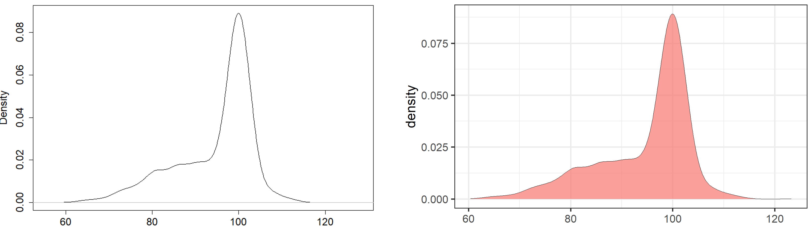
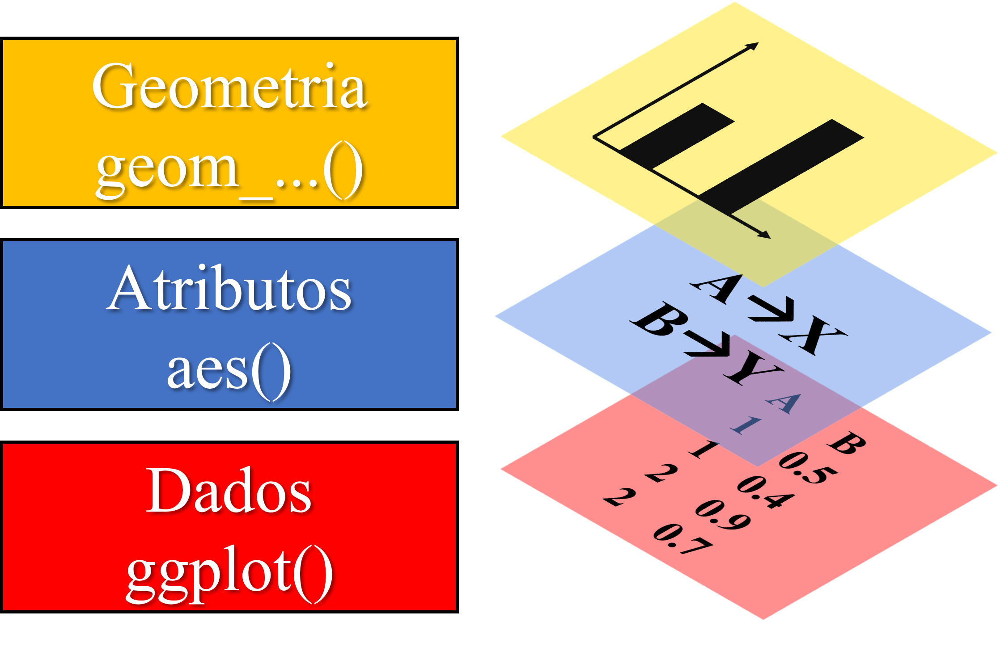
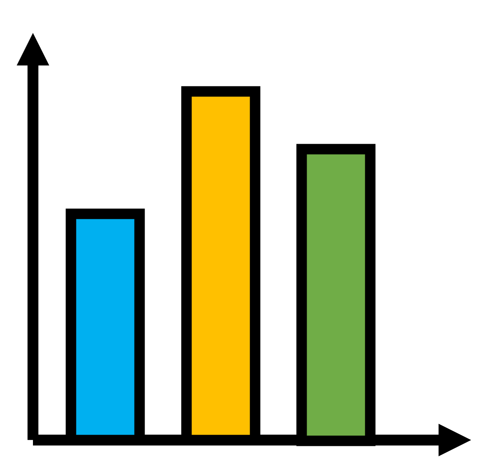
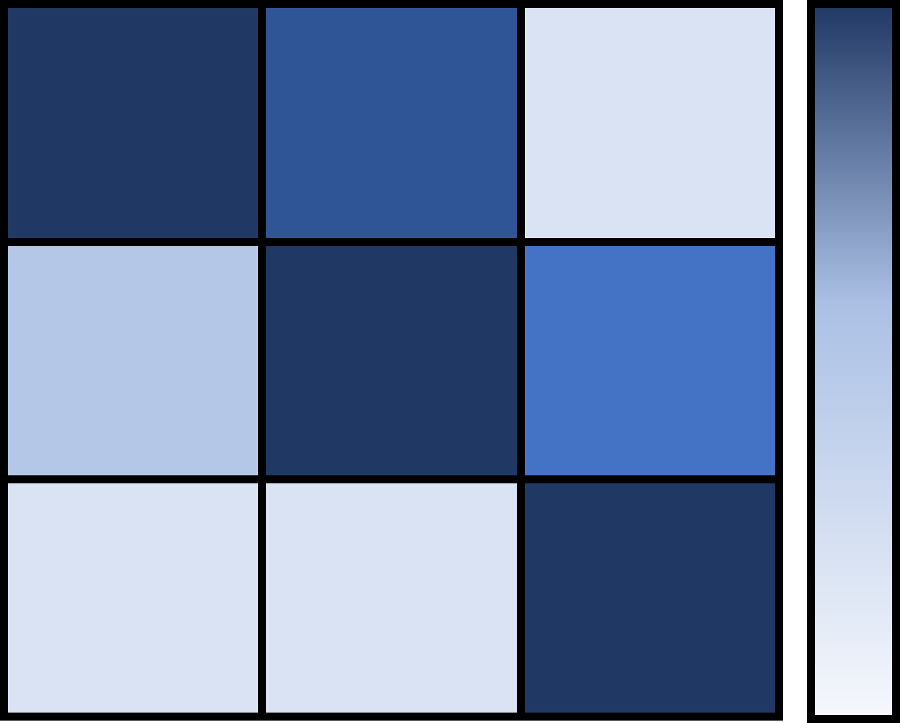
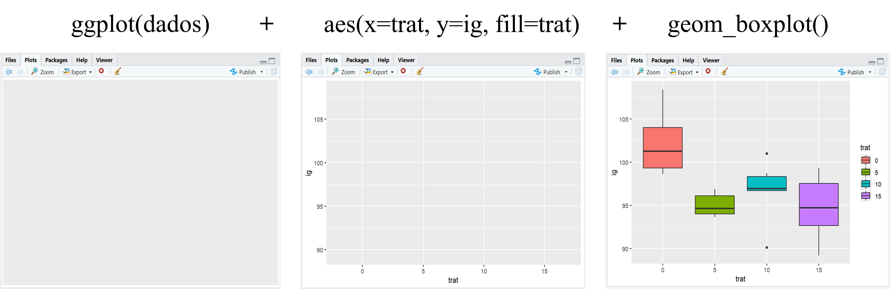

```{r setup, include=FALSE}
knitr::opts_chunk$set(paged.print=FALSE)
knitr::opts_chunk$set(echo=TRUE)
knitr::opts_chunk$set(error=FALSE)
knitr::opts_chunk$set(message=FALSE)
knitr::opts_chunk$set(warning=FALSE)
knitr::opts_chunk$set(tidy.opts = list(width.cutoff = 60), tidy = TRUE)
```

# Estatística descritiva

## Por que descrever os dados?

1.  Análise exploratória.

2.  Resumir dados.

3.  Guiar a modelagem dos dados.

4.  Identificar possíveis anomalias.

## Resumindo os dados

$$
summary(object, …)
$$

```{r}
library(ExpDes.pt) # carregando o pacote com dados de exemplo (ex4)
dados <- ex4 # armazenando ex4 em "dados"
dados$revol <- as.factor(ex4$revol) # transformando a variável revol em fator
summary(dados[1:7]) # resumo das colunas 1 a 7
```

## Medidas de posição

$$
aggregate(x,FUN,...)
$$

-   **x** deve ser escrito em forma de função, ou seja, se você quer calcular al

## Medidas de dispersão

# Visualização de dados

## Como criar gráficos no R?

Existem basicamente duas formas de criarmos gráficos no R:

1.  Usando o R base, ou seja, por meio de funções pré-instaladas: plot(), line(), hist(), entre outras.

2.  Utilizando pacotes externos, os quais precisam ser instalados. Os mais utilizados são o pacote lattice e ggplot2.

## Qual a melhor forma de criar gráficos no R?

Os gráficos do R base, são visualmente mais simples e mais difíceis de manipular quando buscamos elaborar gráficos mais elaborados.

Porém para avaliações rápidas a fim de explorar os dados ou nosso modelo, eles são ótimos, pois não é necessário carregar pacotes, além de serem mais "diretos", ou seja, sem a necessidade de especificar muitos argumentos.

{width="1062"}

# Pacote ggplot2

## Porque o ggplot2?

O pacote ggplot2 é um dos pacotes mais instalados no R e certamente o mais popular na elaboração de gráficos. Isso se deve a alguns pontos:

-   O pacote engloba um uma quantidade muito grande de tipos de gráficos.

-   O pacote permite a customização dos gráficos de diversas maneiras, o que os torna os gráficos visualmente mais agradáveis.

-   Existem muitos pacotes que foram construidos como "auxiliares" do ggplot2, isso faz com que existam ainda mais opções para elaborar e customizar gráficos.

-   Permite a construção de gráficos de forma mais intuitiva que os outros pacotes, pois o gráfico é construido em **camadas**.

{width="130"}

## Estrutura básica do ggplot

A construção de um gráfico em camadas é um dos grandes responsáveis pela popularização do pacote. O ggplot é constituido por basicamente três elementos:

1.  Função base **ggplot()** que irá conter seus dados.

2.  Função **aes()**, responsável por mostrar como seus dados serão distribuidos no gráfico.

3.  Função iniciada por **geom\_...()** que representará a **geom**etria do seu gráfico, ou seja, seu formato.

{width="330"}

## Estrutura básica do ggplot - Função aes()

Quem vai no eixo X e no Y? Devo separar por níveis? Essas questões que a função **aes()** responde.

Principais argumentos da função aes()

| Col1  | Col2                           | Col3 |
|-------|--------------------------------|------|
| x     | variável que irá no eixo x e y |      |
| y     | variável que irá no eixo y     |      |
| fill  | Preencher com cores            |      |
| color | Colorir                        |      |
| group |                                |      |
|       |                                |      |
|       |                                |      |
|       |                                |      |

## Estrutura básica do ggplot - Função geom\_...()

O tipo de gráfico depende da categoria da suas variáveis e o tipo de informação que você busca. O ggplot possui muitos tipos de gráficos e o nome da função geralmente é **geom\_** + o tipo de gráfico:

| Tipo de gráfico | Descrição                                                              |          Função          | Exemplo                                      |
|:------------:|---------------------------|:------------:|-----------------|
|   Histograma    | Usado em apenas uma variável para visualizar sua distribuição.         | \$geom\\\_histogram() \$ | {width="80"}     |
|      Linha      | Acompanhar a mudança de uma variável através do tempo ou entre grupos. |      $geom\_line()$      | {width="80"}          |
|    Dispersão    | Identificar a relação entre duas variáveis quantitativas.              |      $geom\_point$       | {width="80"} |

## Estrutura básica do ggplot - Função geom\_...()

| Tipo de gráfico | Descrição                                                                                                                      |      Função       | Exemplo                               |
|:----------:|-------------------------------------|:----------:|------------|
|   *Box-plot*    | Usado para visualizar a distribuição de uma variável em diferentes categorias.                                                 | $geom\_boxplot()$ | {width="80"} |
|     Colunas     |                                                                                                                                |   $geom\_col()$   | {width="80"}  |
|      Calor      | Usado para três variáveis: intensidade de uma variável conforme a combinação das outras duas. Comum em gráficos de correlação. |  $geom\_tile()$   | {width="94"}   |

## Exemplo da estrutura do ggplot



## Exemplos no R - ggplot

Experimento em campo para testar a compostagem de casca de café misturada ou não com esterco bovinos (variável esterco) em diferentes intervalos de revolvimento (variável revol).

```{r}
library(ExpDes.pt) # carregar pacote com dados de exemplo
dados <- ex4 # armazenar dados de exemplo (ex4) em "dados"
dados$revol <- as.factor(dados$revol) # transformar "revol" de numérico para fator
head(dados) # mostrar o começo dos dados
```

## Exemplos no R - ggplot - Box-plot

```{r, out.width="80%"}
library(ggplot2) # carregar o pacote ggplo2
ggplot(dados) + # especificar os dados
  aes(x=revol, y=c, fill=esterco) + # especificar os atributos
  geom_boxplot() # definir a geometria
```

## Exemplos no R - ggplot - Colunas

Como temos repetições, iremos calcular a média de "c" conforme cada combinação entre os fatores para criar o gráfico de barras.

```{r}
medias <- aggregate(c~revol*esterco, data=dados, FUN=mean) # calculando a média
medias
```

## Exemplos no R - ggplot - Colunas

```{r, out.width="80%"}
ggplot(medias) + # especificar os dados
  aes(x=revol, y=c, fill=esterco) + # especificar os atributos
  geom_col(position="dodge2") # definir a geometria
```

## Exemplos no R - ggplot - Dispersão

Gráfico de dispersão para avaliar a relação entre carbono (C) e zinco (Zn) conforme a adição ou não de esterco na compostagem.

```{r, out.width="80%"}
ggplot(dados) + # especificar os dados
  aes(x=zn, y=c, color=esterco) + # especificar os atributos
  geom_point() # definir a geometria
```

## Exemplos no R - ggplot - linhas

```{r, out.width="80%"}
dados$rep <- as.factor(dados$rep)
ggplot(dados) +
  aes(x=zn, y=c) +
  geom_line()
```

## Exemplos no R - ggplot - linhas

### Interação entre grupos

Pelo gráfico de linhas, podemos ver como as médias se comportam nos diferentes níveis de um fator, a fim de indentificarmos se há indícios de interação entre fatores. A interação entre fatores ocorre quando as linhas se cruzam, pois significa que um fator afeta de forma diferente o outro.

```{r, out.width="80%"}
ggplot(medias) +
  aes(x=revol, y=c, color=esterco, group=esterco) +
  geom_line()
```

## Exemplos no R - ggplot - Calor

Gráfico de calor para avaliar a variação da quantidade de carbono nos diferentes tratamentos.

```{r, out.width="80%"}
ggplot(dados) +
  aes(x=revol, y=esterco, fill=c) +
  geom_tile()
```

## Adicionando mais camadas

### Dividindo em painéis: facet_wrap

Podemos separar nosso gráfico por nível do nosso fator usando facet_wrap()

```{r}
ggplot(dados) +
  aes(x=revol, y=c, fill = revol) +
  geom_boxplot() +
  facet_wrap(vars(esterco))
```

### Adicionando estatística

geom_smooth()

geom_errorbar

## Pacote esquisse

O pacote esquisse veio para facilitar a vida de quem precisa elaborar gráficos.

## Mais informações

-   O site "r-graph-gallery" possui informações de gráficos tanto em Rbase quanto para ggplot2

[https://r-graph-gallery.com/](https://r-graph-gallery.com/base-R.html)

-   O livro R graphics CookBook (2nd ed) é referência, ensina a criar e manipular gráficos de diversas maneiras e se baseia no pacote ggplot2. O livro é totalmente gratuito online:

<https://r-graphics.org/>
