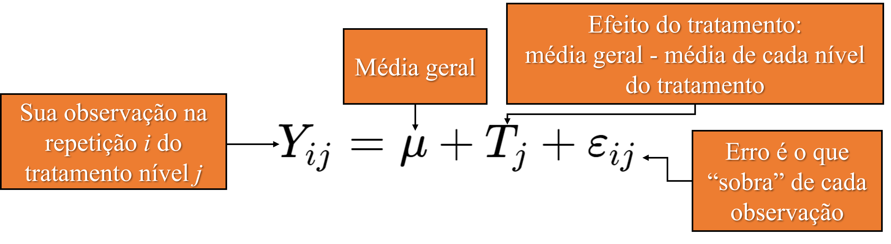
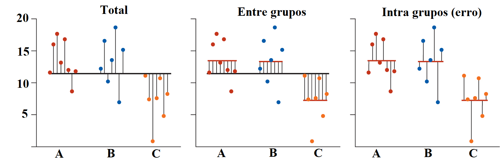
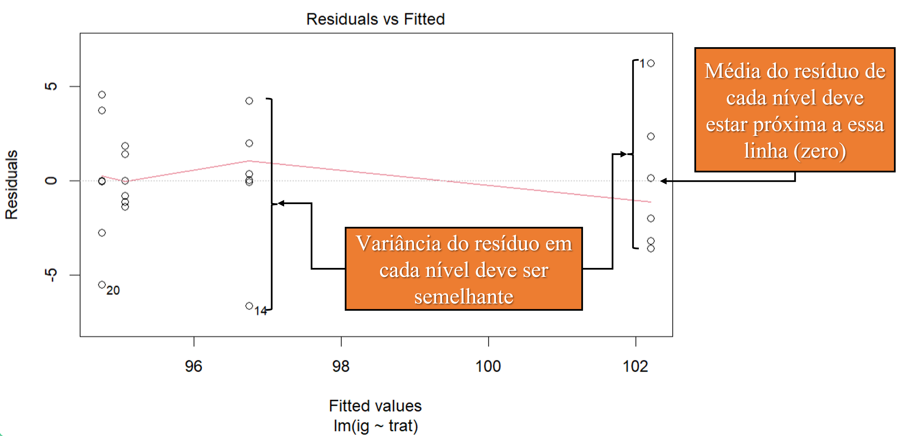
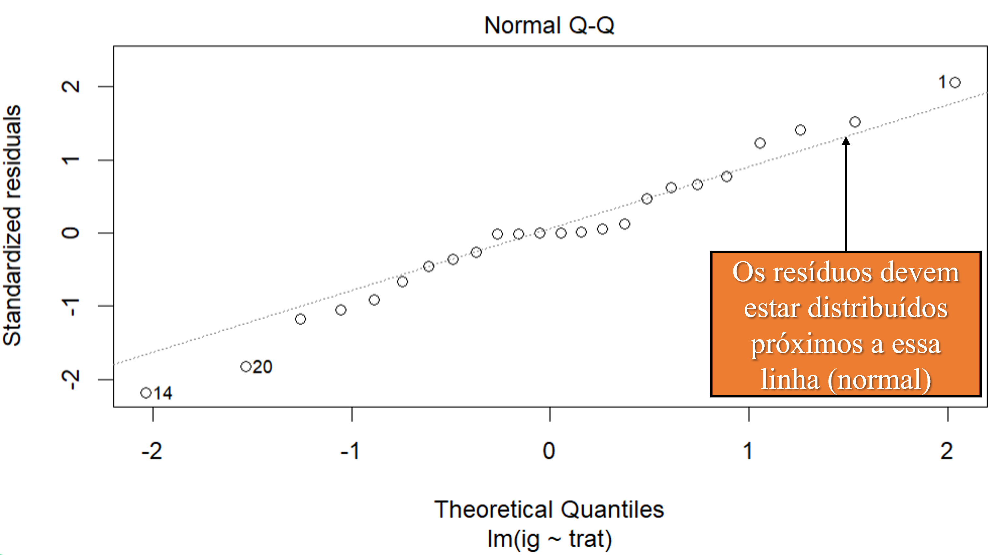
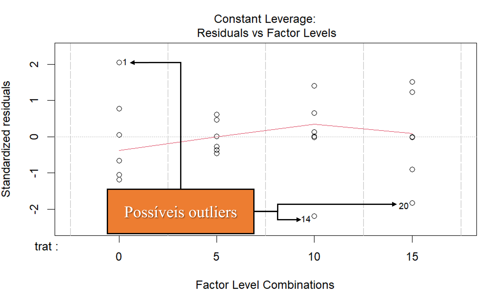
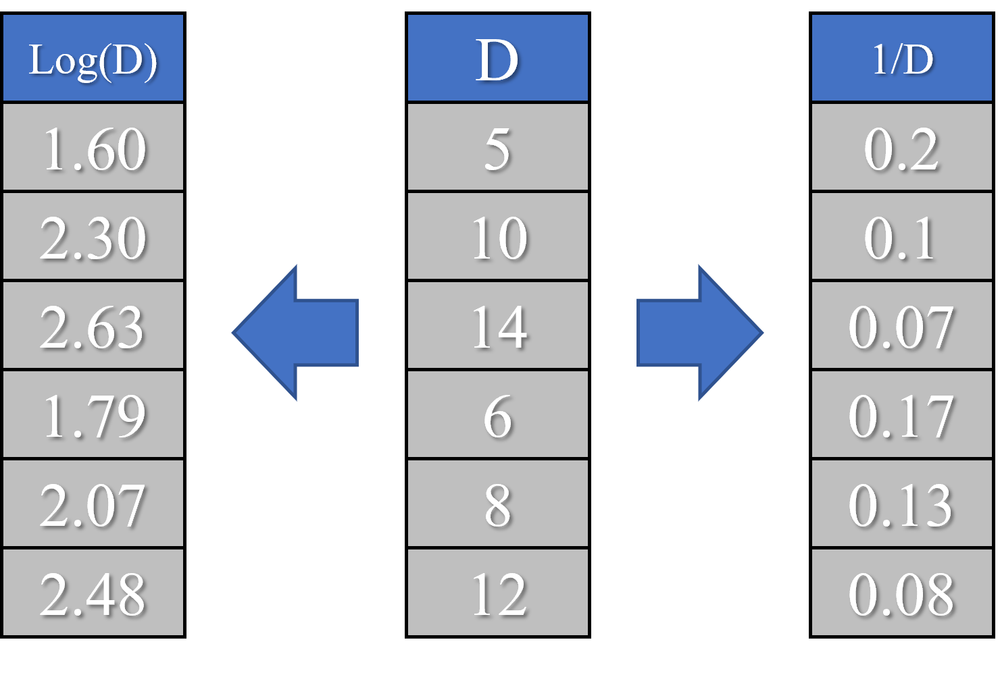
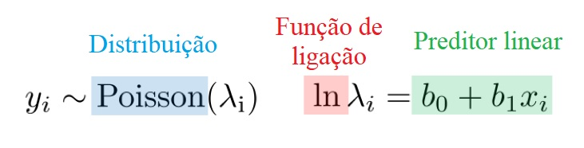
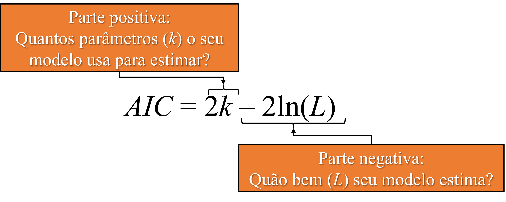

```{r setup, include=FALSE}
knitr::opts_chunk$set(paged.print=FALSE)
knitr::opts_chunk$set(echo=TRUE)
knitr::opts_chunk$set(error=FALSE)
knitr::opts_chunk$set(message=FALSE)
knitr::opts_chunk$set(warning=FALSE)
knitr::opts_chunk$set(tidy.opts = list(width.cutoff = 60), tidy = TRUE)
```

# Delineamento

## Delineamento Inteiramente Casualizado (DIC)

**Delineamento** é o controle do pesquisador sobre o experimento. Quando um local é homogêneo, não é necessário controlar onde serão colocadas as repetições e tratamentos, esses, podem *apenas* serem distribuidos aleatóriamento no local. Isso é im DIC.

O modelo para determinar o valor de cada observação é:

{width="911"}

$*$ **Importante:** como vamos estimar a média de cada tratamento, é importante que os erros sejam **normais**, ou seja, estejam distribuidos de forma igual entorno da média do tratamento.

## Delineamento Inteiramente Casualizado (DIC)

Como supomos que os erros são normalmente distriuidos, podemos estimar a média de cada tratamento usando a média geral e o efeito do tratamento:

$$
\mu_j=\mu+T_j
$$

## Exemplo

Veja esse exemplo de um experimento com consumo de 5 doses de farinha (0, 5, 10,15), onde foi medido o índice glicemico em animais.

```{r, echo = F, out.width="50%"}
library(ExpDes.pt);library(ggplot2)
dados <- ex1 # carregar os dados (ex1) armazenar em "dados"
dados$trat <- as.factor(dados$trat)
p <- ggplot(data=dados, aes(trat, ig,))+geom_point()
p <- p + geom_hline(aes(yintercept = mean(ig)))
p + stat_summary(fun = "mean", colour = "red", size = 6, geom = "point") + theme_classic(base_size = 20) + labs(x="tratamento", y="índice glicemico")
```

A média geral (linha horizontal) é: $97.2$, esse é nosso $\mu$. Já a média **por** tratamento (ponto vermelho), é: dose 0 = $102.2$; dose 5 = $95.1$; dose 10 = $96.7$; dose 15 = $94.7$. Ou seja, dependendo do tratamento, a média dele é maior ou menor que nossa média geral, o quanto maior ou menor é o nosso **efeito do tratamento** ($T_j$). Por exemplo: o efeito da dose 0 é aumentar $5$ unidades da média geral ($97.2 - 102.2$).

## Exemplo no R - DIC fatorial simples

### $1^{\circ}$ Carregando os dados

```{r}
library(ExpDes.pt) # carregar o pacote que tem os dados de exemplo (ex1)
dados <- ex1 # carregar ex1 armazenar em "dados"
dados$trat <- as.factor(dados$trat) # Entender que "trat" é um fator e não números
head(dados) # mostrar só o começo (head) dados
```

## Exemplo no R - DIC fatorial simples

### $2^{\circ}$ Criando o modelo

$$
lm(formula, data,...)
$$

**lm()** significa *linear models* e nela podemos inserir a fórmula do DIC: **Resposta\~Tratamento** ($\mu_j=T_j$).

$*$ **Importante!** Ao invés do R utilizar a fórmula para estimar a média $\mu_j=\mu+T_j$. O R utiliza ela de forma simplificada, sem a média geral: $\mu_j=T_j$. Dessa maneira, **o primeiro nível é usado como base o efeito dos demais níveis são somados a ele.**

## Exemplo no R - DIC fatorial simples

### $2^{\circ}$ Criando o modelo

```{r}
lm(ig~trat, data = dados) # criando modelo
```

Repare, $102.198$ ("intercept") é a média da dose 0, ele foi utilizado como "base", trat5 é a diferença entre a média da dose 0 e a média da dose 5, ou seja, $95.058 - 102.198 = -7.140$.

## DIC fatorial duplo

Quando temos mais tratamentos na nossa pesquisa, devemos inserir não só o efeito desses tratamentos, mas também o efeito da interação:

$$
 \mu_{jh}=\mu+T_j+T_h+T_J*T_h
$$ A média ($\mu$) no nível $j$ do seu primeiro tratamento e no nível $h$ do seu segundo tratamento é igual a média geral somada aos **efeitos simples** dos tratamentos, assim como o **efeito da interação** deles.

## Exemplo no R - DIC fatorial duplo

### $1^{\circ}$ Carregando os dados

Experimento em campo para testar a compostagem de casca de café misturada ou não com esterco bovinos (variável esterco) em diferentes intervalos de revolvimento (variável revol).

```{r}
library(ExpDes.pt) # carregar o pacote que tem os dados de exemplo (ex4)
dados <- ex4 # armazenar ex4 em "dados"
dados$revol <- as.factor(dados$revol) # entender que "trat" é um fator e não números
head(dados) # mostrar o começo dos dados
```

## Exemplo no R - DIC fatorial duplo

### $2^{\circ}$ Criando o modelo:

No R, a notação é **Resposta\~Tratamento1+Tratamento2+Tratamento1**$\colon$**Tratamento2** ou por sua forma abreviada: **Resposta\~Tratamento1\*Tratamento2**.

```{r}
lm(c~revol*esterco, data=dados) # criando modelo
```

Repare que no fatorial duplo, foi utilizada a média da resposta no intervalo de revolvimento 5 (primeiro nível do tratamento 1) com a presença de esterco (primeiro nível do tratamento 2). É o valor 19.6667 indicado no "intercept" e os demais valores são a diferença em relação ao "intercept".

## Demais fatoriais

Para um fatorial triplo ou qualquer que seja a quantidade de tratamentos que possui, basta utilizar a mesma notação anterior, apenas acrescentando "\*" e o novo tratamento:

$$
Resposta\sim Tratamento1*Tratamento2*Tratamento3…
$$

## Delineamento em Blocos Casualizados (DBC)

Nesse delineamento é feito o controle da área experimental, pois, essa é heterogênea. Então se subdivide a área em blocos, os quais são homogeneos dentro deles e então podemos distribuir nossos tratamentos em cada bloco:$$
\mu_{ij}=\mu+bloco_i+T_j
$$

Ou seja, a média de um dos níveis ($j$) do seu tratamento, em um dos blocos ($i$), vai ser igual à média geral ($\mu$) somado aos efeitos do tratamento ($T_j$) e do bloco.

## Exemplo no R - DBC Fatorial simples

### $1^{\circ}$ Carregando os dados

Dados do livro Pimentel-Gomes da produção ($t. ha^{-1}$) de oito variedades de batatinha em DBC (quatro blocos).

```{r}
# lendo dados do repositório online
dados <- dget("https://raw.githubusercontent.com/thomasbrunomichelon/data/main/Pimentel%20gomes%20DBC")
head(dados) # mostrando o começo dos dados
```

## Exemplo no R - DBC Fatorial simples

### $2^{\circ}$ Criando modelo

A notação do DBC é: **Resposta\~Bloco+Tratamento**.

```{r}
lm(producao~bloco+variedade, data=dados) # modelo DBC
```

## Demais delineamentos

Para os demais delineamentos, basta saber qual é o modelo e inserí-lo na função **lm()**:

-   Quadrado latino: **Resposta\~linha+coluna+tratamento**

-   Tratamento adicional: **Resposta\~Tratamento adicional+Tratamento\***

    -   Para o tratamento adicional, é necessário criar uma nova variável e atribuir um valor para o tratamento adicional e outro valor para os demais tratamentos. Ex.: uma coluna com "a" para o tratamento adicional e "b" para os demais.

Para delineamentos com efeitos fixos e aleatórios (como no caso de parcelas subdividadas), deve-se utilizar a função **aov()**.

-   Parcela subdividida em DIC: **Resposta\~Fator1\*Fator2+Erro(Fator1:repetição)**

-   Parcela subdividida em DBC: **Resposta\~Bloco+Fator1\*Fator2+Erro(bloco/Fator1)**

# ANOVA

## Porque a ANOVA?

Se quisermos testar um tratamento com dois níveis A e B, basta fazer um teste T para as médias. Porém, se temos um tratamento com mais níveis A, B e C, já teriamos três testes: AB, AC e BC. Quanto mais testes, maior a chance de errarmos, visto que os testes têm uma "probabilidade de acerto".

Uma alternativa é testar ao invés da média, as variâncias das médias: **variância entre os níveis vs variância dentro de cada nível.**

{width="658"}

Assim, independente do número de níveis, estariamos fazendo apenas um teste e testando "todas as médias de uma vez".

## Pressupostos

Os pressupostos que devemos checar para análise de variância são em relação ao resíduo (ou erros), ou seja, **a diferença entre o que foi medido e o estimados pelo modelo.**

O erros devem ser:

-   Independentes: os erros não devem apresentar correlação entre si.
-   Variância homogênea (homocedásticos): os erros devem variar de forma igual.
-   Normais: erros com média igual a 0 e variância igual $\sigma^2$.

## Exemplos no R - Testes dos pressupostos

### Obtendo os erros

$$
residuals(modelo,...)
$$

Os testes são aplicados aos erros. Dessa forma, devemos primeiro ajustar o modelo, encontrar o erro e aí aplicar os testes:

```{r}
library(ExpDes.pt) # carregar pacote
dados <- ex1 # armazenar ex1 em "dados"
dados$trat <- as.factor(dados$trat) # transformar 
modelo <- lm(ig~trat, data=dados) # entender que "trat" é um fator e não números
erros <- residuals(modelo) # função "residuals" para obter os erros
```

## Exemplos no R - Testes dos pressupostos

### Normalidade dos resíduos: teste de Shapiro-Wilk:

$$
shapiro.test(object,...)
$$

```{r}
shapiro.test(erros) # teste de Shapiro-Wilk
```

## Exemplos no R - Testes dos pressupostos

### Homogeneidade das variâncias dos resíduos: teste de Levene

$$
leveneTest(object, data,...)
$$

```{r}
library(car) # pacote com a função
leveneTest(erros~trat, data=dados) # teste de Levene
```

## Exemplos no R - Testes dos pressupostos

### Homogeneidade das variâncias dos resíduos: teste de Bartlett

$$
bartlett.test(object, data,...)
$$

```{r}
bartlett.test(erros~trat, data=dados) # teste de Bartlett
```

## Exemplos no R - Testes dos pressupostos

### Independência dos resíduos: teste de Durbin-Watson

$$
durbinWatsonTest(model,...)
$$

```{r}
library(car) # pacote com a função
durbinWatsonTest(modelo) # teste de Durbin-Watson
```

## Análise gráfica dos pressupostos

$$
plot(modelo,...)
$$

Se usarmos a função **plot()** em um modelo que criamos com a função **lm()**, são gerados quatro gráficos para análise dos resíduos.

1.  **Resíduos vs valores ajustados:** é o erro que obtivemos em cada observação com o modelo que ajustamos. Devemos observar duas coisas, (1) se a média dos resíduos em cada tratamento está próxima de zero e (2) se a variância dos resíduos em cada tratamento é constante.

2.  **Resíduos padronizados vs valores ajustados:** a escala dos nossos dados pode dificultar a visualização, assim, o gráfico é semelhante ao anterior, porém, com a escala padronizada.

3.  **Quantil-quantil normal:** quantil é basicamente ordenar seus dados de forma crescente e observar como eles se distribuem. Quantil-quantil normal é você comparar a distribuição deles com a distribuição normal, que é a que esperamos que nossos resíduos tenham.

4.  **Constant Leverage:** *leverage* é "quanto meu dado influencia no meu modelo". Como estamos medindo a distância (erro) de cada observção em relação ao nosso modelo, podemos ver o quanto esse único erro influencia todo nosso modelo. É uma forma de indentificarmos possíveis outliers.

## Análise gráfica dos pressupostos

### Resíduos vs Valores ajustados

{width="780"}

## Análise gráfica dos pressupostos

### Quantil-quantil normal

{width="719"}

## Análise gráfica dos pressupostos

### Constant Leverage

{width="653"}

## Exemplos no R - Análise gráfica dos pressupostos

```{r, out.width="50%"}
modelo <- lm(ig~trat, data=dados) # criando modelo
par(mfrow=c(2,2)) # plotar os quatro gráficos na mesma tela
plot(modelo) # gerar gráficos 
```

## Transformações

Se seus dados não são normais, você pode transformá-los. Existe diversas fórmulas e transformações.

Por exemplo, podemos simplesmente elevar nossos dados: $resposta^2$ ou realizar o logarítimo: $log(resposta)$. Então qual transformação utilizar?

{width="431"}

## Box-Cox

Box-Cox é um **família** de transformações, ou seja, em sua fórmula, podemos tranformar nossos dados de diferentes formas conforme um critério. O critério é a escolha de uma váriável chamada $\lambda$.

-   Quando escolhemos algum valor de $\lambda \neq 0$, os dados ($y$) são transformados conforme a seguinte fórmula:

$$
y'= (y^\lambda-1)/\lambda
$$

-   Quando escolhemos $\lambda=0$, é feito apenas o $log(y)$, na base $e$.

Então basta escolhermos vários valores para lambda, transformar nossos dados e ver qual a melhor transformação.

## Exemplo no R - Box-Cox

```{r, echo=F}
library(ExpDes.pt) # carrear pacote
dados <- ex1 # armazenar ex1 em "dados"
dados$trat <- as.factor(dados$trat) # entender que "trat" é um fator e não números
```

### $1^{\circ}$ Identificando o melhor lambda

Podemos testar vários lambdas e avaliar o ajuste automaticamente pela função do pacote **MASS**:

$$
boxcox(object,...)
$$

-   **Object:** é como estão organizados seus dados, se você possui um tratamento **TODO**

### $1^{\circ}$ Identificando o melhor lambda

```{r, out.width="70%"}
library(MASS) # carregando o pacote com a função "boxcox"
bc <- boxcox(dados$ig~dados$trat) # testando os lambdas e identificando o melhor
```

Repare que o maior valor de *log-likelihood* gerado no gráfico é quando $\lambda$ é quase 0.

## Exemplo no R - Box-Cox

### $2^{\circ}$ Extraindo o lambda

Para criar o gráfico, a função gerou duas colunas de dados, uma com os diferentes lambdas testados (coluna x) e outra com a medida de ajuste de cada um, chamado de log-likelihood (coluna y).

Como armazenamos esses dados em "bc", podemos encontrar o valor do melhor ajuste e o seu lambda.

```{r}
maior_likelihood <- which.max(bc$y) # maior valor do "log likelihood"
lambda <- bc$x[maior_likelihood] # valor do lambda que corresponde ao maior "log likelihood"
lambda # valor de lambda
```

Nosso lambda é $0.02$ aproximadamente. Ou seja, nossos dados transformados ficariam: $y'=y^{0.02}-1/0.02$.

## Exemplo no R - Box-Cox

### $3^{\circ}$ Transformando todos os dados e usado no modelo

```{r}
transformacao <- function(y, lambda) { # criando uma função
      if (lambda == 0L) { # se o lambda for igual a 0, log(y)
      log(y)
      } else { # se for diferente de 0, (y^lambda)-1/lambda
      ((y^lambda) - 1) / lambda
      }
  }
dados_transformados <- transformacao(dados$ig, 0.0202) # transformando
head(cbind(dados$ig, dados_transformados)) # mostrando os dados lado a lado (cbind)
```

## Exemplo no R - Box-Cox

### $4^{\circ}$ Usando seus dados transformados no modelo

```{r}
lm(dados_transformados~trat, data=dados) # modelo com os dados transformados
```

$*$ Repare que os dados ficam na nova escala e assim também ficarão quando fizer a comparação de médias.

## ANOVA

$$
anova(object,...)
$$

O *object* é o seu modelo obtido pela função **lm()**.

```{r}
modelo <- lm(ig~trat, data=dados) # criando modelo
anova(modelo) # anova
```

# Comparações múltiplas

## Pacote Emmeans

O a função **emmeans()** do pacote possibilita obter as médias marginais realizar o teste de comparação de médias:

$$emmeans(object, specs, type, … )$$

-   O *object* é o seu modelo

-   *specs* é o argumento responsável pelo desdobramento das médias:

| Número de fatores                       | simbolo | exemplo                               |
|---------------------------|-------------------|---------------------------|
| Um fator                                |         | specs = \~ tratamento                 |
| Dois fatores: fator 1 dentro do fator 2 | $$|$$   | specs = \~ tratamento1 \| tratamento2 |
| Dois fatores: todas as combinações      | $$*$$   | specs = \~ tratamento1 \* tratamento2 |

-   type: usamos type="response" quando utilizamos outra distribuição que não a normal.

## Pacote multicomp

É comum atribuirmos letras na nossa comparação de médias para facilitar a visualização entre as médias que são consideradas iguais (letras iguais) ou diferem entre si (letras diferentes).

Para isso, usamos a função **cld()** (*compact letter display*) do pacote multicomp:

$$
cld(object, Letters = LETTERS, reversed = TRUE,...)
$$

-   Object: o objeto com as médias que você obteve com a função **emmeans().**

-   Letters: você define que quer letras e não números, ao passo que "= LETTERS", significa que você quer letras maiúsculas.

-   reversed = TRUE: ordenar as médias de forma decrescente.

## Exemplo no R - emmeans fatorial duplo em DIC

### $1^{\circ}$ Carregando dados

```{r}
library(ExpDes.pt) # carregando o pacote
dados <- ex4 # armazenando ex4 em "dados"
dados$revol <- as.factor(dados$revol) # transformando em fator
dados$esterco <- as.factor(dados$esterco) # transformando em fator
```

### $2^{\circ}$ Criando o modelo

```{r}
modelo <- lm(c~revol*esterco, data=dados) # criando modelo
```

## Exemplo no R - emmeans fatorial duplo em DIC

### $3^{\circ}$ Comparando as médias

```{r}
library(emmeans) # carregando o pacote
medias <- emmeans(modelo, specs = ~ revol|esterco) # médias
library(multcomp) # facilitar a visualização por meio das "letras"
cld(medias, Letters = LETTERS, reversed = TRUE) # mostrando as médias com as "letras"
```

## Pacote Exp.des

O pacote Exp.des, engloba diversos delinementos e realiza os procedimentos automaticamente: ANOVA, testes de pressupostos e comparação de médias.

Basta usar a função conforme o seu delineamento. Confira algumas das funções presentes no pacote.

| Delineamento                                                     |                Função                |
|------------------------------------------------------------------|:------------------------------------:|
| Inteiramente casualizado                                         |        $dic(trat, resp,...)$         |
| Fatorial duplo inteiramente casualizado                          |  $fat2.dic(fator1, fator2, resp,…)$  |
| Fatorial duplo inteiramente casualizado com tratamento adicional | $fat2.ad.dic(fator1,fator2,repet,…)$ |
| Blocos casualizados                                              |     $dbc(trat, bloco, resp,...)$     |
| Quadrado latino                                                  |     $dql(trat, linha, coluna,…)$     |

$*$ **Nota**: se o pacote faz todas as etapas, o porque ensinar por meio de funções separadamente? A principal razão é que junto com a facilidade de utilizar um pacote, vem a dificuldade de acessar facilmente os resultados separadamente, para fins de gráficos ou análises mais complexas.

## Pacote Exp.des

Cada função possui diversos argumentos; porém, alguns são básicos e se repetem entre as funções:

| Argumento   | O que é?                                                                                                   |
|-------------------------|-----------------------------------------------|
| trat        | Variável tratamento.                                                                                       |
| resp        | Variável resposta.                                                                                         |
| quali       | Se os tratamentos são (TRUE) ou não (FALSE) qualitativo.                                                   |
| mcomp       | Teste de comparação de médias (Tukey, Scott-Knott, Duncan...).                                             |
| fac.names   | Mostrar os nomes dos tratamentos durante a análise.                                                        |
| sigT e sigF | Nível de significancia do teste T (comparação de médias) e F (ANOVA).                                      |
| unfold      | Se não deve realizar compração de médias (0), se deve desdobrar só efeitos simples (1) ou a interação (2). |

Consulte o "?Exp.des para" ver todas as funções e os demais argumentos da função escolhida.

## Exemplo no R - Exp.des DIC Fatorial duplo

```{r}
library(ExpDes.pt) # carregando pacote
fat2.dic(dados$revol, dados$esterco, dados$c, fac.names = c("revol", "esterco")) # fazendo a análise completa
```

# Modelos Lineares Generalizados (GLM)

## O que são?

Alguns dados claramente pertencem a outra distribuição que não a normal: dados de contagem - Poisson (ex., número de plantas daninhas), dados binomiais (ex., germinação ou não germinação), entre outras.

$*$ **Alerta para terminologia!** Distribuição é a distribuição de probabilidade que é simplesmente a probabilidade de obtermos um determinado valor de algo que medimos, como ocorre em nossas repetições. Existem algumas distribuições teóricas que utilizamos, já que mais fácil (e barato) do que realizarmos milhares de repetições.

Porém, diferente do modelo linear (*linear models* - função **lm()**), em que a média do dados normais é obtida por uma **combinação linear entre os coeficientes,** ou seja, os coeficientes estão separados por uma soma:

$$
\mu_j=\beta_1*Nível_1+\beta_2*Nível_2... 
$$

O mesmo não ocorre quando usamos outra distribuição. Veja, por exemplo, como é na distribuição de poisson, em que a média é representada pela letra grega lambda:

$$
\lambda_j=e^{\beta_1*Nível_1+\beta_2*Nível_2...}
$$

Já que é dificil estimar a média usando coeficientes que não têm uma combinação linear, a solução encontrada foi **transformar a média dessa distribuição** para que os coeficientes sejam lineares:

$$
g(\lambda_j)=\beta_1*Nível_1+\beta_2*Nível_2...
$$

O $g$ é chamado de função de ligação e ela varia de acordo com a distribuição escolhida.

## O que são?

Veja como é transformada a média na distribuição de Poisson, para que tenhamos uma combinação linear entre os coeficientes:

{width="525"}

Assim, esse método é uma *generalização dos modelos lineares*, pois conseguimos um modelo linear a partir de qualquer distribuição pertencente à familia exponencial (ex., normal, gamma, binomial, poisson...).

## Por que?

Quando temos dados não normais, o que geralmente é feito:

1.  Transformar os dados.
2.  Utilizar uma estatística não paramétrica.
3.  Ignorar a não normalidade e prosseguir com a análise.

Porém, uma quarta alternativa é testar alguma outra distribuição, a qual não exige os pressupostos da normalidade e/ou que seja mais bem ajustada aos dados, **mesmo que esses atendam a normalidade**.

## Algumas distribuições - Normal

A distribuição normal é a mais comum e é utilizada para dados contínuos ou não. Se utilizarmos a distribuição normal em um glm, o resultado será o mesmo que pelo lm (modelo linear)

```{r,echo=F, out.width="60%"}
library(ggplot2); library(ggpubr); library(cowplot)
set.seed(49)
a <- data.frame(resposta=rnorm(100,10,3),tratamento="a")
b <- data.frame(resposta=rnorm(100,20,3),tratamento="b")
c <- data.frame(resposta=rnorm(100,30,3),tratamento="c")
dados_normal <- rbind(a,b,c)

p <- ggplot(dados_normal, aes(tratamento, resposta, colour=tratamento))+ geom_jitter()+theme_bw()
dens <- ggdensity(dados_normal, "resposta", fill = "tratamento") +rotate()

p <- p + rremove("legend")
dens <- dens + clean_theme() + rremove("legend")
plot_grid(p, dens, ncol = 2, align = "h", 
          rel_widths = c(2, 1), rel_heights = c(1, 1))
```

## Algumas distribuições - Poisson

Utilizada para **dados de contagem** (ex., número de ovos de inseto, surgimento de plantas daninhas).

```{r, echo=F, out.width="55%"}
set.seed(30)
a <- data.frame(resposta=rpois(100,2),tratamento="a")
b <- data.frame(resposta=rpois(100,15),tratamento="b")
c <- data.frame(resposta=rpois(100,35),tratamento="c")
dados_pois <- rbind(a,b,c)

p <- ggplot(dados_pois, aes(tratamento, resposta, colour=tratamento))+ geom_jitter()+theme_bw()

dens <- ggplot(dados_pois, aes(resposta, fill=tratamento))+
  geom_bar(alpha=0.8)+
  rotate()+
  theme_classic()+
  rremove("legend")

p <- p + rremove("legend")
dens <- dens + clean_theme() + rremove("legend")
plot_grid(p, dens, ncol = 2, align = "h", 
          rel_widths = c(2, 1), rel_heights = c(1, 1))

```

**Cuidado!** Essa distribuição exige que a variância dos dados seja igual a média. Se a variância for maior, ocorre o que é chamado de superdisperção dos dados e isso sempre deve ser testado.

## Algumas distribuições- Binomial

Usada para dados com **resposta mutuamente exclusiva**, ou seja, sucesso ou fracasso (ex., germinação de sementes, morte de insetos).

```{r, echo=F, out.width="60%"}
set.seed(49)
a <- data.frame(resposta=rbinom(100,15,0.1),tratamento="a")
b <- data.frame(resposta=rbinom(100,15,0.5),tratamento="b")
c <- data.frame(resposta=rbinom(100,15,0.9),tratamento="c")
dados_bin <- rbind(a,b,c)

# ggplot
p <- ggplot(dados_bin, aes(tratamento, resposta, colour=tratamento))+ geom_jitter()+theme_bw()

# barplot
dens <- ggplot(dados_bin, aes(resposta, fill=tratamento))+
  geom_bar(alpha=0.8)+
  rotate()+
  theme_classic()+
  rremove("legend")

p <- p + rremove("legend")
dens <- dens + clean_theme() + rremove("legend")
plot_grid(p, dens, ncol = 2, align = "h", 
          rel_widths = c(2, 1), rel_heights = c(1, 1))
```

## Algumas distribuições - Gamma

Usada em dados **contínuos e positivos** (ex., comprimento de raiz).

```{r, echo=F, out.width="60%"}
set.seed(5)
a <- data.frame(resposta=rgamma(100,3,1),tratamento="a")
b <- data.frame(resposta=rgamma(100,10,1),tratamento="b")
c <- data.frame(resposta=rgamma(100,20,1),tratamento="c")
dados_gam <- rbind(a,b,c)

p <- ggplot(dados_gam, aes(tratamento, resposta, colour=tratamento))+ geom_jitter()+theme_bw()
dens <- ggdensity(dados_gam, "resposta", fill = "tratamento") +rotate()

p <- p + rremove("legend")
dens <- dens + clean_theme() + rremove("legend")
plot_grid(p, dens, ncol = 2, align = "h", 
          rel_widths = c(2, 1), rel_heights = c(1, 1))
```

-   **Outras distribuições:** <https://en.wikipedia.org/wiki/Exponential_family>

## Exemplo no R - GLM

Semelhante ao **lm()**, a função para criar o modelo é:

$$
glm(formula, family, data,...) 
$$

Em *family*, podemos ecolher a distribuição:**"binomial"**, **"poisson"**, **"gamma"**, entre outras.

A "ANOVA de um GLM" se chama Análise de Deviance e é usada a partir da mesma função **anova()**. Porém, devemos especificar o teste conforme a distribuição escolhida:

| Distribuição       | Teste    | Como fica                   |
|--------------------|----------|-----------------------------|
| Normal e gamma     | F        | anova(modelo, test="F")     |
| Binomial e poisson | $\chi^2$ | anova(modelo, test="Chisq") |

## Exemplo no R - GLM Binomial

### $1^{\circ}$ Carregando os dados

Experimento avaliando germinação de oito repetições de 25 sementes armazenadas por quatro meses em dois tipos de embalagem (0.1mm e 0.2mm).

```{r}
dados <- dget("https://raw.githubusercontent.com/thomasbrunomichelon/data/main/germinacao") # obter os dados de exemplo no repositório online
str(dados) # mostrar como são os dados
```

## Exemplo no R - GLM Binomial

### $2^{\circ}$ Criando a variável resposta

Criando uma nova variável com duas colunas, uma com a germinação e a outra com as sementes que não germinaram (25 sementes - o total germinado).

```{r}
resposta <- cbind(dados$germ, 25-dados$germ) # juntar colunas (cbind) com as sementes que germinaram e não germinaram
head(resposta) # mostrar o começo (head) dos dados
```

## Exemplo no R - GLM Binomial

### $3^{\circ}$ Criando o modelo e realizando a análise de deviance

```{r}
modelo <- glm(resposta ~ armazenamento*embalagem, data=dados, family="binomial") # criar modelo binomial
anova(modelo, test="Chisq") # "anova" do modelo
```

## Exemplo no R - GLM Binomial

### $4^{\circ}$ Comparação de médias

```{r}
library(emmeans) # carregar pacote
médias <- emmeans(modelo, specs=~armazenamento|embalagem, type="response") # estimar as médias
library(multcomp) # carregar pacote das "letras"
cld(médias, Letters=LETTERS, reverse=TRUE) # mostrar as médias com as "letras"
```

## Exemplo no R - GLM Poisson

### $1^{\circ}$ Carregando os dados

Experimento avaliando o número de plântulas emergidas de três lotes de sementes, beneficiadas em peneiras com quatro crivos diferentes (testemunha, 0,84mm, 1mm, 1,18mm).

```{r}
dados <- dget("https://raw.githubusercontent.com/thomasbrunomichelon/data/main/contagem%20plantulas") # carregar dados do repositório online
str(dados) # mostrar como são os dados
```

### $2^{\circ}$ Criando o modelo

```{r}
modelo <- glm(plantulas~lote*peneira, data=dados, family="poisson") # criar modelo Poisson
```

## Exemplo no R - GLM Poisson

### $3^{\circ}$ Checando o pressuposto

```{r}
library(AER) # carregar pacote
dispersiontest(modelo) # testar superdispersão
```

## Exemplo no R - GLM Poisson

### $4^{\circ}$ Análise de deviance

```{r}
anova(modelo, test="Chisq") # criar modelo
```

## Exemplo no R - GLM Poisson

### $5^{\circ}$ Comparação de médias

```{r}
library(emmeans) # carregar pacote
médias <- emmeans(modelo, specs=~peneira|lote, type="response") # estimar as médias
library(multcomp) # carregar pacote com as "letras"
cld(médias, Letters=LETTERS, reverse=TRUE) # mostrar as médias com as "letras"
```

# Comparação de modelos

## Critério de Akaike (AIC)

Existem várias formas de comparar modelos, o AIC é um dos mais populares. O AIC avalia duas coisas: o ajuste do modelo e o número de parâmetros. Quanto melhor o ajuste, melhor o modelo, porém, se o modelo precisou de muitos parâmetros para se ajustar, pior ele é:

{width="598"}

A fórmula do AIC é simples, nela contém uma parte relativa ao número de parâmetros ($k$) e outra parte relativa ao ajuste, por meio do valor máximo do chamado *likelihood* ou verossemilhança ($L$).

Reparem que de acordo com a fórmula, quanto mais parâmetros (parte positiva) e/ou quanto menor o ajuste (parte negativa), maior o valor de AIC. Logo, **quanto menor o valor de AIC melhor o modelo**.

## Exemplo no R - AIC

### $1^{\circ}$ Carregando dados

Usaremos os dados do experimento referente ao número de plântulas emergidas.

```{r}
dados <- dget("https://raw.githubusercontent.com/thomasbrunomichelon/data/main/contagem%20plantulas") # carregando dados do respositório online
str(dados) # mostrando como são os dados
```

## Exemplo no R - AIC

### $2^{\circ}$ Criando modelo normal e checando os pressupostos

```{r}
modelo_normal <- lm(plantulas~lote*peneira, data=dados) # criando modelo normal
erros <- residuals(modelo_normal) # calculando os erros (resíduos)
shapiro.test(erros) # testando a normalidade do resíduo
library(car) # carregando pacote
leveneTest(erros~lote*peneira, data=dados) # testando a homogenidade da variância dos residuos 
durbinWatsonTest(modelo_normal) # testando a independência dos resíduos
```

## Exemplo no R - AIC

### $3^{\circ}$ Criando modelo com distribuição de Poisson

```{r}
modelo_poisson <- glm(plantulas~lote*peneira, data=dados, family="poisson") # criando modelo Poisson
```

### $4^{\circ}$ Criando modelo com distribuição binomial negativa

```{r}
library(MASS) # carregando pacote
modelo_binomial_negativa <- glm.nb(plantulas~lote*peneira, data=dados) # criando modelo binomial negativa
```

## Exemplo no R - AIC

### $5^{\circ}$ Comparando os modelos

$$
AIC(object,...)
$$

```{r}
AIC(modelo_normal, modelo_poisson, modelo_binomial_negativa) # comparando os modelos
```

## O que realmente muda?

Se os dados são normais, por que testar outros ajustes?

```{r}
library(emmeans) # carregando pacote
media_normal <- emmeans(modelo_normal, specs=~lote|peneira) # estimando as médias modelo normal
media_poisson <- emmeans(modelo_poisson, specs=~lote|peneira) # estimando as médias modelo Poisson
library(multcomp) # carregando pacote com as "letras"
letras_normal <- cld(media_normal, Letters = LETTERS, reversed = T) # média com as "letras"
letras_poisson <- cld(media_poisson, Letters = LETTERS, reversed = T, type="response") # médias com as "letras"
cbind(letras_normal, letras_poisson)[,c(1,2,8,16)] # colocando lado a lado as respostas

```

## Referências

-   Bussab, W. O.; MORETTIN, P. A. Estatística Básica (9 ed.). Saraiva, 2017, p. 553.

-   Pimentel Gomes, F. Curso de Estatística Experimental (12 ed.). Piracicaba, 1987, p. 467.

-   Cordeiro, G. M.; Demétrio, C. G. Modelos lineares generalizados e extensões. Piracicaba, 2008, p. 400.

-   <http://leg.ufpr.br/~walmes/mpaer/index.html>

-   <https://tiagoolivoto.github.io/e-bookr/index.html>

## Códigos

```{r, eval=FALSE}
### Delineamento
## DIC fatorial simples
library(ExpDes.pt) # carregar o pacote que tem os dados de exemplo (ex1)
dados <- ex1 # carregar ex1 armazenar em "dados"
dados$trat <- as.factor(dados$trat) # Entender que "trat" é um fator e não números
head(dados) # mostrar só o começo (head) dados
lm(ig~trat, data = dados) # criando modelo
## DIC fatorial duplo
library(ExpDes.pt) # carregar o pacote que tem os dados de exemplo (ex4)
dados <- ex4 # armazenar ex4 em "dados"
dados$revol <- as.factor(dados$revol) # entender que "trat" é um fator e não números
dados # mostrar os dados
lm(c~revol*esterco, data=dados) # criando modelo
## DBC fatorial simples
dados <- dget("https://raw.githubusercontent.com/thomasbrunomichelon/data/main/Pimentel%20gomes%20DBC") # lendo dados do repositório online
head(dados) # mostrando o começo dos dados
lm(producao~bloco+variedade, data=dados) # modelo DBC

### ANOVA
## Teste de pressupostos
library(ExpDes.pt) # carregar pacote
dados <- ex1 # armazenar ex1 em "dados"
dados$trat <- as.factor(dados$trat) # transformar 
modelo <- lm(ig~trat, data=dados) # entender que "trat" é um fator e não números
erros <- residuals(modelo) # função "residuals" para obter os erros
shapiro.test(erros) # teste de Shapiro-Wilk
library(car) # pacote com a função
leveneTest(erros~trat, data=dados) # Levene
bartlett.test(erros~trat, data=dados) # teste de Bartlett
library(car) # pacote com a função
durbinWatsonTest(modelo) # teste de Durbin-Watson
## Análise gráfica
modelo <- lm(ig~trat, data=dados) # criando modelo
par(mfrow=c(2,2)) # plotar os quatro gráficos na mesma tela
plot(modelo) # gerar gráficos 
## Box-Cox
library(ExpDes.pt) # carrear pacote
dados <- ex1 # armazenar ex1 em "dados"
dados$trat <- as.factor(dados$trat) # entender que "trat" é um fator e não números
library(MASS) # carregando o pacote com a função "boxcox"
bc <- boxcox(dados$ig~dados$trat) # testando os lambdas e identificando o melhor
maior_likelihood <- which.max(bc$y) # maior valor do "log likelihood"
lambda <- bc$x[maior_likelihood] # valor do lambda que corresponde ao maior "log likelihood"
lambda # valor de lambda
transformacao <- function(y, lambda) {
  if (lambda == 0L) { # se o lambda for igual a 0, log(y)
    log(y)
  } else { # se for diferente de 0, (y^lambda)-1/lambda
    ((y^lambda) - 1) / lambda
  }
}
dados_transformados <- transformacao(dados$ig, 0.0202) # transformando
head(cbind(dados$ig, dados_transformados)) # mostrando os dados lado a lado (cbind)
lm(dados_transformados~trat, data=dados) # modelo com os dados transformados
##ANOVA
modelo <- lm(ig~trat, data=dados) # criando modelo
anova(modelo) # anova

### Comparações múltiplas
## Pacote Emmeans e multicomp
library(ExpDes.pt) # carregando o pacote
dados <- ex4 # armazenando ex4 em "dados"
dados$revol <- as.factor(dados$revol) # transformando em fator
dados$esterco <- as.factor(dados$esterco) # transformando em fator
modelo <- lm(c~revol*esterco, data=dados) # criando modelo
library(emmeans) # carregando o pacote
medias <- emmeans(modelo, specs = ~ revol|esterco) # médias
library(multcomp) # facilitar a visualização por meio das "letras"
cld(medias, Letters = LETTERS, reversed = TRUE) # mostrando as médias com as "letras"
## Pacote ExpDes.pt
{r}
library(ExpDes.pt) # carregando pacote
fat2.dic(dados$revol, dados$esterco, dados$c, fac.names = c("revol", "esterco")) # fazendo a análise completa

### GLM
## Binomial
dados <- dget("https://raw.githubusercontent.com/thomasbrunomichelon/data/main/germinacao") # obter os dados de exemplo no repositório online
str(dados) # mostrar como são os dados
resposta <- cbind(dados$germ, 25-dados$germ) # juntar colunas (cbind) com as sementes que germinaram e não germinaram
head(resposta) # mostrar o começo (head) dos dados
modelo <- glm(resposta ~ armazenamento*embalagem, data=dados, family="binomial") # criar modelo binomial
anova(modelo, test="Chisq") # "anova" do modelo
library(emmeans) # carregar pacote
médias <- emmeans(modelo, specs=~armazenamento|embalagem, type="response") # estimar as médias
library(multcomp) # carregar pacote das "letras"
cld(médias, Letters=LETTERS, reverse=TRUE) # mostrar as médias com as "letras"
## Poisson
dados <- dget("https://raw.githubusercontent.com/thomasbrunomichelon/data/main/contagem%20plantulas") # carregar dados do repositório online
str(dados) # mostrar como são os dados
modelo <- glm(plantulas~lote*peneira, data=dados, family="poisson") # criar modelo Poisson
library(AER) # carregar pacote
dispersiontest(modelo) # testar superdispersão
anova(modelo, test="Chisq") # criar modelo
library(emmeans) # carregar pacote
médias <- emmeans(modelo, specs=~peneira|lote, type="response") # estimar as médias
library(multcomp) # carregar pacote com as "letras"
cld(médias, Letters=LETTERS, reverse=TRUE) # mostrar as médias com as "letras"

### Comparação de modelos
## AIC
dados <- dget("https://raw.githubusercontent.com/thomasbrunomichelon/data/main/contagem%20plantulas") # carregando dados do respositório online
str(dados) # mostrando como são os dados
modelo_normal <- lm(plantulas~lote*peneira, data=dados) # criando modelo normal
erros <- residuals(modelo_normal) # calculando os erros (resíduos)
shapiro.test(erros) # testando a normalidade do resíduo
library(car) # carregando pacote
leveneTest(erros~lote*peneira, data=dados) # testando a homogenidade da variância dos residuos 
durbinWatsonTest(modelo_normal) # testando a independência dos resíduos
modelo_poisson <- glm(plantulas~lote*peneira, data=dados, family="poisson") # criando modelo Poisson
library(MASS) # carregando pacote
modelo_binomial_negativa <- glm.nb(plantulas~lote*peneira, data=dados) # criando modelo binomial negativa
AIC(modelo_normal, modelo_poisson, modelo_binomial_negativa) # comparando os modelos
## O que realmente muda ?
library(emmeans) # carregando pacote
media_normal <- emmeans(modelo_normal, specs=~lote|peneira) # estimando as médias modelo normal
media_poisson <- emmeans(modelo_poisson, specs=~lote|peneira) # estimando as médias modelo Poisson
library(multcomp) # carregando pacote com as "letras"
letras_normal <- cld(media_normal, Letters = LETTERS, reversed = T) # média com as "letras"
letras_poisson <- cld(media_poisson, Letters = LETTERS, reversed = T, type="response") # médias com as "letras"
cbind(letras_normal, letras_poisson)[,c(1,2,8,16)] # colocando lado a lado as respostas
```
