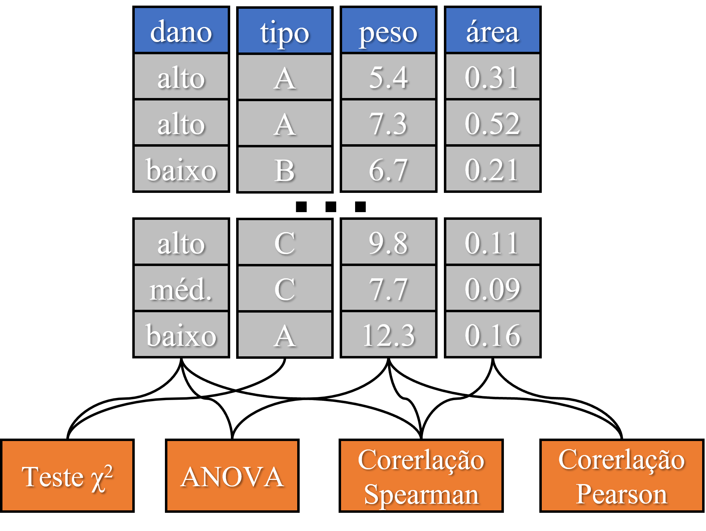
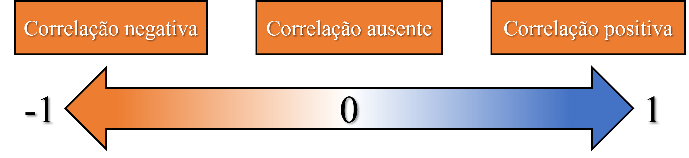
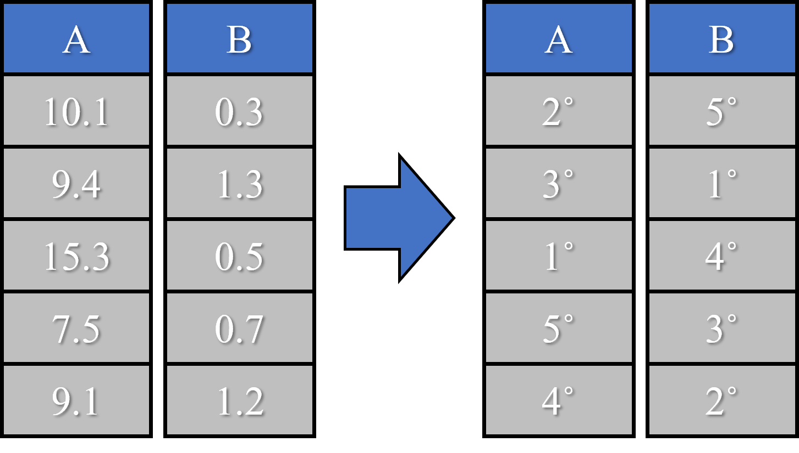
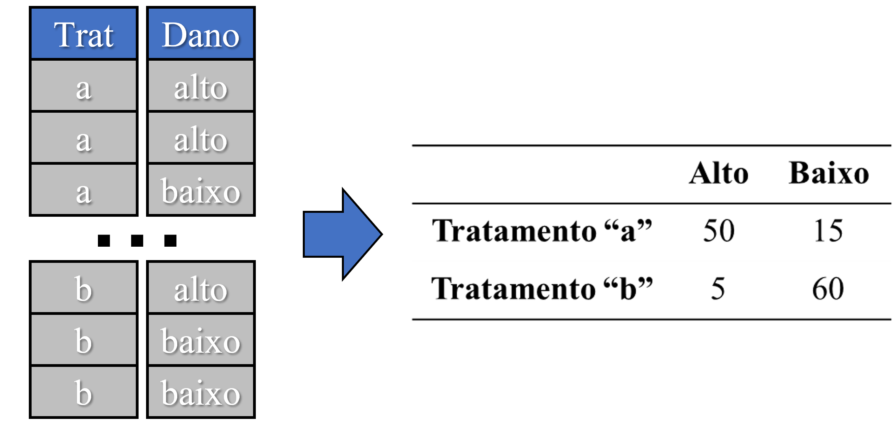

```{r setup, include=FALSE}
knitr::opts_chunk$set(paged.print=FALSE)
knitr::opts_chunk$set(echo=TRUE)
knitr::opts_chunk$set(error=FALSE)
knitr::opts_chunk$set(message=FALSE)
knitr::opts_chunk$set(warning=FALSE)
knitr::opts_chunk$set(tidy.opts = list(width.cutoff = 60), tidy = TRUE)
```

# Regressão linear

## Tipos de regressão linear

Regressão é o método usado quando tanto a resposta quanto a variável explicativa são **contínuas**. A forma mais simples que existe de regressão é:

$$
y_i=a+bx_i
$$

Primeiro, vamos relembrar que um **modelo linear** é diferente de uma **relação linear**. Uma relação linear é uma simples reta descrevendo duas variáveis. Já um modelo linear se trata dos coeficientes ligados linearmente, ou seja, uma regressão polinomial também é um modelo linear:

$$
y_i=a+b_1x_i+b_2x_i^2
$$

Aqui, abordaremos os modelos lineares de regressão, ou seja: regressão linear e polinomial.

## Regressão linear

Normalidade dos residuos, homogenidade e independencia.

-   O teste *t* da função **summary** testa cada variável preditora assumindo que **todas as demais variáveis já estâo presentes no modelo**.

-   O teste *F* da função **anova** testa as variáveis preditoras na seqüência apresentada no modelo, assumindo que as **variáveis anteriores** já estavam no modelo.

## Exemplos no R - Regressão linear simples

<http://www.leg.ufpr.br/~walmes/cursoR/ciaeear/ciaeear_11reg.html>

## Regressão polinomial

Regressão linar é na verdade um polinomio de grau um. Regressão polinomial é nada mais que adicionarmos a nossa mesma variável explicativa, porém elevada a um determianado grau:

-   Polinômio de primeiro grau: $resposta \sim explicativa^1$

-   Polinômio de segundo grau: $resposta \sim explicativa^1+explicativa^2$

-   Polinômio de terceiro grau: $resposta \sim explicativa^1+explicativa^2+explicativa^3$

Cada grau adiciona uma curvatura a mais no nosso gráfico, logo, fica evidente que em algum momento, a regressão polinomial poderá passar em todos (ou quase todos) os pontos.

**A ideia é achar até qual grau devemos ir.**

## Regressão polinomial

É comum que a relação entre a resposta e a variável explicativa seja uma linha. Porém, devemos estabelecer que a relação é realmente linear **contanto que outra relação não descreve significantemente melhor os dados.**

$*$ **Atenção!** Descrever a relação entre os dados é diferente de explicar o mecanismo/causa da relação entre as variáveis.

## Exemplos no R - regressão polinomial

## Fazendo predições

Se temos a equação que associa a resposta à variável explicativa, podemos facilmente obter a partir da outra. A maneira mais simples de fazer isso no R é pela função:

$$
predict (object,newdata...)
$$

-   **object** é o objeto criado pela função **lm()**, ou seja, de onde será extraida a equação.

-   **newdata** define os novos valores que serão usados para predizer a resposta.

    -   Deve-se utilizar o formato data.frame com o nome da coluna igual ao nome da sua variável explicativa: **newdata=data.frame(tratamento=c(1,2,3,4,5,6))**

    -   Esse argumento é opcional, se não utilizá-lo, será utilizado os próprios valores da sua coluna de dados explicativa para predizer a resposta.

Exemplo:

```{r}

```

## Calculando intervalos de confiança

## Falta de ajuste

Em experimentos planejados, geralmente existem **repetições no mesmo nível**:

```{r, out.width="70%"}
library(ExpDes.pt) # carregar pacotes com dados de exemplo ("ex1")
dados <- ex1 # armazenar dados de exemplo em "dados"
plot(dados$trat, dados$ig) # gráfico de dispersão
```

## Falta de ajuste

As repetições tornam a situação um pouco diferente, pois podemos considerar como níveis de uma categoria ou como uma variável númerica, ou seja, podemos realizar uma **regressão** quanto uma **ANOVA**:

```{r, echo=FALSE}
par(mfrow=c(1,2)) # separar painel gráfico
modelo.categorias <- lm(ig~as.factor(trat), data=dados) # modelo considerando categoria
modelo.regressao <- lm(ig~trat, data=dados) # modelo considerando regressão
plot(dados$trat, dados$ig) # gerar primeiro gráfico
abline(modelo.regressao) # colocar linha da regressão
plot(dados$trat, dados$ig) # gerar segundo gráfico
points(c(0,5,10,15), predict(modelo.categorias)[c(1,7,12,17)],col="red", pch=19, lwd=5) # colocar as médias estimadas pelo modelo 2
```

## Falta de ajuste

Assim, podemos testar a falta de ajuste de um modelo de regressão, comparando ele com o modelo considerando os níveis como categoria.

```{r, echo=FALSE, out.width="70%"}
library(dplyr)
my <- as.vector(tapply(dados$ig,as.factor(dados$trat),mean))
d <- rep(my[1],5)

for (i in 2:4){
d <- c(d,rep(my[i],5))
}

plot(dados$trat, dados$ig, pch=21, bg="yellow") # gráfico de dispersão
model.reg <- lm(ig~trat, data=dados)
for (i in seq(0,15, by=5)){
  lines(c(i,i),c(d[i+1],predict(model.reg,list(trat=0:15))[i+1]),col="red", lwd=4)
  points(i, d[i+1], col="red", pch=19, lwd=5)
  }
abline(model.reg)
```

Repare que a falta de ajuste não é nada mais que a **diferença entre a regressão e as médias de cada nível.**

## Falta de ajuste

Podemos comparar os dois modelos e idenficar se a falta de ajuste é significativa.

```{r}
modelo.categorias <- lm(ig~as.factor(trat), data=dados) # modelo considerando categoria
modelo.regressao <- lm(ig~trat, data=dados) # modelo considerando regressão
anova(modelo.regressao, modelo.categorias)
```

Repare que a diferença entre os dois modelos foi significativa ($p<0.05$) isso significa que a **regressão linear não é adequada**.

## Falta de ajuste

Então, se curva linear não é adequada, o que fazer?

```{r}
modelo.regressao.2 <- lm(ig~trat+I(trat^2), data=dados)
anova(modelo.categorias, modelo.regressao.2)
modelo.regressao.3 <- lm(ig~trat+I(trat^2)+I(trat^3), data=dados)
anova(modelo.categorias, modelo.regressao.3)
summary(modelo.regressao.3)
anova(modelo.regressao.3)
```

<http://www.leg.ufpr.br/~walmes/cursoR/cnpaf3/cnpaf06poli.html>

## Pacote ExpDes.pt

O pacote permite acrescentar variáveis numéricas na análise e aborda os principais delineamentos.

## Exemplos no R - regressão em DIC

## Exemplos no R - regressão em DBC

# Correlação

## Associação entre variáveis

Para sabermos se duas variáveis estão relacionadas, podemos medir o grau de associação entre elas. Porém, a forma de medir a associação entre duas variáveis, depende da classe delas:

{width="464"}

## Correlação de Pearson

A **correlação de pearson (r)** mede a relação **linear** entre duas variáveis, ou seja, **x** e **y** formando uma linha reta. É uma medida de **correlação paramétrica**, pois depende da distribuição dos dados, os quais devem ser **normalmente distribuidos** e pode ser calculada por:

$$
r=\frac{1}{n}\sum(\frac{x_i-\bar{x}}{DP(X)})(\frac{y_i-\bar{y}}{DP(Y)})
$$

A correlação de Pearson não é nada mais que a média ($\frac{1}{n}\sum$) da variação conjunta de $x$ e $y$ (($x_i-\bar{x}$)($y_i-\bar{y}))$, dividida pelo desvio padrão ($DP$) para anular a diferença de escala entre as variáveis.

## Correlação de Pearson

A medida varia de -1 e 1 e indica:

{width="653"}

## Correlação de Pearson

```{r echo=FALSE, out.width="70%"}
par(mfrow=c(1,3))
set.seed(3)
x <- 1:20 +rnorm(20, 10,3)
y <- 21:40+rnorm(20, 15,5)
plot(x,y, main="Correlação posit. forte (r>0.5)")
abline(lm(y~x))
text(10,55,paste("r=",round(cor(x,y),2)))
set.seed(4)
x <- 20:1 +rnorm(20, 10,3)
y <- 21:40+rnorm(20, 15,5)
plot(x,y, main="Correlação negat. forte (r<-0.5)")
abline(lm(y~x))
text(14,55,paste("r=",round(cor(x,y),2)))
set.seed(6)
x <- 20:1 +rnorm(20, 10,3)
y <- 50+rnorm(20, 15,5)
plot(x,y, main="Sem correlação (r=0)")
abline(lm(y~x))
text(15,74,paste("r=",round(cor(x,y),2)))

```

## Correlação de Pearson - problemas

```{r,echo=FALSE, out.width="70%"}
par(mfrow=c(1,3))
# outlier
set.seed(2)
x <- c(rnorm(25, 10,3),40)
y <- c(rnorm(25, 10, 3),50)
dados <- data.frame(x=x, y=y)
plot(x,y, main="Outliers")
abline(lm(y~x))

# non linear
set.seed(1)
x <- seq(6,10,by=0.07)
y <- (1/(1+exp(1)^-x*0.2))+rnorm(58, 0.1,0.00002)
dados <- data.frame(x=x, y=y)
plot(x,y, main="Relação não-linear")
abline(lm(y~x))

# non-normal
set.seed(1)
x <- 1:100+rnorm(100, 10,3)
y <- x+rnorm(100, 10, x/5)
dados <- data.frame(x=x, y=y)
plot(x,y,main="Variância não homogênea")
abline(lm(y~x))
```

## Correlação de Spearman

Correlação de Spearman é uma **correlação baseada no ranqueamento**:

{width="528"}

Por esse motivo, é capaz identificar de forma geral a tendência de aumento ou diminuição entre dados e **não apenas a sua relação linear**, como a correlação de pearson.

## Correlação de Spearman

A correlação de Spearman é uma correlação **não-paramétrica** e é indicada para:

-   Dado não-normais;

-   Que possuem relação não-linear entre variáveis;

-   Dados com possíveis outliers;

$*$ **Atenção**, pelo fato da correlação de Spearman baseada no ranqueamento dos dados, é possível utilizá-la em **dados categóricos ordinais**: nível de infestação de uma doença, classes de qualidade, entre outros.

## Correlação no R

$$
cor(x, y, method,...)
$$

-   **x** e **y** podem ser tanto um vetor com cada variável, quanto uma matriz ou objeto do tipo data frame.

    -   Quando é fornecido uma matriz ou data frame, não é necessário especificar o **y** e o resultado será uma matriz de correlação entre todas as variáveis.

-   **method** define qual correlação deverá ser calculada:

    -   Pearson: **method="pearson"**

    -   Spearman: **method="spearman"**

## Exemplos no R - correlação

### $1^\circ$ Carregando dados e criando gráfico

```{r, out.width="50%"}
library(ExpDes.pt) # carregar pacotes com dados de exemplo ("ex4")
dados <- ex4 # armazenar dados de exemplo em "dados"
plot(dados$k, dados$c) # gráfico de dispersão
abline(lm(dados$c~dados$k)) # tendência
```

## Exemplos no R - correlação

### $2^\circ$ Checando normalidade dos dados

```{r}
shapiro.test(dados$k) # teste de normalidade para variável "k"
shapiro.test(dados$c) # teste de normalidade para variável "c"
```

## Exemplos no R - correlação

### $3^\circ$ Correlação

```{r}
cor(dados$k, dados$c, method = "pearson") # correlação de Pearson
cor(dados$k, dados$c, method = "spearman") # correlação de Spearman
```

## Exemplos no R - matriz de correlação

```{r}
cor(dados[,c(4, 5, 6, 7,8)], method="spearman") # matriz de correlação
```

## Teste de correlação

Para calcular se a correlação entre duas variáveis é significativa ou não, pode-se usar:

$$
cor.test(x, y, method,...)
$$

-   **x** e **y** são os dois vetores com os dados a serem correlacionados.

-   **method** define qual correlação deverá ser calculada:

    -   Pearson: **method="pearson"**

    -   Spearman: **method="spearman"**

## Exemplos no R - teste de correlação

```{r}
cor.test(dados$zn, dados$c, method = "spearman")
```

## Gráfico de correlação

O pacote **ggcorrplot** possui a função com mesmo nome e é a extensão do ggplot2 responsável por criar o gráfico de correlação:

```{r, eval=FALSE}
install.package("ggcorrplot")
```

$$
ggcorrplot(corr, lab, p.mat, type,...)
$$

-   **corr** é a matriz de correlação gerada pela função **cor()**.

-   **lab** determina se deve (**=TRUE**) ou não (**=FALSE**) mostrar os valores da correlação.

-   **p.mat** é o objeto com a matriz de p-valores de cada correlação criada com a função **cor_pmat()**.

    -   Os p-valores não significativos (\>0.05), são marcados com um "X".

-   **type** determina se deve mostrar apenas a parte superior (**="upper"**) ou inferior (**="lower"**) do gráfico.

## Exemplos no R - gráfico de correlação

```{r, out.width="70%"}
library(ExpDes.pt)
dados <- ex4
library(ggcorrplot)
corr <- cor(dados[,c(4, 5, 6, 7, 8, 9, 10)])
p.valores <- cor_pmat(dados[,c(4, 5, 6, 7, 8, 9, 10)])
ggcorrplot(corr, lab=TRUE, p.mat=p.valores, type="lower")
```

## Teste do chi-quadrado ($\chi^2$)

Identificar a correlação entre duas variáveis númericas é, de certa forma, mais intuitivo. Basta observarmos o que ocorre com uma variável, quando outra variável aumenta ou diminui. Porém, como identificamos a correlação entre duas variáveis categóricas?

{width="548"}

A solução é criar uma tabela de dupla entrada e verificar se a frequência entre os níveis de um fator, muda quando observamos os níveis de outro fator.

## Teste do chi-quadrado ($\chi^2$)

A fórmula do teste de $\chi^2$ é:

$$
\chi^2=\sum\frac{(o_i-e_i)^2}{e_i}
$$

Onde $o_i$ é o valor observado e $e_i$ é o valor esperado, ou seja, a frequência que se espera, caso não exista associação entre as duas variávies.

$*$ Quanto maior o valor, maior a probabilidade das variáveis estarem associadas, ou seja, menor será o seu p-valor referente na tabela da distribuição do $\chi^2$.

## Teste do chi-quadrado ($\chi^2$)

No R, o teste de correlação entre duas variáveis pode ser realizado pela função:

$$
chisq.test(x, y,...)
$$

-   **x** e **y** podem ser tanto um vetor com cada variável, quanto uma matriz ou objeto do tipo data frame.

## Exemplos no R - teste do chi-quadrado ($\chi^2$)

```{r}
dados <- data.frame(dano=c(rep("alto", 55), rep("baixo", 75)),
                    trat=c(rep("a",50), rep("b", 5), rep("a", 15), rep("b", 60))) # dados fictícios
table(dados) # tabela de frequência
chisq.test(dados$dano, dados$trat) # teste de chi-quadrado
```

## Referências

-   Bussab, W. O.; Morettin, P. A. **Estatística Básica (9 ed.)**. Saraiva, 2017, p. 553.

-   Pimentel Gomes, F. **Curso de Estatística Experimental (12 ed.)**. Piracicaba, 1987, p. 467.

-   Long, J.; Teetor, P. **R cookbook (2 ed.)**. O'Reilly, 2019.

    -   <https://rc2e.com/>

-   Crawley, M.J. **The R Book**. Willey, 2013, 975p.

## Códigos

\`\`\`{r## Regressão} library(ExpDes.pt) dados \<- ex4 r0 \<- lm(c\~1, data=dados) r1 \<- lm(c\~zn, data=dados) summary(r1) anova(r1)

plot(dados$zn,dados$c) abline(r0)

dados \<- data.frame( w \<- c(0.9,1.8,2.4,3.5,3.9,4.4,5.1,5.6,6.3), s \<- c(1.4,2.6,1.0,3.7,5.5,3.2,3.0,4.9,6.3))

r0 \<- lm(s\~1, data=dados) r1 \<- lm(s\~w, data=dados) summary(r1) anova(r0,r1)

## Lack of fit

library(ExpDes.pt) dados \<- ex1 dic(dados$trat, dados$ig, quali=FALSE)

r0 \<- lm(ig\~1, data=dados) r1 \<- lm(ig\~trat, data=dados) r2 \<- lm(ig\~poly(trat, 2, raw=TRUE), data=dados) r3 \<- lm(ig\~poly(trat, 3, raw=TRUE), data=dados) rc \<- lm(ig\~as.factor(trat), data=dados) summary(r2) anova(r0, r1, r2, r3)

par(mfrow=c(1,2)) modelo.categorias \<- lm(ig\~as.factor(trat), data=dados) modelo.regressao \<- lm(ig\~trat, data=dados) plot(dados$trat, dados$ig) abline(modelo.regressao) plot(dados$trat, dados$ig) abline(modelo.categorias)

predict(modelo.categorias) }

\`\`\`
