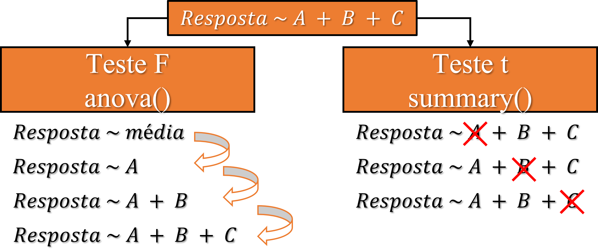

```{r setup, include=FALSE}
knitr::opts_chunk$set(paged.print=FALSE)
knitr::opts_chunk$set(echo=TRUE)
knitr::opts_chunk$set(error=FALSE)
knitr::opts_chunk$set(message=FALSE)
knitr::opts_chunk$set(warning=FALSE)
knitr::opts_chunk$set(tidy.opts = list(width.cutoff = 60), tidy = TRUE)
```

# Regressão linear

## Regressão linear

Regressão é o método usado quando tanto a resposta quanto a variável explicativa são **contínuas**:

```{r, out.width="70%", echo=FALSE}
library(ggplot2)
set.seed(1)
x <- c(1:20 + rnorm(20, 1,1), 1:20 + rnorm(20, 1,1))
y <- c(51:70 + rnorm(20,1,1), 51:70 + rnorm(20, 5,1))
ggplot(as.data.frame(cbind(x,y))) +
  aes(x=x, y=y) +
  geom_point() +
  theme_classic()
```

## Regressão linear simples

A forma mais simples que existe de regressão é:

$$
y_i=a+bx_i
$$

Ou seja, apenas dois parâmetros e uma variável explicativa. Isso é uma **regressão linear simples**:

```{r, out.width="55%", echo=FALSE}
library(ggplot2)
set.seed(1)
x <- c(1:20 + rnorm(20, 1,1), 1:20 + rnorm(20, 1,1))
y <- c(51:70 + rnorm(20,1,1), 51:70 + rnorm(20, 5,1))
ggplot(as.data.frame(cbind(x,y))) +
  aes(x=x, y=y) +
  geom_point() +
  geom_smooth(formula=y~x, method="lm", se=FALSE) +
  theme_classic()
```

## Regressão linear múltipla

Porém, pode haver mais de uma variável explicando $y$:

$$
y_i=\beta_0+\beta_1x_1+\beta_2x_2
$$

Ou seja, eu posso estimar o valor de cada $y$ a partir do valor de duas outras variáveis ou mais:

```{r, out.width="60%", echo=FALSE}
library(ggplot2)
set.seed(1)
x <- c(1:20 + rnorm(20, 1,1), 1:20 + rnorm(20, 1,1))
y <- c(51:70 + rnorm(20,1,1), 51:70 + rnorm(20, 5,1))
data <- data.frame(x=x, y=y,g=c(rep("a",20), rep("b",20)))
ggplot(data) +
  aes(x=x, y=y, color=g) +
  geom_point() +
  geom_smooth(formula=y~x,method="lm", se=FALSE) +
  theme_classic()+labs(color="Cultivar")
```

## Regressão polinomial

É comum descrevermos a relação entre variáveis por uma reta, porém, também podemos usar outra relação que não seja linear. Nesse contexto, temos a regressão polinomial que não é nada mais que um tipo de regressão linear múltipla:

$$
y_i=a+b_1x_i+b_2x_i^2
$$

$*$ **Cuidado com a terminologia!** **Modelo linear** é diferente de uma **relação linear**. Uma relação linear é uma simples reta descrevendo duas variáveis. Já um modelo linear se trata dos coeficientes ligados linearmente, ou seja, uma regressão polinomial também é um modelo linear.

## Regressão polinomial

Regressão linear é um polinomio de primeiro grau. Se adicionarmos novamente nossa mesma variável explicativa, porém, elevada a um determinado grau, teremos uma regressão polinomial:

-   Polinômio de primeiro grau: $resposta \sim explicativa^1$

-   Polinômio de segundo grau: $resposta \sim explicativa^1+explicativa^2$

-   Polinômio de terceiro grau: $resposta \sim explicativa^1+explicativa^2+explicativa^3$

$*$ **Atenção!** Descrever a relação entre as variáveis é diferente de explicar sua relação de causa e efeito.

## Regressão polinomial

Cada grau adiciona uma curvatura a mais no nosso gráfico, logo, fica evidente que em algum momento, a regressão polinomial poderá passar em quase todos os pontos.

```{r, out.width="55%", echo=FALSE}
library(ggplot2)
library(reshape2)
library(dplyr)

rm(list=ls())

times <- seq(0, 800, 16.66)

my_data <- data.frame(Time = rep(times, 3)) %>%
  mutate(Response = 1000 + 
           # linear component
           (((Time - 400)*6) ^ 1) + 
           # quadratic component
           (((Time - 400)*-0.0350) ^ 2) + 
           # cubic component
           (((Time - 400)*-0.0270) ^ 3)) %>%
  mutate(Response = Response + 
           rnorm(n = 3*length(times), mean = 0, sd = 25))


code.poly <- function(df=NULL, predictor=NULL, poly.order=NULL, orthogonal=TRUE, draw.poly=TRUE){
  require(reshape2)
  require(ggplot2)
 raw <- (orthogonal-1)^2
  
 
  if (!predictor %in% names(df)){
    warning(paste0(predictor, " is not a variable in your data frame. Check spelling and try again"))
  }
  

  predictor.vector <- df[,which(colnames(df)==predictor)]

  predictor.indices <- as.numeric(as.factor(predictor.vector))
  
  df$temp.predictor.index <- predictor.indices

  predictor.polynomial <- poly(x = unique(sort(predictor.vector)), 
                               degree = poly.order, raw=raw)
  df[, paste("poly", 1:poly.order, sep="")] <- 
    predictor.polynomial[predictor.indices, 1:poly.order]
  
  if (draw.poly == TRUE){

    df.poly <- unique(df[c(predictor, paste("poly", 1:poly.order, sep=""))])
    

    df.poly.melt <- melt(df.poly, id.vars=predictor)
    
    
    levels(df.poly.melt$variable)[levels(df.poly.melt$variable)=="poly1"] <- "Linear"
    levels(df.poly.melt$variable)[levels(df.poly.melt$variable)=="poly2"] <- "Quadratica"
    levels(df.poly.melt$variable)[levels(df.poly.melt$variable)=="poly3"] <- "Cubica"
    levels(df.poly.melt$variable)[levels(df.poly.melt$variable)=="poly4"] <- "Quartic"
    levels(df.poly.melt$variable)[levels(df.poly.melt$variable)=="poly5"] <- "Quintic"
    levels(df.poly.melt$variable)[levels(df.poly.melt$variable)=="poly6"] <- "Sextic"
    
  
    colnames(df.poly.melt)[colnames(df.poly.melt) == "variable"] <- "Order"
    
    poly.plot <- ggplot(df.poly.melt, aes(y=value, color=Order))+
      aes_string(x=predictor)+
      geom_line()+
      ylab("")+
      xlab("")+
      theme_classic()+
      theme(axis.text.x=element_blank(),
            axis.text.y=element_blank(),
            axis.ticks.x=element_blank(),
            axis.ticks.y=element_blank())
     
    
    print(poly.plot)
  }
  
  colnames(df)[colnames(df) == "temp.predictor.index"] <- paste0(predictor,".Index")
  return(df)
}

data.gca <- code.poly(df=my_data, predictor="Time", poly.order=3, orthogonal=TRUE, draw.poly=TRUE)
```

**A ideia é achar até qual grau devemos ir.**

## Pressupostos

Os coeficientes em um modelo linear são estimados pelos métodos dos mínimos quadrados. Logo, a regressão linear também exige dos erros:

-   **Ser independentes**: os erros não devem apresentar correlação entre si.
-   **Ter variância homogênea (homocedásticos)**: todos os erros variam de forma igual.
-   **Ser normais**: erros possuem distribuição normal com média igual a zero.

## Como avaliar a regressão?

Existem duas formas:

-   **Teste F** compara a contribuição de modelos simples em relação aos mais complexos por meio da função **anova()**.

    -   É um teste feito em sequência, do modelo mais simples ao mais complexo. A ideia é identificar se a de informação a mais que um modelo mais complexo explica é siginificantemente melhor do que um modelo mais simples. **Se não for, então para que um modelo complicado?**

-   **Teste t** compara se cada coeficiente de cada variável do modelo é significativamente diferente de zero por meio da função **summary()**.

    -   A ideia aqui é checar se um determinado coeficiente, na presença dos outros, é necessários. **Se não for, então para que ter ele no modelo?**

## Como avaliar a regressão?

{width="711"}

## Coeficiente de determinação ($R^2$)

Quão melhor minha regressão explica a variação observada nos dados? O $R^2$ responde:

$$
R^2=1-\frac{Soma\;de\;quadrados\;residual}{Soma\;de\;quadrados\;total}
$$

O $R^2$ varia de 0 a 1, pois uma regressão pode explicar até no máximo 100% da variação observada na resposta.

## Coeficiente de determinação ($R^2$)

Visualmente fica mais fácil:

{width="914"}

## Coeficiente de determinação ajustado ($R^2_{adj}$)

O coeficiente de determinação ajustado é o $R^2$ "corrigido" para o número de variáveis que o modelo usou:

$$
R^2=1-\frac{Soma\;de\;quadrados\;residual/GL_{regressão}}{Soma\;de\;quadrados\;total/GL_{total}}
$$

Por que corrigir? Porque seu $R^2$. sempre será maior quanto mais variáveis você usar para descrever a sua resposta!

## Exemplos no R - regressão

```{r, out.width="70%"}
library(ExpDes.pt) # carregar pacotes com dados de exemplo ("ex1")
dados <- ex1 # armazenar dados de exemplo em "dados"
plot(dados$trat, dados$ig) # gráfico de dispersão
```

## Exemplos no R - regressão

Ajustando um modelo de regressão polinomial de maior ordem.

```{r}
modelo.cubico <- lm(ig~trat+I(trat^2)+I(trat^3), data=dados) # modelo cúbico
```

## Exemplos no R - checando os pressupostos

```{r,, out.width="75%"}
par(mfrow=c(2,2)) # dividir painel gráfico
plot(modelo.cubico) # plotar gráfico
```

## Exemplos no R - teste t

```{r}
summary(modelo.cubico) # teste t
```

## Exemplos no R - teste F

Vamos testar a contribuição sequêncial dos modelos pela **anova()**:

```{r}
modelo.nulo <- lm(ig~1, data=dados) # modelo mais simples
modelo.linear <- lm(ig~trat, data=dados) # modelo linear
modelo.quadratico <- lm(ig~trat+I(trat^2), data=dados) # modelo quadrático
anova(modelo.nulo, modelo.linear, modelo.quadratico, modelo.cubico) # comparação dos modelos
```

$*$ Repare que após o modelo linear, os modelos não contribuem significativamente, então, ficamos com ele.

## Exemplos no R - teste F

Mesmo resultado:

```{r}
anova(modelo.cubico) # anova da regressão
```

## Exemplos no R - teste F

```{r, out.width="70%"}
par(mfrow=c(2,2)) # dividir o painel
plot(modelo.linear) # plotar o modelo
```

## Teste da falta de ajuste

Como em experimentos planejados temos **repetições no mesmo nível** a situação fica um pouco diferente. Podemos considerar como níveis de um fator ou como uma variável númerica contínua, ou seja, podemos realizar uma **regressão** quanto uma **anova**.

```{r, out.width="60%", echo=FALSE}
par(mfrow=c(1,2)) # separar painel gráfico
modelo.categorias <- lm(ig~as.factor(trat), data=dados) # modelo considerando categoria
modelo.regressao <- lm(ig~trat, data=dados) # modelo considerando regressão
plot(dados$trat, dados$ig) # gerar primeiro gráfico
abline(modelo.regressao) # colocar linha da regressão
plot(dados$trat, dados$ig) # gerar segundo gráfico
points(c(0,5,10,15), predict(modelo.categorias)[c(1,7,12,17)],col="red", pch=19, lwd=5) # colocar as médias estimadas pelo modelo 2
```

E então? Consideramos como categorias ou como variável numérica contínua?

## Teste da falta de ajuste

Podemos testar a falta de ajuste de um modelo de regressão, comparando ele com o modelo que considera a variável como níveis de um fator.

```{r, echo=FALSE, out.width="60%"}
library(dplyr)
my <- as.vector(tapply(dados$ig,as.factor(dados$trat),mean))
d <- rep(my[1],5)

for (i in 2:4){
d <- c(d,rep(my[i],5))
}

plot(dados$trat, dados$ig, pch=21, bg="yellow") # gráfico de dispersão
model.reg <- lm(ig~trat, data=dados)
for (i in seq(0,15, by=5)){
  lines(c(i,i),c(d[i+1],predict(model.reg,list(trat=0:15))[i+1]),col="red", lwd=4)
  points(i, d[i+1], col="red", pch=19, lwd=5)
  }
abline(model.reg)
```

$*$ A falta de ajuste não é nada mais que a **diferença entre a regressão e as médias de cada nível.**

## Exemplos no R - Teste da falta de ajuste

Podemos testar em sequência, do modelo mais simples até o modelo que não tem diferença em relação ao modelo considerando a variável como níveis de um fator:

```{r}
modelo.categorias <- lm(ig~as.factor(trat), data=dados) # modelo considerando categoria
anova(modelo.linear, modelo.categorias) # testar falta de ajuste
```

Repare que a diferença entre os dois modelos foi significativa, isso significa que a **regressão linear não é adequada, pois a falta de ajuste entre os modelos é significativo.**

## Exemplos no R - Teste da falta de ajuste

Então, se regressão linear não é adequada, o que fazer?

```{r}
anova(modelo.categorias, modelo.quadratico) # comparar os modelos
```

## Exemplos no R - Teste da falta de ajuste

```{r, out.width="75%"}
par(mfrow=c(2,2)) # dividir o painel
plot(modelo.quadratico) # plotar o modelo
```

## Exemplos no R - Pacote ExpDes.pt

```{r}
library(ExpDes.pt) # carregar pacote
dados <- ex1 # armazenar ex1 em "dados"
dic(dados$trat, dados$ig, quali=FALSE) # dic com fator quantitativo
```

## Exemplos no R - gerando o gráfico

```{r}
library(ggplot2) # carregando o pacote
ggplot(dados) + # indicando os dados
  aes(x=trat, y=ig) + # distribuindo as variáveis
  geom_point() + # gráfico de dispersão
  geom_smooth(formula=y~poly(x, 2), method="lm") + # adicionando linha de regressão
  theme_classic() # alterando a estética
```

## Ideias principais

-   Para usar um modelo mais complexo, ele precisa explicar significativamente que um modelo mais simples.

-   O $R^2$ diz quanto da variação é explicada pelo seu modelo de regressão. Use o $R^2$ ajustado ao comparar modelos mais complexos.

-   Se você tem variáveis que podem ser consideradas tanto como quantitativas quanto como níveis de um fator:

    1.  Considere elas como fator e faça a anova conforme o seu delineamento para checar se o efeito do tratamento é significativo.

    2.  Considere ela quantitativa e ajuste modelos de diferentes ordens.

    3.  Em cada ordem, da menor para maior, compare com o modelo que considera como níveis de um fator por meio da **anova()**. O modelo primeiro modelo que não for significativamente diferente é o seu modelo.

# Correlação

## Associação entre variáveis

Para sabermos se duas variáveis estão relacionadas, podemos medir o grau de associação entre elas. Porém, a forma de medir a associação entre duas variáveis, depende da classe delas:

{width="464"}

## Correlação de Pearson

A **correlação de pearson (r)** mede a relação **linear** entre duas variáveis, ou seja, **x** e **y** formando uma linha reta. É uma medida de **correlação paramétrica**, pois depende da distribuição dos dados, os quais devem ser **normalmente distribuidos** e pode ser calculada por:

$$
r=\frac{1}{n}\sum(\frac{x_i-\bar{x}}{DP(X)})(\frac{y_i-\bar{y}}{DP(Y)})
$$

A correlação de Pearson não é nada mais que a média ($\frac{1}{n}\sum$) da variação conjunta de $x$ e $y$ (($x_i-\bar{x}$)($y_i-\bar{y}))$, dividida pelo desvio padrão ($DP$) para anular a diferença de escala entre as variáveis.

## Correlação de Pearson

A medida varia de -1 e 1 e indica:

{width="653"}

## Correlação de Pearson

```{r echo=FALSE, out.width="70%"}
par(mfrow=c(1,3))
set.seed(3)
x <- 1:20 +rnorm(20, 10,3)
y <- 21:40+rnorm(20, 15,5)
plot(x,y, main="Correlação posit. forte (r>0.5)")
abline(lm(y~x))
text(10,55,paste("r=",round(cor(x,y),2)))
set.seed(4)
x <- 20:1 +rnorm(20, 10,3)
y <- 21:40+rnorm(20, 15,5)
plot(x,y, main="Correlação negat. forte (r<-0.5)")
abline(lm(y~x))
text(14,55,paste("r=",round(cor(x,y),2)))
set.seed(6)
x <- 20:1 +rnorm(20, 10,3)
y <- 50+rnorm(20, 15,5)
plot(x,y, main="Sem correlação (r=0)")
abline(lm(y~x))
text(15,74,paste("r=",round(cor(x,y),2)))

```

## Correlação de Pearson - problemas

```{r,echo=FALSE, out.width="70%"}
par(mfrow=c(1,3))
# outlier
set.seed(2)
x <- c(rnorm(25, 10,3),40)
y <- c(rnorm(25, 10, 3),50)
dados <- data.frame(x=x, y=y)
plot(x,y, main="Outliers")
abline(lm(y~x))

# non linear
set.seed(1)
x <- seq(6,10,by=0.07)
y <- (1/(1+exp(1)^-x*0.2))+rnorm(58, 0.1,0.00002)
dados <- data.frame(x=x, y=y)
plot(x,y, main="Relação não-linear")
abline(lm(y~x))

# non-normal
set.seed(1)
x <- 1:100+rnorm(100, 10,3)
y <- x+rnorm(100, 10, x/5)
dados <- data.frame(x=x, y=y)
plot(x,y,main="Variância não homogênea")
abline(lm(y~x))
```

## Correlação de Spearman

Correlação de Spearman é uma **correlação baseada no ranqueamento**:

{width="528"}

Por esse motivo, é capaz identificar de forma geral a tendência de aumento ou diminuição entre dados e **não apenas a sua relação linear**, como a correlação de pearson.

## Correlação de Spearman

A correlação de Spearman é uma correlação **não-paramétrica** e é indicada para:

-   Dado não-normais;

-   Que possuem relação não-linear entre variáveis;

-   Dados com possíveis outliers;

$*$ **Atenção**, pelo fato da correlação de Spearman baseada no ranqueamento dos dados, é possível utilizá-la em **dados categóricos ordinais**: nível de infestação de uma doença, classes de qualidade, entre outros.

## Correlação no R

$$
cor(x, y, method,...)
$$

-   **x** e **y** podem ser tanto um vetor com cada variável, quanto uma matriz ou objeto do tipo data frame.

    -   Quando é fornecido uma matriz ou data frame, não é necessário especificar o **y** e o resultado será uma matriz de correlação entre todas as variáveis.

-   **method** define qual correlação deverá ser calculada:

    -   Pearson: **method="pearson"**

    -   Spearman: **method="spearman"**

## Exemplos no R - correlação

### $1^\circ$ Carregando dados e criando gráfico

```{r, out.width="50%"}
library(ExpDes.pt) # carregar pacotes com dados de exemplo ("ex4")
dados <- ex4 # armazenar dados de exemplo em "dados"
plot(dados$k, dados$c) # gráfico de dispersão
abline(lm(dados$c~dados$k)) # tendência
```

## Exemplos no R - correlação

### $2^\circ$ Checando normalidade dos dados

```{r}
shapiro.test(dados$k) # teste de normalidade para variável "k"
shapiro.test(dados$c) # teste de normalidade para variável "c"
```

## Exemplos no R - correlação

### $3^\circ$ Correlação

```{r}
cor(dados$k, dados$c, method = "pearson") # correlação de Pearson
cor(dados$k, dados$c, method = "spearman") # correlação de Spearman
```

## Exemplos no R - matriz de correlação

```{r}
cor(dados[,c(4, 5, 6, 7,8)], method="spearman") # matriz de correlação
```

## Teste de correlação

Para calcular se a correlação entre duas variáveis é significativa ou não, pode-se usar:

$$
cor.test(x, y, method,...)
$$

-   **x** e **y** são os dois vetores com os dados a serem correlacionados.

-   **method** define qual correlação deverá ser calculada:

    -   Pearson: **method="pearson"**

    -   Spearman: **method="spearman"**

## Exemplos no R - teste de correlação

```{r}
cor.test(dados$zn, dados$c, method = "spearman") # teste de spearman
```

## Gráfico de correlação

O pacote **ggcorrplot** possui a função com mesmo nome e é a extensão do ggplot2 responsável por criar o gráfico de correlação:

```{r, eval=FALSE}
install.package("ggcorrplot")
```

$$
ggcorrplot(corr, lab, p.mat, type,...)
$$

-   **corr** é a matriz de correlação gerada pela função **cor()**.

-   **lab** determina se deve (**=TRUE**) ou não (**=FALSE**) mostrar os valores da correlação.

-   **p.mat** é o objeto com a matriz de p-valores de cada correlação criada com a função **cor_pmat()**.

    -   Os p-valores não significativos (\>0.05), são marcados com um "X".

-   **type** determina se deve mostrar apenas a parte superior (**="upper"**) ou inferior (**="lower"**) do gráfico.

## Exemplos no R - gráfico de correlação

```{r, out.width="70%"}
library(ExpDes.pt) # carregando o pacote com dados de exemplo
dados <- ex4 # armazenando ex4 em "dados"
library(ggcorrplot) # carrgando pacote do gráfico de correlação
corr <- cor(dados[,c(4, 5, 6, 7, 8, 9, 10)]) # filtrando colunas
p.valores <- cor_pmat(dados[,c(4, 5, 6, 7, 8, 9, 10)]) # calculando p-valores
ggcorrplot(corr, lab=TRUE, p.mat=p.valores, type="lower") # grafico de correlacao
```

## Teste do chi-quadrado ($\chi^2$)

Identificar a correlação entre duas variáveis númericas é, de certa forma, mais intuitivo. Basta observarmos o que ocorre com uma variável, quando outra variável aumenta ou diminui. Porém, como identificamos a correlação entre duas variáveis categóricas?

{width="548"}

A solução é criar uma tabela de dupla entrada e verificar se a frequência entre os níveis de um fator, muda quando observamos os níveis de outro fator.

## Teste do chi-quadrado ($\chi^2$)

A fórmula do teste de $\chi^2$ é:

$$
\chi^2=\sum\frac{(o_i-e_i)^2}{e_i}
$$

Onde $o_i$ é o valor observado e $e_i$ é o valor esperado, ou seja, a frequência que se espera, caso não exista associação entre as duas variávies.

$*$ Quanto maior o valor, maior a probabilidade das variáveis estarem associadas, ou seja, menor será o seu p-valor referente na tabela da distribuição do $\chi^2$.

## Teste do chi-quadrado ($\chi^2$)

No R, o teste de correlação entre duas variáveis pode ser realizado pela função:

$$
chisq.test(x, y,...)
$$

-   **x** e **y** podem ser tanto um vetor com cada variável, quanto uma matriz ou objeto do tipo data frame.

## Exemplos no R - teste do chi-quadrado ($\chi^2$)

```{r}
dados <- data.frame(dano=c(rep("alto", 55), rep("baixo", 75)),
                    trat=c(rep("a",50), rep("b", 5), rep("a", 15), rep("b", 60))) # dados fictícios
table(dados) # tabela de frequência
chisq.test(dados$dano, dados$trat) # teste de chi-quadrado
```

## Referências

-   Bussab, W. O.; Morettin, P. A. **Estatística Básica (9 ed.)**. Saraiva, 2017, p. 553.

-   Pimentel Gomes, F. **Curso de Estatística Experimental (12 ed.)**. Piracicaba, 1987, p. 467.

-   Long, J.; Teetor, P. **R cookbook (2 ed.)**. O'Reilly, 2019.

    -   <https://rc2e.com/>

-   Crawley, M.J. **The R Book**. Willey, 2013, 975p.

## Códigos

```{r, eval=FALSE}
### Regressão linear
library(ExpDes.pt) # carregar pacotes com dados de exemplo ("ex1")
dados <- ex1 # armazenar dados de exemplo em "dados"
plot(dados$trat, dados$ig) # gráfico de dispersão
modelo.cubico <- lm(ig~trat+I(trat^2)+I(trat^3), data=dados) # modelo cúbico
par(mfrow=c(2,2)) # dividir painel gráfico
plot(modelo.cubico) # plotar gráfico
## Teste t (summary)
summary(modelo.cubico) # teste t
## Teste F (anova)
modelo.nulo <- lm(ig~1, data=dados) # modelo mais simples
modelo.linear <- lm(ig~trat, data=dados) # modelo linear
modelo.quadratico <- lm(ig~trat+I(trat^2), data=dados) # modelo quadrático
anova(modelo.nulo, modelo.linear, modelo.quadratico, modelo.cubico) # comparação dos modelos
anova(modelo.cubico) # anova da regressão
par(mfrow=c(2,2)) # dividir o painel
plot(modelo.linear) # plotar o modelo
## Teste da falta de ajuste
modelo.categorias <- lm(ig~as.factor(trat), data=dados) # modelo considerando categoria
anova(modelo.linear, modelo.categorias) # testar falta de ajuste
anova(modelo.categorias, modelo.quadratico) # comparar os modelos
par(mfrow=c(2,2)) # dividir o painel
plot(modelo.quadratico) # plotar o modelo
## pacote expdes
library(ExpDes.pt) # carregar pacote
dados <- ex1 # armazenar ex1 em "dados"
dic(dados$trat, dados$ig, quali=FALSE) # dic com fator quantitativo
## gráfico
library(ggplot2) # carregando o pacote
ggplot(dados) + # indicando os dados
  aes(x=trat, y=ig) + # distribuindo as variáveis
  geom_point() + # gráfico de dispersão
  geom_smooth(formula=y~poly(x, 2), method="lm") + # adicionando linha de regressão
  theme_classic() # alterando a estética


### Correlação
library(ExpDes.pt) # carregar pacotes com dados de exemplo ("ex4")
dados <- ex4 # armazenar dados de exemplo em "dados"
plot(dados$k, dados$c) # gráfico de dispersão
abline(lm(dados$c~dados$k)) # tendência
shapiro.test(dados$k) # teste de normalidade para variável "k"
shapiro.test(dados$c) # teste de normalidade para variável "c"
cor(dados$k, dados$c, method = "pearson") # correlação de Pearson
cor(dados$k, dados$c, method = "spearman") # correlação de Spearman
cor(dados[,c(4, 5, 6, 7,8)], method="spearman") # matriz de correlação
cor.test(dados$zn, dados$c, method = "spearman") # teste de spearman
install.package("ggcorrplot")
library(ExpDes.pt) # carregando o pacote com dados de exemplo
dados <- ex4 # armazenando ex4 em "dados"
library(ggcorrplot) # carrgando pacote do gráfico de correlação
corr <- cor(dados[,c(4, 5, 6, 7, 8, 9, 10)]) # filtrando colunas
p.valores <- cor_pmat(dados[,c(4, 5, 6, 7, 8, 9, 10)]) # calculando p-valores
ggcorrplot(corr, lab=TRUE, p.mat=p.valores, type="lower") # grafico de correlacao
dados <- data.frame(dano=c(rep("alto", 55), rep("baixo", 75)),
                    trat=c(rep("a",50), rep("b", 5), rep("a", 15), rep("b", 60))) # dados fictícios
table(dados) # tabela de frequência
chisq.test(dados$dano, dados$trat) # teste de chi-quadrado

```
