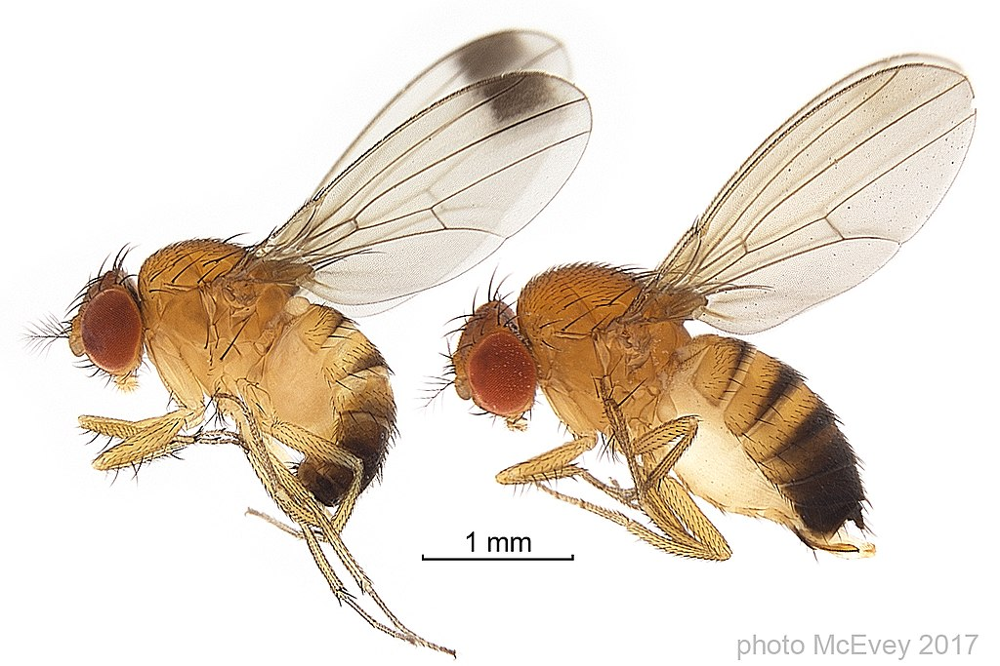
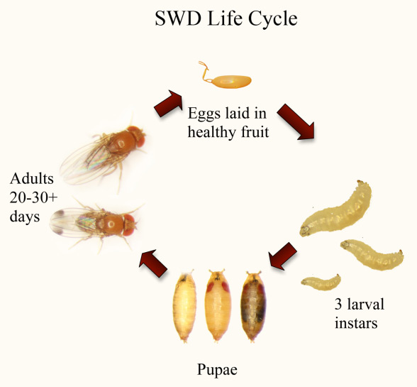

```{r setup, include=FALSE}
knitr::opts_chunk$set(paged.print=FALSE)
knitr::opts_chunk$set(echo=TRUE)
knitr::opts_chunk$set(error=FALSE)
knitr::opts_chunk$set(message=FALSE)
knitr::opts_chunk$set(warning=FALSE)
knitr::opts_chunk$set(tidy.opts = list(width.cutoff = 60), tidy = TRUE)
```

# **Teste do sinal**

## **O que é?**

O teste de sinais se baseia num estatístico **S** (= número de sinais positivos), com distribuição binomial B (N, 0,5), baixo a hipótese nula de ser a mediana (Me) igual a um valor determinado.

## **Estatístico de prova** (**S**)

Corresponde ao número de valores observados por cima de Me0 (observações com sinais positivos) que se denomina por **k**. A distribuição de **k** é binomial (N, 0,5)

-   N representa o número de observações\
-   0,5 a probabilidade de acerto de que uma observação realmente esteja acima de Me0.

## **Estatístico de prova** (**S**)

A partir desta distribuição, o valor p para avaliar a hipóteses nula para as tres hipóteses alternativas é igual, respectivamente, a:

a)  2⋅P(x ≤ k) se k \< n/2 ou 2⋅P(x ≥ k) se k \> n/2
b)  P(x ≥ k)
c)  P(x ≤ k)

## **Estatístico de prova** (**S**)

Pode ser aplicado para duas amostras emparelhadas (Two-sample Paired Data) ou

para uma amostra emparelhada (paired data )

## **Para que serve o teste de sinal?**

*O teste de sinal para duas amostras*

1.  O Teste de Sinal de duas amostras avalia o número de observações em um grupo que são maiores que as observações pareadas no outro grupo, sem levar em conta a magnitude da diferença.

2.  O teste é similar em propósito ao teste de Wilcoxon de duas amostras, mas examina especificamente o valor mediano das diferenças (se os valores forem numéricos) e não é afetado pela distribuição dos dados.

## O teste de sinal para amostra emparelhada

A prova do sinal também pode ser utilizada quando se obtem uma amostra com observações emparelhadas, por exemplo, quando se aplicam duas avaliações sobre o mesmo indivíduo.

-   Neste caso, a prova de sinal permite avaliar se existe diferenças sobre as observações.

-   Simplesmente se aplica a prova de sinal sobre a diferença de valores das observações realizadas, definindo a hipótese nula com Me0, isto significa que esta se avaliando se a mediana da diferença é igual a zero.

## **Presuposto**

Assume-se que a variável é contínua, mesmo que a prova possa ser aplicada em variáveis medidas ao menos em uma escala ordinal e aonde exista "sentido" a interpretação da mediana.

## **Hipótese (H)**

*Hipótese nula: a mediana (Me) é igual a um certo valor Me0*

H0: Me = Me0

*Hipóteses alternativas (Ha):*

-   Ha: Me ≠ Me0
-   Ha: Me \> Me0
-   Ha: Me \< Me0

## **Hipótese**

Se cada valor da variável se classifica com sinal " -- " quando é menor que o Me 0 ou com sinal " + " quando é maior que a Me0, as três hipóteses alternativas anteriores podem ser escritas da seguinte forma, respectivamente:

1.  Ha: P(+) ≠ P(−)
2.  Ha: P(+) \> P(−)
3.  Ha: P(+) \< P(−)

Onde P (+) é a probabilidade de se obter uma observação maior que a Me0 e P (-) é a probabilidade se se obter uma observação menor que a Me0

## **Como se calcula o teste do sinal no R?**

Será necessário instalar o pacote BSDA, carregar os dados emparelhados e rodar a análise:

```{r, eval=FALSE}
install.packages("BSDA")
```

## **Interpretação**

Quanto a interpretação dos resultados eles podem ser significativos e podem ser relatados do tipo:

"Houve uma diferença significativa nos valores entre o grupo A e o grupo B."

## Exemplos

Verifique se existe diferença entre os tempos de taxiamento de decolagem e os tempos de taxiamente de pouso para um Voo da Azul de Porto Alegre para Curitiba. Utilizaremos o teste do sinal com nível de significância de 5 %.

Hipóteses (H):

-   H0: Não existe diferença nos tempos de taxiamento de pouso e decolagem.

-   H1: Existe diferença nos tempos de taxiamento de pouso e decolagem.

------------------------------------------------------------------------

```{r, echo=TRUE}
# Carrega pacotes
library(BSDA)

# Dados decolagem
decolagem <- c(15, 29, 17, 19, 42, 19, 22, 43, 49, 45, 13, 55)

# Dados pouco
pouso <- c(15, 7, 9, 22, 29, 5, 32, 9, 12, 7, 36, 19)
```

```{r }
# Realiza o teste
testeSinal <- SIGN.test(
  decolagem, 
  pouso, 
  md=0, 
  alternative="two.sided"
)
```

## **Resultados**

```{r }
# Exibe teste
testeSinal
```

------------------------------------------------------------------------

-   É apresentado a estatística representada pela variável 'S' (8), o p-valor (0.2266), a hipótese alternativa, o intervalo de confiança e a estimativa da mediana das diferenças. Também é apresentado os intervalos de confiança inferior, intervalos de confiança interpolados e e intervalos de confiança superior.

-   Concluí-se que não existe evidências para rejeitar a hispótese H0 pois p=0.2266 \> 0.05, ou seja, não existe diferença nos tempos de taxiamento de pouso e decolagem.

## Exemplo 2

-   Estão listados os resultados de um experimento, com o objetivo de testar a eficiência de um herbicida pré-emergente no controle de ervas daninhas da cultura do arroz irrigado.

-   Em cada uma das dez parcelas, tratou-se a metade, sendo que a outra metade não recebeu o herbicida (controle).

-   Deseja-se verificar se o efeito do tratamento foi eficiente (p ≤ 0,05).

-   H0 = não existe diferença entre a aplicação do tratamento controle e o tratamento com herbicida sobre a redução do peso das hervas daninhas

-   H1 = existe diferença entre a aplicação do tratamento controle e o tratamento com herbicida sobre a redução do peso das hervas daninhas

------------------------------------------------------------------------

```{r, echo=TRUE}

# Carrega pacotes
library(BSDA)

# Tratamento
controle <- c(115.4, 121.0, 121.3, 78.7, 65.6, 213.5, 157.5, 80.7, 142.8, 100.3)

# Tratamento
herbicida <- c(98.4, 73.6, 65.9, 42.1, 77.2, 104.0, 82.8, 59.4, 102.6, 53.6)
```

```{r, echo=TRUE}
# Realiza o teste
testeSinal2 <- SIGN.test(
  controle, 
  herbicida, 
  md=0, 
  alternative="two.sided",
  conf.level = 0.95,
)
```

## **Resultados**

```{r }
# Exibe teste
testeSinal2
```

## **Conclusão**

-   Concluí-se que existe evidência para aceitar a hispótese H1 pois p-value = 0.02148, ou seja, o herbicida foi eficiente e reduziu o peso de ervas daninhas na cultura do arroz irrigado.

## Considerações finais

O teste dos sinais tem uma aplicabilidade bastante generalizada, entretanto, pode não ter tanta potência estatística quanto outros testes não-paramétricos.

# **Contraste de intervalos de sinais de Wilcoxon**

## **O que é?**

-   Teste utilizado para comparar se dois grupos possuem a mesma medida de tendência central.\
-   Pode ser usado para avaliar se os dados de uma população tem uma determinada mediana.\
-   Leva em consideração a magnitude das diferenças entre os pares de dados.

## **O que é?**

-   Compara se as diferenças entre pares de dados seguem uma distribuição simétrica ao redor de um valor.\
-   Tem menor poder estatistico (menor probabilidade de rejeitar a hipotese nula quando realmente é falsa) porque ignora os valores extremos. Porém é mais robusto que outros testes paramétricos, como o t-test.

## **Pressupostos**

-   A variável é de natureza contínua, porém a prova pode ser aplicada em variáveis medidas em intervalo.\
-   A amostra é proveniente de uma população com distribuição simétrica, de forma que, a mediana e a média seriam iguais, e assim, a hipótese sobre a mediana aplicaria-se para a média;\
-   A diferença com o teste de sinais, esta no fato de que o teste de Contraste de intervalos de sinais de Wilcoxon considera não apenas a posição da observação (ranking), mas também a sua magnitude;

## **Pressupostos**

-   Os dados tem que ser dependentes;\
-   Os dados devem poder ser ordenados do menor para o maior e vice-versa;\
-   Não é necessario assumir que as amostras se distribuam de forma normal ou que procedam de populações normais. Entretanto, seja qual seja o tipo de distribuição das diferenças, deve ser simétrica.

## **Hipótese**

-   Hipótese nula: a mediana (Me) é igual a um certo valor, Me0.\
    -   H0: Me = Me0\
-   Hipóteses alternativas (Ha):\
    -   Ha: Me ≠ Me0\

    -   Ha: Me \> Me0\

    -   Ha: Me \< Me0

## **Estatístico de prova**

-   Se classifica cada observação xi com sinal "--" se esta toma valores menores que Me0, ou com sinais " + " se os valores são maiores que Me0.\
-   Para cada observação se calcula o valor absoluto da diferença entre xi menos Me0, o que chamamos \|Di\|.\
-   Este resultado se ordena de menor para maior, e se associa a uma posição (ranking pi) que ocupam dentro do total de n observações.\
-   O estatístico de prova T+ corresponde a soma dos rankings associados as observações com o sinal positivo ("+").

## **Empates e zeros**

Podem surgir duas situações durante a análise: 

a)  Ocorrer um empate, isto é, diferentes observações tenham o mesmo valor do estatístico de prova; ocasionando que não seja possível associar um intervalo a cada observação; 

b)  Presença de zeros, ou seja, xi é igual a Me0, ocasionando que não seja possível colocar um sinal "+" ou "-".

## **Empates e zeros**

-   Quando ocorre o primeiro caso, uma alternativa é associar a média dos intervalos iniciais a cada uma das observações que apresentam o empate. 

-   Se ocorrem as duas situações, deve ser realizado um ajuste sobre o valor esperado e a variância de T+.

## **Como se calcula o contraste de intervalos de sinais de Wilcoxon?**

O teste de contraste de intervalos de sinais de Wilcoxon se executa com as funções **wilcox.test()**, contida dentro do pacote **MASS**, e **wilcoxsign_test()**, contida no pacote **coin**. 

-   **wilcoxsign_test()** permite calcular o p-valor exato, quando ocorra empates, enquanto **wilcox.test()** não faz isto; 

-   A função **wilcoxsign_test()** requer os argumentos em forma de função (\~), motivo pelo qual os dados devem estar armazenados em formato de data frame. 

## **Como se calcula o contraste de intervalos de sinais de Wilcoxon?**

-   Os dois comandos calculam o estatístico T+, eliminando os valores de Di = 0; 

-   **wilcox.test()** permite realizar o ajuste por continuidade para o cálculo do p-valor, aproximando pela distribuição normal.

------------------------------------------------------------------------

Os argumentos que a função **wilcox.test()** usa por padrão são:

$$
wilcox.test (x, alternative="two.sided", mu=0,exact=T, correct=T)
$$

-   **x** é o vetor de observações
-   **alternative** permite escolher o tipo de teste que se vai executar:
    -   bilateral (que é o padrão);

    -   less, se a hipótese nula, a qual desejamos contranstar, é menor;

    -   greater, se a hipótese nula, a qual desejamos contranstar, é maior.

------------------------------------------------------------------------

-   **mu** permite sinalizar que valor da hipótese será contrastado. Assume o valor zero por padrão.
-   **exact**: indicamos se R deve calcular o valor exato ou aproximado da distribuição do estatístico T+ de Wilcoxon
-   **exact =T** (é a opção padrão)
-   **exact=F** irá fornecer o p-valor aproximado
-   **correct** indica se desejamos utilizar a correção de continuidade

$*$ Observação: devem ser eliminadas da amostra os valores iguais aos da hipótese a contrastar

## **Exemplo: estudo de caso**

-   A mosca *Drosophila susuki* é considerada uma importante praga de pequenas frutas, como o morango, mirtilo, amora, framboesa, etc.

{width="421"}

## Problema

-   Os danos são causados quando esta mosca oviposita dentro dos frutos, podendo ocasionar queda prematura, no caso do mirtilo, e também o desenvolvimento de larvas no interior do fruto. Estas larvas consomem a polpa acelerando o processo de senescência do fruto.

{width="302"}

## Motivação da investigação

-   O uso de baixas temperaturas pode contribuir para inibir o desenvolvimento das formas imaturas (ovos e larvas) desta mosca em frutos infestados e desacelerar o declínio da qualidade visual destes frutos durante a comercialização.

## **Metodologia**

A qualidade visual de frutos de morango, a qual reflete a deterioração causada pelo processo de senecêscia e danos ocasionados pela mosca *Drosophila suzukii*, foi avaliada por um consumidor, o qual dividiu os frutos em cinco classes:

5 = excelente, 4= bom, 3= aceitável, 2=ruim, 1=inaceitável, de acordo com sua opinião, nos dias 1, 3, 5 e 7 dias após a colheita.

Foram avaliados dois grupos de frutos:\
a) frutos mantidos refrigerados a 3 ° C desde a colheita\
b) frutos mantidos a temperatura ambiente (21 °C)

## Pergunta:

A refrigeração dos frutos de morangos, previamente infestados, permite manter a qualidade visual destes com nota superior a 2 (aceitável) até os 7 dias após a colheita?

------------------------------------------------------------------------

```{r, echo=TRUE}
library(MASS)  

morango_refrigerado<-c(5,4,5,4,4,5,4,3,4,3,3,4,3,3,3,3,2,3,2,2,3,1,2,3)

wilcox.test(morango_refrigerado, mu=2,exact=F,alternative = "g",conf.int = 0.95) 

```

## Conclusão

O tratamento de refrigeração dos frutos consegue manter a sua qualidade visual com nota superior a 2 até 7 dias após a colheita.

## Pergunta

A qualidade visual de frutos de morangos, previamente infestados por larvas de mosca *D. suzukii* e submetidos a cadeia de frio e temperatura ambiente, foi avaliada. Estes frutos receberam notas no primeiro dia e aos 5 dias após a colheita.

```{r, include=FALSE}

# Dados
m1_TA<-c(5,5,4,4,4,5,4,4,4,4,5,4,5,4,4,5)
m5_TA<-c(3,2,2,2,2,3,2,3,2,2,3,2,2,2,2,3)
diferenças <- c(m1_TA - m5_TA)

rbind(m1_TA, m5_TA, diferenças)
ranksdiferenças <- rank(abs(diferenças[diferenças != 0])) 
ranksdiferenças <- c(ranksdiferenças[1:14], 0, ranksdiferenças[16]) 

```

```{r, include=FALSE}

tabela <- data.frame(m1_TA = m1_TA, m5_TA = m5_TA, sinal = sign(diferenças),
                    diferença = abs(diferenças), rank = ranksdiferenças)

m1_r<-c(5,4,4,4,5,5,4,5,4,5,5,4,5,4,5,4)
m5_r<-c(4,3,4,2,3,3,3,3,2,3,3,3,3,2,3,2)
diferenças1 <- c(m1_r - m5_r)

rbind(m1_r, m5_r, diferenças1)
tabela1 <- data.frame(m1_r = m1_r, m5_r = m5_r, sinal = sign(diferenças),
                    diferenças = abs(diferenças1), rank = ranksdiferenças)

```

a)  Existe diferenças na qualidade visual entre o primeiro e aos 5 dias após a colheita para ambos tratamentos?

## wilcox.test, *p-value* aproximado

### Temperatura ambiente

```{r, echo=TRUE, warning=FALSE}
wilcox.test(m1_TA,m5_TA,paired = T, correct = T,  conf.int = 0.95)
```

## wilcox.test, *p-value* aproximado

### Temperatura refrigerada

```{r, echo=TRUE, warning=FALSE}
wilcox.test(m1_r,m5_r,paired = T,exact = F, correct = T,  conf.int = 0.95)
```

## Wilcoxsign_test(), *p-value* exato

```{r, echo=TRUE, warning=FALSE}
require(coin)
morango_refrigerado <- data.frame(m1_r = m1_r, m1_r = m5_r)
wilcoxsign_test(m1_r ~ m5_r, data = morango_refrigerado, distribution = "exact")

```

## **Conclusão**

O *p-valor* é suficientemente pequeno como para afirmar que existem diferenças com respeito a qualidade visual dos frutos entre os dias 1 e 5, para ambos os tratamentos.

------------------------------------------------------------------------

b)  Existem diferenças na qualidade visual entre os frutos refrigerados e os frutos não refrigerados aos 5 dias após a colheita?

```{r, echo=TRUE, warning=FALSE}
wilcox.test(m5_TA,m5_r,paired = T,exact = F, correct = T,  conf.int = 0.95)

```

## **Conclusão**

Existem diferenças com respeito a qualidade visual dos morangos submetidos aos tratamentos de refrigeração e sem refrigeração no dia 5 após a colheita.

# Teste de bondade de ajuste de Kolmogorov-Smirnov

## O que é o teste de bondade de ajuste de Kolmogorov-Smirnov?

-   Também conhecido como teste K-S.

-   Compara os dados com uma distribuição de probabilidade conhecida.

## O que é o teste de bondade de ajuste de Kolmogorov-Smirnov?

-   Embora o teste seja não-paramétrico, este não assume nenhuma distribuição de probabilidades específica.

-   Normalmente, é usado como um teste para verificar a normalidade dos teus dados, por exemplo as suposições de normalidade da Análise de variância.

## O que é o teste de bondade de ajuste de Kolmogorov-Smirnov?

-   Em resumo, o teste compara uma distribuição de probabilidade hipotética (por exemplo, a distribuição normal), com a distribuição gerada por teus dados (a função empirica de distribuição).

Existem dois tipos de teste de Kolmogorov-Smirnov:

-   Uma amostra;

-   Duas amostras independentes.

## Teste de Kolmogorov-Smirnov (K-S)

-   O teste de (K-S) de **uma amostra**, responde se a variável segue uma determinada distribuição de probabilidades na amostra analisada.

-   Esta "determinada distribuição", é normalmente, mas não sempre, a distribuição normal.

-   Existe também, embora muito menos comum, o teste de Kolmogorov-Smirnov para **duas amostras independentes**.

-   Este teste visa verificar se a distribuição da variável testada é identica nas duas populações analisadas.

## Como realizar o teste de Kolmogorov-Smirnov no R

A função utilizada é:

$$
ks.test (x, y, …, alternative = "two.sided")
$$

-   **x** é o vetor de observações;

-   **y** é o nome da função de distribuição a qual desejamos efetuar a comparação com nossos dados;

-   **alternative** é onde se pode escolher o tipo de teste a executar (**bilateral**, que é o padrão), **less** or **greater** no caso de a hipótese alternativa com a que desejamos comparar seja maior ou menor.

## Exemplo 1: Teste de Kolmogorov-Smirnov para uma amostra

```{r, warning= F, echo = TRUE}
# torne este exemplo replicável
set.seed (0)

#gerando un dataset de 100 valores que seguem a distribuição de Poisson com média=5
data <- rpois(n=20, lambda=5)
data
```

------------------------------------------------------------------------

```{r, warning= F, echo = TRUE}
# Realize o teste de  Kolmogorov-Smirnov
ks.test(data, "pnorm")
```

## Conclusão

-   Desde que o p-value é menor que 0.05, se pode rejeitar a hipótese nula (a distribuição é a mesma).\
-   Temos evidência suficiente para dizer que os dados do exemplo não vêm de uma distribuição normal.

## Exemplo 2: Teste de Kolmogorov-Smirnov para duas amostras

Suponhamos que tenhamos estes dois datasets:

```{r, warning= F, echo = TRUE}
# torne este exemplo replicável
set.seed(0)

#generando dois datasets
data1 <- rpois(n=20, lambda=5)
data2 <- rnorm(100)
```

## Exemplo 2: Teste de Kolmogorov-Smirnov para duas amostras

```{r, warning= F, echo = TRUE}

# Realize o teste de Kolmogorov-Smirnov
ks.test(data1, data2)

```

## Conclusão

-   Desde que o p-value é menor que 0.05, se pode rejeitar a hipótese nula.
-   Temos evidência suficiente para dizer que os dois datasets deste exemplo não apresentam uma mesma distribuição de probabilidades.

## Referências

<https://www.statisticshowto.com/kolmogorov-smirnov-test/>

# Teste da mediana

## Introdução

-   O teste da mediana consiste em executar uma prova de homogeneidade de duas amostras ordenadas em uma tabela de dupla entrada.

### Pressuposto

-   Se aplica para variáveis de natureza contínua, medidas ao menos em escala ordinal.

## Hipóteses

-   Hipóteses nula: as k variáveis possuem a mesma distribuição.

    -   H0:F1(x)=F2(X)=...=Fk(X)

-   Hipóteses alternativas:

    -   Ha:Fi(X)≠Fj(X) para qualquer i≠j.

## Exemplo 1

Foi realizado um estudo para verificar se o número de pulsações por minuto pode ser considerado igual entre os homens e mulheres de uma determinada população.

Para isto foram escolhidos ao acaso 12 homens e 12 mulheres.

## Resolvendo

```{r, echo=TRUE, warning=FALSE}
Homens <-c(74,77,71,76,79,74,83,79,83,72,79,77)
Mulheres <-c(81,84,80,73,78,80,82,84,80,84,75,82)
mediana<-median(c(Homens,Mulheres)) # mediana geral
mediana

Homens<-c(sum(Homens>mediana),sum(Homens<=mediana))
Mulheres<-c(sum(Mulheres>mediana),sum(Mulheres<=mediana))

dados1<-as.table(cbind(Homens,Mulheres))
dados1
```

## Resolvendo

### Teste da mediana

```{r, echo=TRUE, warning=FALSE}
pulsaciones <- matrix(c(2,10,9,3),ncol=2)
chisq.test(pulsaciones)

```

------------------------------------------------------------------------

```{r, echo=TRUE, warning=FALSE}
chisq.test(pulsaciones)$expected
chisq.test(pulsaciones, correct=F)
```

## Solução

-   Verificou-se que as frequências esperadas eram todas superiores a 5, de forma que não é necessário aplicar a correção de Yates.

-   Com um p-value \<0.01 podemos rejeitar a hipótese de homogeneidade entre as populações de homens e mulheres deste exemplo.

## Exemplo 2

Deseja-se verificar se há diferença significativa entre os escores de QI de sujeitos com baixa exposição ao chumbo, média exposição ao chumbo e alta exposição ao chumbo.

Use o nível de significância de 0.05 para testar se as três amostras provêm de populações com medianas iguais.

## Exemplo 2

### **Parâmetros**

-   Para a realização desse teste, foi criada uma matriz onde as colunas ainda são os **k** grupos, e as linhas indicam quantos indivíduos de cada grupo estão acima e quantos estão abaixo da mediana geral.

------------------------------------------------------------------------

Hipóteses:

-   H0: Os grupos possuem medianas semelhates\
-   H1: Ao menos um grupo possue mediana diferente a os demais

## Resolvendo

```{r, echo=TRUE, warning=FALSE}
baixo<-c(85,90,107,85,100,97,101,64)
medio<-c(78,97,107,80,90,83)
alto<-c(93,100,97,79,97)
mediana<-median(c(baixo,medio,alto)) # mediana geral
baixo<-c(sum(baixo>mediana),sum(baixo<=mediana))
medio<-c(sum(medio>mediana),sum(medio<=mediana))
alto<-c(sum(alto>mediana),sum(alto<=mediana))
dados<-as.table(cbind(baixo,medio,alto))
dados
```

## Solução

```{r, echo=TRUE, warning=FALSE}
chisq.test(dados)$expected # verificando que as frequências

chisq.test(dados)


```

## Observação

-   os dados não atendem o requisito do Teste Qui-Quadrado de que todas as frequências esperadas devem ser maiores que **5**.

-   Desta forma deveria ser realizado o teste exato de Fisher!!!

------------------------------------------------------------------------

```{r, echo=TRUE, warning=FALSE}
fisher.test(x = dados, alternative = "two.sided")

```

-   Não há evidências para rejeitar H0 (p=0,7272), ou seja, não há evidencias suficientes para afirmar que as medianas dos grupos são diferentes.

## Referências

<https://rpubs.com/cjrr/puj_decb_np>

Garcia, A. Estadística aplicada com R. UNED, Madrid, 2012.

# Contraste de Kruskal-Wallis

## Introdução

-   Este teste é uma alternativa não paramétrica do método da ANOVA.

-   Serve para contrastar a hipótese de que **k** amostras quantitativas tenham sido obtidas de uma mesma população.

-   A única exigência versa sobre a aleatoriedade na extração das amostras, não fazendo referência a nenhuma das outras condições adicionais de homocedasticidade e normalidade necessárias para a aplicação do teste paramétrico ANOVA.

## Como se executa o teste de Kruskal-Wallis em R?

A função que se usa para executar este teste é:

$$
kruskal.test(x \sim y, dados)
$$

-   **x** são os valores observados da variável resposta (em formato vetor de dados).

-   **y** são os fator que define os grupos a comparar (em formato de fator).

-   **dados** são os dados em formato *data frame*.

## Exemplo

Com o objetivo de analisar se existem diferenças significativas, no aumento de peso, entre três dietas alimentícias (A, B e C) se decidiu submeter três galinhas a cada uma delas, obtendo-se os seguintes resultados:

```{r, echo = TRUE}
peso<-c(32,37,34,33,30,36,38,37,30,34,35,30,36,29,31)
dieta<-factor(rep(LETTERS[1:3],c(5,5,5)))
galinhas <- data.frame(dieta,peso)
head(galinhas)
```

## Hipótese

H0: Não existem diferenças entre as dietas ofertadas com relação ao aumento de peso das galinhas;

H1: Existem diferenças significativas entre as dietas para o aumento de peso das galinhas.

## Exemplo

```{r, echo = TRUE}
kruskal.test(peso~dieta, galinhas)
```

## Conclusão

-   O p-value= 0.3176 é suficientemente grande para aceitar a hipótese nula.

-   Se aceita a hipotese nula de igualdade dos efeitos das 3 dietas em relação ao aumento de peso das galinhas.

## Referências

Pérez, Garcia, A. Estadística aplicada com R. UNED, Madrid, 2012.

# Teste de Friedman

## Introdução

-   Trata-se de um teste não paramétrico para analizar experimentos delineados em blocos ao acaso.

## Como calcular o Teste de Friedman em R?

-   Pode ser realizado de duas formas:

-   Criar um vetor de dados **y** com os valores observados da variável de resposta que virá em forma de *vetor* de dados;\

-   E dois *fatores*, **grupos** e **blocos** que são as variáveis que formam a tabela de dupla entrada na qual aparecem classificadas as observações e que correspondem respectivamente, com o fator que forma os grupos a comparar e com os blocos considerados; ambos deverão vir em formato de fator.

## Como calcular o Teste de Friedman em R?

A função se executa na forma:

$$
friedman.test(y, grupos, blocos)
$$

-   Outra opção é criar um *data.frame* de dados com o vetor observações e os dois fatores, estabelecer um modelo, onde os fatores apareçam na forma grupos\|blocos e executar:

    -   friedman.test (modelo, dados)

## Exemplo 1

-   Se deseja verificar se tres tipos de complexos vitamínicos, denominados U, V e W produzem os mesmos efeitos com respeito ao aumento de peso em coelhos.

-   Com este propósito se realizou um ensaio em blocos ao acaso, visto que o investigador acredita que neste estudo pode ocorrer alguma alteração, devido ao fato de que os coelhos são de quatro raças diferentes.

-   Por isto, escolheu 3 coelhos de cada uma das raças, oferecendo ao acaso os três complexos vitamínicos entre cada "grupo"(terna?)

## Solução

-   Para resolver este exemplo com R, primeiro incorporamos os dados conforme mostraremos a seguir:

```{r, echo = TRUE}
peso<-c(94,89,87,98,92,86,86,92,90,86,84,82)
Complexo_vitaminico<-factor(rep(LETTERS[21:23],c(4,4,4)))
Raza<-factor(rep(LETTERS[1:4],length.out=12))
Coelho<-data.frame(Complexo_vitaminico, Raza,peso)
```

------------------------------------------------------------------------

```{r, echo = TRUE}
Coelho
```

## Solução

-   H0: existe igualdade dos efeitos médios dos três complexos de vitaminas sobre o aumento de peso dos coelhos.
-   H1: não existe igualdade dos efeitos médios dos três complexos de vitaminas sobre o aumento de peso dos coelhos

## Solução

```{r, echo = TRUE}
friedman.test(peso, Complexo_vitaminico, Raza)
friedman.test(peso~Complexo_vitaminico | Raza, Coelho)

```

## Conclusão

-   Ambas formas resultam exatamente no mesmo resultado.
-   O p-value de 0.02 sugere rejeitar a hipótese de igualdade dos efeitos médios dos três complexos de vitaminas sob o aumento de peso dos coelhos.

## Referências

Pérez, Garcia, A. Estadística aplicada com R. UNED, Madrid, 2012.
