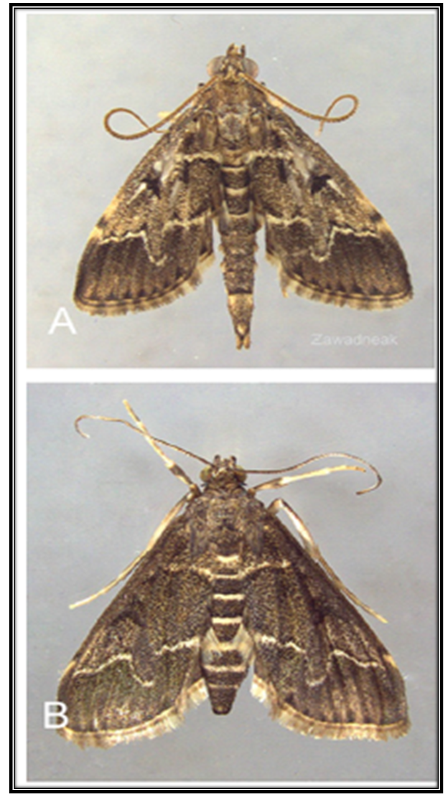

## Introdução

-   Este teste é uma alternativa não paramétrica do método da ANOVA;

-   Serve para contrastar a hipótese de que **k** amostras quantitativas tenham sido obtidas de uma mesma população.\

-   A única exigência versa sobre a aleatoriedade na extração das amostras, não fazendo referência a nenhuma das outras condições adicionais de homocedasticidade e normalidade necessárias para a aplicação do teste paramétrico ANOVA.

## Como se executa o teste de Kruskal-Wallis em R?

A função que se usa para executar este teste é:

kruskal.test(x \~ y, dados)

**x**= valores observados da variável resposta (em formato vetor de dados);\

**y**= fator que define os grupos a comparar (em formato de fator). **dados**= dados em formato *data frame*.

## Exemplo 1

Com o objetivo de analisar se existem diferenças significativas, no aumento de peso, entre três dietas alimentícias (A, B e C) se decidiu submeter três galinhas a cada uma delas, obtendo-se os seguintes resultados:

```{r, echo = TRUE}
peso<-c(32,37,34,33,30,36,38,37,30,34,35,30,36,29,31)
dieta<-factor(rep(LETTERS[1:3],c(5,5,5)))
galinhas <- data.frame(dieta,peso)
head(galinhas)
```

## Hipótese

H0: Não existem diferenças entre as dietas ofertadas com relação ao aumento de peso das galinhas;

H1: Existem diferenças significativas entre as dietas para o aumento de peso das galinhas.

## Exemplo 1

```{r, echo = TRUE}
kruskal.test(peso~dieta, galinhas)
```

## Conclusão exemplo 1

-   O p-value= 0.3176 é suficientemente grande para aceitar a hipótese nula.

-   Se aceita a hipótese nula de igualdade dos efeitos das 3 dietas em relação ao aumento de peso das galinhas.

## Exemplo 2

Com o objetivo de analisar se existem diferenças significativas, na longevidade (dias) de adultos da mariposa *Duponchelia fovealis* (Lepidoptera: Crambidae), alimentadas com 4 dietas alimentares, foi conduzido um experimento em laboratório em delineamento inteiramente casualizado, obtendo-se os seguintes resultados:

{width="177"}

## Dados

```{r, echo = TRUE}
longevidade<-c(47,43,34,13,29,12,17,10,39,15,1,12,6,7,1,3,27,7,5,2)
dieta<-factor(rep(LETTERS[1:4],c(5,5,5,5)))

Mariposa <- data.frame(dieta,longevidade)
head(Mariposa)
```

## Hipótese

H0: Não existem diferenças entre as dietas ofertadas com relação ao aumento de longevidade das mariposas;

H1: Existem diferenças significativas entre as dietas para o aumento de longevidade das mariposas.

## Investigando teus dados! **Histograma**

```{r, echo = TRUE}
hist(Mariposa$longevidade, col=c(2,3,4,5,6,7,8,9), main = "Dietas",
     xlab = "Longevidade de D. fovealis (Dias)",
     ylab= "Frequencias absolutas")
```

## Gráfico de qqnorm

```{r, echo = TRUE}
qqnorm(Mariposa$longevidade, pch=16, col=2)
```

##  Boxplot 

```{r, echo = TRUE}
boxplot(longevidade ~ dieta, 
        data = Mariposa, ylab = "Longevidade de D. fovealis (dias)")
```

## Teste de homogenicidade das variâncias - Bartlett test

```{r, echo = TRUE}
bartlett.test(longevidade ~ dieta, data= Mariposa)
```

## Médias e desvio padrão

```{r, echo = TRUE}
aggregate (longevidade ~ dieta, 
           data = Mariposa, rm.na= TRUE,mean) # Médias dos tratamentos

aggregate (longevidade ~ dieta, data = Mariposa,sd) # Desvio padrão
```

## Longevidade (dias), teste de normalidade

```{r, echo = TRUE}
shapiro.test(Mariposa$longevidade[Mariposa$dieta=="A"])
shapiro.test(Mariposa$longevidade[Mariposa$dieta=="B"])
shapiro.test(Mariposa$longevidade[Mariposa$dieta=="C"])
shapiro.test(Mariposa$longevidade[Mariposa$dieta=="D"])
```

## Teste de Kruskal-Wallis

```{r, echo = TRUE}
kruskal.test(longevidade~dieta, Mariposa)
```

##  Dunn.test - Separação de médias
- Inicialmente vamos carregar o pacote "FSA"
```{r, warning=FALSE,echo=TRUE}
library(FSA)
```

##  Dunn.test 
```{r, warning=FALSE,echo = TRUE}
dunnTest(longevidade ~ dieta,
         data=Mariposa, 
         method="bonferroni")
```

## Médias, desvio padrão e erro padrão

-   Forma 1 de calcular erro padrão

```{r, echo = TRUE}
mean(Mariposa$longevidade[Mariposa$dieta=="A"]) # Médias dos tratamentos
sd (Mariposa$longevidade[Mariposa$dieta=="A"]) # Desvio padrão
se <- c(sd (Mariposa$longevidade[Mariposa$dieta=="A"])/sqrt(5))
se # erro padrão
```

## Forma 2 de calcular erro padrão

```{r, echo = TRUE}
library(plotrix)
std.error(Mariposa$longevidade[Mariposa$dieta=="A"])
std.error(Mariposa$longevidade[Mariposa$dieta=="B"])
std.error(Mariposa$longevidade[Mariposa$dieta=="C"])
std.error(Mariposa$longevidade[Mariposa$dieta=="D"])
```

## Resultado final

```{r, echo = TRUE}
Longevidade_media <- c(33.2,18.6,5.4,8.8)
Dietas <- c("A","B", "C", "D")
SE <- c("5.97", "5.24", "2.06","4.63")
signif <- c("a","ab", "b", "b")
Dupon <- data.frame(Dietas,Longevidade_media, SE,signif)
head(Dupon)

```

## Conclusão do exemplo 2

- As dietas influenciam significativamente (p-value <0.01) a longevidade da mariposa *D. fovealis* (Lepidoptera: Crambidae).  

- As dietas A e B foram os tratamentos que proporcionaram em média as maiores longevidades para as mariposas.  

## Referências

Pérez, Garcia, A. Estadística aplicada com R. UNED, Madrid, 2012.

## Muito obrigada!


Emily Silva Araujo  

araujosemily@gmail.com  